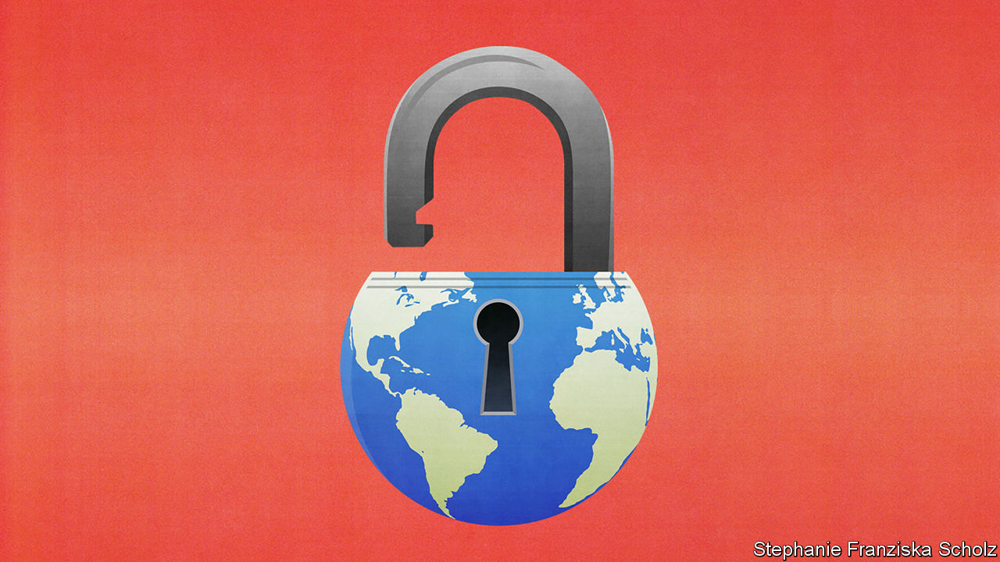

## The next stage of covid-19

# Lifting lockdowns: the when, why and how

> They are blunt instruments that can cause immense harm. Time to be more discriminating

> May 23rd 2020

Editor’s note: Some of our covid-19 coverage is free for readers of The Economist Today, our daily [newsletter](https://www.economist.com/https://my.economist.com/user#newsletter). For more stories and our pandemic tracker, see our [hub](https://www.economist.com//news/2020/03/11/the-economists-coverage-of-the-coronavirus)

SINCE CHINA locked down the city of Wuhan on January 23rd, over a third of the world’s population has at one time or another been shut away at home. It is hard to think of any policy ever having been imposed so widely with such little preparation or debate. But then closing down society was not a thought-out response, so much as a desperate measure for a desperate time. It has slowed the pandemic, but at a terrible price. As they seek to put lockdowns behind them, governments are not thinking hard enough about the costs and benefits of what comes next.

Although social distancing may have to be sustained for months or years, lockdowns can only ever be temporary. That is because it is becoming clear how costly they are, especially in poor countries. Part of the price is economic. Goldman Sachs this week predicted that India’s GDP would fall in the second quarter at an annualised quarterly rate of 45%, and would rebound by 20% in the third quarter if lockdowns were lifted. Absa, a bank, reckons South Africa’s economy could shrink at an annualised rate of 23.5% in the second quarter.

The poorest are hit very hard, because they have nothing to fall back on. In sub-Saharan Africa an individual in the lowest income quintile has only a 4% chance of receiving social assistance from the government in normal times. The combination of covid-19 and lockdowns could drive up to 420m people into absolute poverty—defined as having to live on less than $1.90 a day. That would increase the total by two-thirds and set back progress against penury by a decade (see [article](https://www.economist.com//international/2020/05/23/covid-19-is-undoing-years-of-progress-in-curbing-global-poverty)).

The consequences will be far-reaching. Hunger permanently stunts children. Lockdowns that block normal services cost lives. The World Health Organisation has warned that covid-19 threatens vaccination programmes. If they stop in Africa, 140 children could die for each covid death averted. A three-month lockdown, followed by a ten-month interruption of tuberculosis treatment, could cause 1.4m deaths in 2020-25. It is the same for malaria and AIDS. The longer lockdowns continue, the likelier it is that they will cost more lives than they save.

The picture in rich countries is less dramatic, but still worrying. America’s unemployment rate increased from 3.5% in February to 14.7% in April. In Britain a third of new graduates had a job offer withdrawn or delayed. Bond markets in America are signalling a wave of defaults, especially in hospitality, raw materials, carmaking and utilities. The scarring in the labour market could last for years. Rich-world services are vulnerable, too. One study concluded that delaying cancer consultations in England by six months would offset 40% of the life-years gained from treating an equivalent number of covid-19 patients. Vaccination rates have fallen, risking outbreaks of diseases like measles.

Lifting lockdowns risks a second wave. Iran reopened in April to save the economy, but last week designated the capital, Tehran, and eight provinces as “red zones”, because the virus is spreading there again. Some American states, such as Georgia, that never suppressed the initial outbreak will soon find whether they lifted lockdowns too hastily. Some African countries are going ahead even though their case loads are rising.

To limit the risk requires an epidemiological approach that focuses on the places and people most likely to spread the disease. An example is care homes, which in Canada have seen 80% of all the country’s deaths even though they house only 1% of the population. In Sweden refugees turn out to be high-risk, perhaps because several generations may be packed into a household. So are security guards, who are often elderly and are exposed to many people in their work (see [article](https://www.economist.com//science-and-technology/2020/05/21/the-risk-of-severe-covid-19-is-not-uniform)).

For this approach to succeed at scale, you need data from tests to provide a fine-grained picture of how the disease spreads. Testing let Germany rapidly spot that it had a problem in its slaughterhouses, where the virus persists longer than expected on cold surfaces. Likewise, South Korea identified a super-spreader in Seoul’s gay bars. Without testing, a country is blind.

Armed with data, governments can continuously refine their policies. Some are universal. Masks were once thought ineffective, but in fact help stop the spread of the disease. Like handwashing, they are cheap and do not impose hidden costs. However, closing schools harms children and stops parents from working. In contrast with flu, it turns out, the benefits to health are not especially great. Schools should reopen, under conditions that lower the risk to teachers and vulnerable pupils.

As a rule, the balance of costs and benefits favours narrow local policies over blanket national ones. In Britain agency workers carry the virus between care homes: they should work at only one. Gibraltar has a Golden Hour, when open spaces are set aside for the over-70s to exercise while everyone else stays at home. Stockholm is moving vulnerable people into their own flats. Liberty University, run by Jerry Falwell, a supporter of President Donald Trump, was condemned for keeping its campus open. But thanks to social distancing, it has logged no cases of covid-19.

Poor countries will not be able to afford all these approaches. However, Vietnam and the Indian state of Kerala have shown that good primary-health systems can devise and disseminate sensible adaptations. Poor countries have more experience of infectious diseases than rich ones. Epidemiologists talk of “smart containment” that all can practise. Rwanda has put foot-operated handwashing stations in busy places such as bus depots. Slums need clean water for handwashing and to cut queues. Local leaders can spread health messages and designate areas where suspected cases can be isolated. Markets must remain open, but limit social contact. If people can earn some money, millions who would otherwise go hungry could feed themselves.

The emergency phase of the pandemic is drawing to a close. Too many governments failed to spot what was coming, but then did what they could. In the much longer second phase they will have no such excuse. They must identify groups at risk; devise and enact policies for them; explain these so that vulnerable people change their behaviour without becoming scapegoats; provide vital infrastructure; and be ready to adapt as new data come in. This will sort countries where the government works from those where it does not. The stakes could not be higher. ■