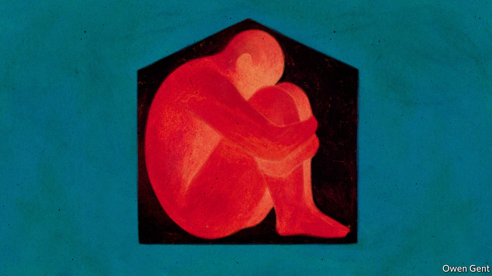
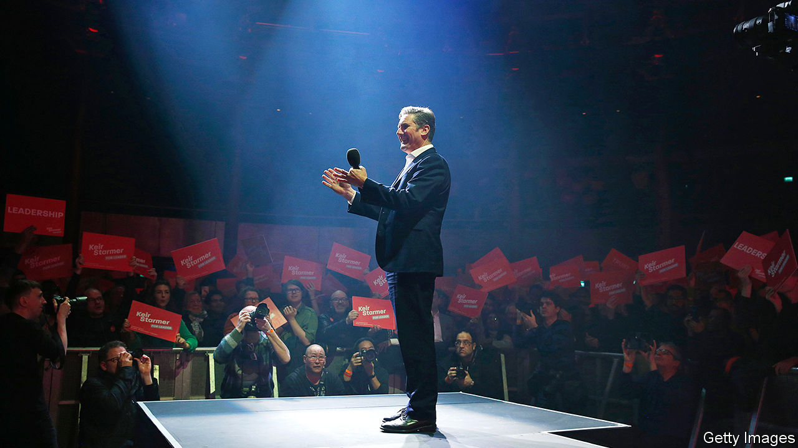
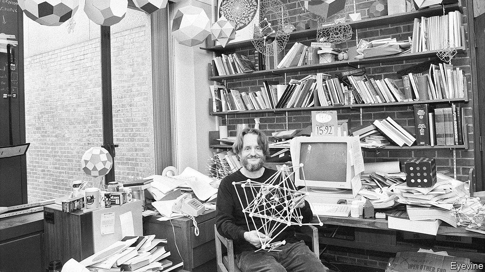
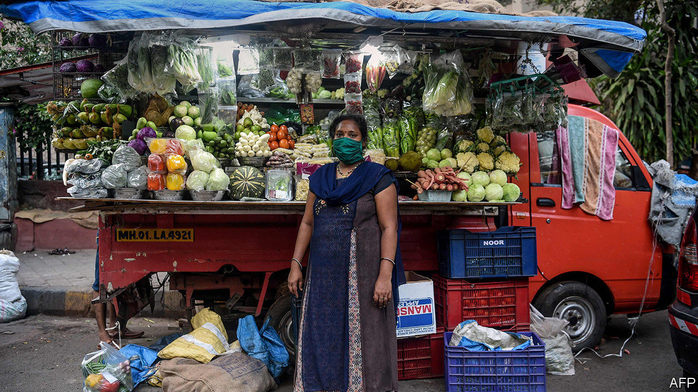

## On solitude, investors, electric cars, Yemen, Labour, Einstein, three points

# Letters to the editor

> A selection of correspondence

> May 23rd 2020

Loneliness can indeed arise from the extremes of solitude, but solitude is not about being physically distant from others (“[All the lonely people](https://www.economist.com//books-and-arts/2020/04/30/solitude-has-always-been-both-a-blessing-and-a-curse)”, May 2nd). Solitude is giving your mind repose from the incessant stream of distraction in the external world: music, TV, instant communication, endless scrolling. Solitude is allowing yourself the time and space to become comfortable with the wondrous ongoing of your mind without wishing for an immediate suppressant.

Loneliness, by contrast, comes from the endless desire to seek out connection, in which one struggles to find anything real or profound.

PIERRE MASON-PEREZDurham

I recall David Foster Wallace remarking once that loneliness does not come from being alone. Sadly, from a man who probably knew all too well.

CHRIS STILLNashville

I am reminded of what Amartya Sen said about the difference between voluntarily eating 1,000 calories a day on a diet and having to stick to that limit because you cannot afford food. Choosing solitude is one thing; imposed solitary confinement quite another.

ARNOLD PACKERFormer assistant secretary of labourLa Jolla, California

Alex Honnold did indeed climb El Capitan in Yosemite “with neither companions nor crampons”. That’s because crampons are used for ice and snow in alpine environments. El Capitan is a granite monolith and is never climbed with crampons but rather with rock-climbing shoes.

JOSHUA COOKBogotá

You said that “Sherlock Holmes preferred an opium pipe to ignite his solitary reveries.” Poppycock I say! He smoked tobacco in his pipe. True, Watson did find the great detective in an opium den in “The Man with the Twisted Lip”, but Holmes assured him it was all for cover and he did not inhale.

The real vice for Holmes was cocaine, a stimulant that enhanced frenetic thinking until a solution emerged.

ANDREW WILSONPortland, Oregon

“Leslie Stephen and G.M. Trevelyan thought nothing of walking from Cambridge to London for dinner”, you wrote. However, I wonder if they did think during their 50-mile hike that their 6am departure was cutting it a bit fine.

ADRIAN WILLIAMSHeadington, Oxford

May I respectfully question Schumpeter’s imagery of activist investors as soon-to-be awakened serpents ([April 18th](https://www.economist.com//business/2020/04/18/activist-investors-have-gone-quiet-during-the-pandemic)). The extreme disruption for business being wrought by this dreadful virus will indeed expose the weaker performers to scrutiny from activists and institutional investors alike. Warren Buffett’s line that “only when the tide goes out do you discover who’s been swimming naked” comes to mind.

Emboldened by a market hungry for yield and with little patience for underperformance, energised from a flush of capital and bearing the stripes of lessons learned, perhaps the image of the activist as a prowling tiger would be more appropriate. Continuing with that imagery, the boards of any companies targeted by such activists should hope that they are more “The Tiger Who Came To Tea” than the one that bares its claws. I, however, am expecting more of the latter.

MALCOLM MCKENZIEManaging directorAlvarez & MarsalLondon

You suggested that we may soon reach the $100 per kWh price for lithium-ion batteries to make electric vehicles competitive (“[Charging up for a long ride](https://www.economist.com//briefing/2020/04/25/lithium-remains-the-car-battery-material-of-choice)”, April 25th). However, research from MIT finds that once we account for price floors set by materials cost, battery prices will probably fall to only $124 per kWh by 2030. This, coupled with cheaper fuel for cars from lower oil prices, means that government interventions in the form of subsidies, fuel taxes and emission rules are still necessary if EVs are to compete.

KARAN BHUWALKACambridge, Massachusetts

“[Looking for an exit](https://www.economist.com//middle-east-and-africa/2020/04/18/saudi-arabia-looks-for-an-exit-to-the-war-in-yemen)” (April 18th) discussed the prospects for an end to the war in Yemen. Many Yemenis are also looking for an exit, but they have few opportunities for migration. Only 33 countries allow Yemenis visa-free access, according to the Henley Passport Index. Oman is even building a wall. Instead of offering protection, Saudi Arabia has been sending Yemenis back across the border. Djibouti has granted refugee status to those who survive the dangerous sea crossing, but it is a poor country. Europe is all but inaccessible. Clandestine journeys can cost as much as $26,000.

These restrictive migration policies mean that Yemenis are forced to move internally to stay safe. At least 3.6m people in a population of 28m are internally displaced; many have been forced to move more than once. These repeated displacements undermine the prospects for lasting stability.

CHLOE SYDNEYInternal DisplacementMonitoring CentreGeneva

The parallel between Neil Kinnock and Sir Keir Starmer in their respective ascension to the leadership of Britain’s Labour Party is striking (“[Socialism with a barrister’s face](https://www.economist.com//britain/2020/04/11/keir-starmer-labours-electable-new-leader)”, April 11th). Jeremy Corbyn’s manifesto at last year’s election brought to mind Michael Foot’s in 1983, described as the longest suicide-note in history. Mr Kinnock replaced Foot, giving Labour credibility and holding the Thatcher government to account far more eloquently than Foot ever had.

Sir Keir will also flourish in both these aspects. His great challenge, however, lies in convincing voters to rid Boris Johnson of his majority, something which Mr Kinnock never managed to achieve with Margaret Thatcher or even John Major. The cold truth in British politics, that oppositions don’t win elections but governments lose them, may come to haunt Sir Keir.

KARDO BECKLondon

Your obituary of John Conway ([April 25th](https://www.economist.com//obituary/2020/04/23/john-conway-died-on-april-11th)) states that he earned fellowship of the Royal Society “in the same big book as Newton and Einstein”. If you are referring to the Charter Book of the Royal Society, which all fellows sign, it is worth mentioning that one notable omission is Albert Einstein. Although elected as a Foreign Member in 1921, he never signed the book.

SEMIR ZEKIProfessor of neuroestheticsUniversity College London

* I understand your article (“[For microfinance lenders, covid-19 is an existential threat](https://www.economist.com//finance-and-economics/2020/05/05/for-microfinance-lenders-covid-19-is-an-existential-threat)”, May 5th) as a call to action to prevent a reversal in progress towards financial inclusion. However, the title of the piece suggests that the very existence of the financial inclusion sector is at stake which is clearly not true. The demand and need for financial services for low income populations will be greater than ever in the future. You highlighted one of the elements to succeed: a boost in digitalisation.

You also rightly note the liquidity stress that the financial institutions lending to MSMEs are experiencing due to the impact of lockdowns and payment holidays. One of the key initiatives to support the sector was not mentioned, namely the extraordinary actions of solidarity from the firms that fund these institutions: impact investors. Our priority as impact investors has been to continue to fund bankable institutions through the refinancing of existing debt or additional financing in a responsible manner. As a group of eight such investors we have recently published a memorandum to provide a framework for efficient coordination among leading impact investors. Indeed, MSMEs form a vital basis for future social and economic recovery post-covid-19.

It is critical not to fan a flame of panic, but to foster the communal approach that impact investors and development banks have taken—continued support for the financial institutions that reach out to MSMEs in order to support the informal economy and all income-generating activities for the most vulnerable among us.

MARTIN HEIMESCo-head, Financial Institutions DebtresponsAbility InvestmentsZurich

I am a big fan of The Economist, but I do have one pet peeve. Why must lists always be in sets of three? In several articles in just one issue ([May 9th](https://www.economist.com//printedition/2020-05-09)), for example, we had: “There are countless threats to such a prospect, but three stand out”; “But three dangers loom”; “Three things are driving change”; “There are three types of benefits to the issuers of a reserve currency”; and “Nevertheless it brings three dangers”. Do challenges or opportunities never come in sets of two or four?

SEAN LEIMBACHNew York* Letters appear online only