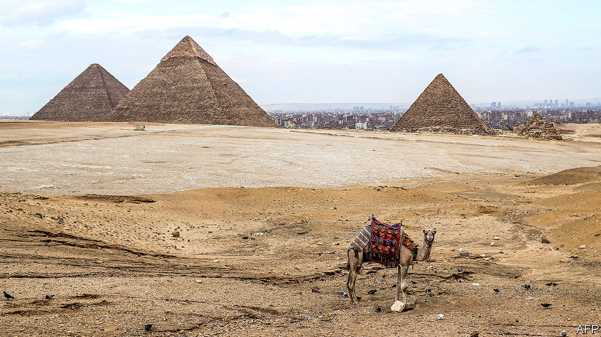
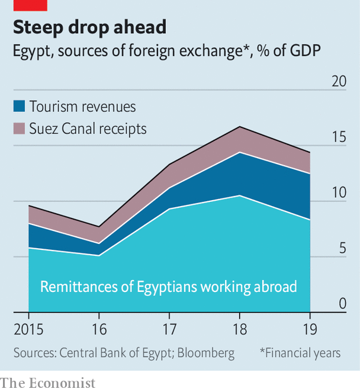

## Ahead of the covid curve

# Egypt chose a looser lockdown. Its economy is still in crisis

> Other Arab states will face similar problems

> May 23rd 2020BEIRUT

THERE WAS never much chance of social distancing in Cairo, a city more populous than most countries. Buses fill to overflowing, passengers dangling out of open doors. Millions live in informal settlements with streets barely wide enough for a sedan. And indeed, unlike many other Arab countries, Egypt did not try to impose a strict lockdown. There is a night-time curfew; busy spaces like restaurants and cafés are shut. But public transport is running, factories are humming and shops keep at least limited opening hours.

So far, Egypt has dodged a devastating outbreak. Confirmed cases—about 14,000 on May 21st, in a country of 100m—are an unreliable measure. Data suggest the government is testing only about 30,000 people a week (it does not release exact figures). Some Egyptians who test positive are told that relatives living in the same house cannot be swabbed unless they show symptoms. But the death toll, a more reliable measure, is less than seven per 1m citizens, below some wealthy Gulf states, to say nothing of hard-hit countries such as Britain (over 500 per 1m citizens).

The looser lockdown has not spared Egypt an economic crisis, however. The private sector, weak to start, is in free fall: the purchasing managers’ index crashed from 44.2 in March to 29.7 in April, an all-time low (anything below 50 suggests a contraction). Export orders fell even faster. Big sources of foreign currency are particularly vulnerable to a downturn. Citizens were already struggling after years of political turmoil and austerity; the state lacks the resources and reach to deliver large amounts of aid. Egypt may be first, but similar problems will clobber the Arab world’s other non-oil states in the coming months.

First to suffer was tourism, which employs one in ten Egyptians. Last year foreign visitors brought in $13bn, about 5% of GDP (see chart). With airports closed since March, revenue is now zero. The national carrier, Egyptair, had hoped to resume international flights in June, but the government has extended the closure indefinitely. Desperate to snag some cash, hotels have started to reopen (at a maximum 25% occupancy) for domestic tourists, but they spend a lot less than foreigners.

A larger concern is the 3.4m Egyptians who work overseas. In 2019 Egypt was the fifth-largest recipient of remittances: $27bn, about 9% of GDP. It is too early to say how far that number will fall, but the World Bank estimates that global remittances could drop by 20% this year. More than half of Egyptian expats work in the Gulf states, which have begun widespread salary cuts and lay-offs driven by low oil prices.

Even the Suez canal, which collects a reliable $5bn-6bn in annual transit fees, could take a hit. Fully laden vessels can pay almost $1m to sail through it. They pay the toll because the alternative is to sail thousands of miles round Africa. But low oil prices mean fuel is cheap, and weak global demand means ships are in no hurry to make port. Almost two dozen vessels sailing to and from Asia have skipped the canal and gone the long way. The canal authority has lowered fees to stay competitive.

Foreign reserves, which plunged after the revolution in 2011, had recovered to a comfortable $45bn in February. They are now dropping again, to $37bn at the end of April, as the state covers loan repayments and portfolio outflows. Fitch, a ratings agency, thinks they will hit $31bn this year. It sees the current-account deficit widening to 5.3% of GDP, up from 3.6% last year.

Bankers estimate that Egypt will need at least $10bn in external financing. It has already turned to the IMF. Last year it finished a three-year, $12bn IMF programme that trimmed the deficit to 8% of GDP, from 12% three years earlier. The fund has already approved $2.8bn in new emergency financing and is in talks for a standby loan of up to $5bn more.

Still, the state has limited firepower to help those struggling. Civil servants and pensioners will receive a modest pay bump. But many will have to give back 1% of their monthly income in a new “corona tax”. Thousands of families were added to the main cash-transfer schemes, which reach 10% of the population. The central bank has earmarked 50bn pounds ($3.2bn) for soft loans to help tourist businesses. They carry two-year repayment terms; travel agents think it will take at least that long for the sector to rebound. Informal workers generate perhaps half of GDP. Most are now idled. The government promised them 500 pounds a month for three months—less than half the average weekly wage. Charities are distributing twice as many food boxes this Ramadan as last year.

Business is slumping. Many big firms reported soft sales in the first quarter, which captures only the early weeks of the pandemic. GB Auto, a car giant, saw revenue fall by 4.1% compared with 2019. Edita, a snack firm, reported a 44% drop in year-on-year profits. Billboards along Cairo’s main roads, which should be full of advertisements aimed at Ramadan shoppers, are blank. Sensing a growing unease, the government has stifled any criticism.

Other Arab states are emerging from lockdown into the same problems. Although Egypt’s tourism revenues are large in absolute terms, the sector in Tunisia, Lebanon and Jordan is bigger as a share of GDP. The latter two also depend heavily on remittances. All three have lower long-term credit ratings than Egypt (none worse than Lebanon, which defaulted in March). Egypt was astute to ask the IMF for early help: its neighbours are not far behind. ■

Editor’s note: Some of our covid-19 coverage is free for readers of The Economist Today, our daily [newsletter](https://www.economist.com/https://my.economist.com/user#newsletter). For more stories and our pandemic tracker, see our [hub](https://www.economist.com//news/2020/03/11/the-economists-coverage-of-the-coronavirus)