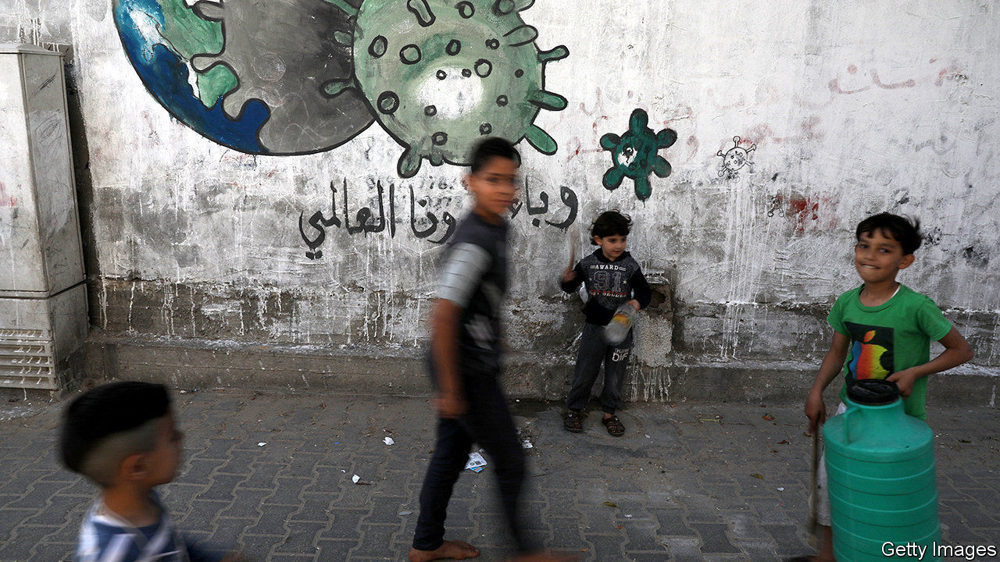
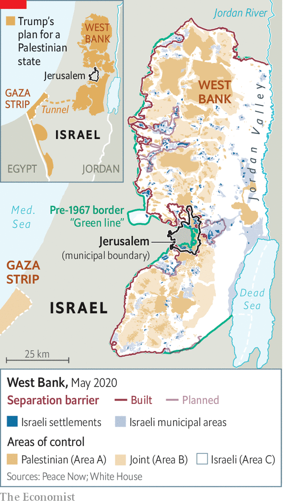

## West Bank job

# How fast will Israel’s new government proceed with annexation?

> A period of co-operation with the Palestinians may be coming to an end

> May 21st 2020JERUSALEM

IT HAS BEEN six years since Israeli and Palestinian leaders last talked to each other. There is no end in sight to the decades-old confrontation between the two sides. But the outbreak of covid-19 has at least led to “inspiring examples” of co-operation, says Nickolay Mladenov, the UN’s envoy in the region. On May 19th, for example, Israel allowed a plane from the United Arab Emirates, with which it does not have formal relations, to deliver medical supplies to the Palestinians. Israel itself has trained Palestinian medics and ensured that testing kits and protective gear reach the occupied territories. It is also planning a loan for the Palestinian Authority (PA), which runs the West Bank. “The recognition of this interdependence could—if there is political will—translate into tangible progress towards resolving the conflict,” Mr Mladenov says hopefully.

Yet a new government in Israel, sworn in on May 17th, may bring this period of co-operation to an end. After three elections and over a year of political deadlock, Binyamin Netanyahu, the prime minister, reached a deal with his former rival, Benny Gantz, to share power. Mr Netanyahu will stay in the top job until November 2021, when Mr Gantz (currently the “alternate prime minister”) will take over. The big question is how will they proceed with annexation. Mr Netanyahu has promised to extend Israeli sovereignty over chunks of the West Bank that the Palestinians see as part of their future state. According to the coalition agreement, he can hold a vote on annexation in the cabinet or parliament any time after July 1st. America must also approve any move.

Donald Trump, America’s president, gave Mr Netanyahu a push in January when his administration released a peace plan that would have Israel maintain control of all of Jerusalem and take parts of the West Bank, where Israel has dozens of settlements, and all of the Jordan Valley (see map). In his inaugural speech Mr Netanyahu sounded eager “to write a glorious new chapter in the history of Zionism”. But currently he is focused on restoring “jobs, jobs, jobs” to an economy hit hard by the virus—and fighting corruption charges in a trial that begins on May 24th. He has not specified a timetable for annexation, and when he spoke to his new ministers he didn’t list it as a priority. “It was a good election gimmick for Netanyahu to rally his base,” says a minister. “And it worked. But I don’t think he’s going to go through with it. Perhaps he’ll make do with a symbolic annexation of a couple of settlements.”

Mr Netanyahu’s new partners are also sounding cautious. Gabi Ashkenazi, the foreign minister (and an ally of Mr Gantz), says the Trump plan is a “historic opportunity”, but that Israel will proceed “responsibly, in co-ordination with the United States, while safeguarding peace agreements and Israel’s strategic interests”. Mr Ashkenazi is concerned about Jordan, which is at peace with Israel and is home to millions of Palestinians. King Abdullah of Jordan worries that annexation would kill any hope of a two-state solution and stir up his own Palestinian subjects.

Mr Netanyahu’s supporters want him to push ahead while Mr Trump is still in office. Lately, though, the White House, under pressure from Arab leaders, has sounded less gung-ho about annexation. When Mike Pompeo, America’s secretary of state, visited Israel on May 13th, he said Mr Netanyahu and Mr Gantz, a former army chief who opposes unilateral annexation, “will have to find the way forward together”. Israeli diplomats say the administration has asked Mr Netanyahu to put things on hold, for now. Some on the Israeli right hope that Mr Trump, who is up for re-election in November, may yet push for annexation in order to win over evangelicals and right-wing Jewish voters.

The Palestinians, for their part, are outraged. Mahmoud Abbas, their president, says the annexation clause in the Israeli coalition deal means the PA is no longer bound by its agreements with Israel. He has made such statements before, but never followed through by, for example, ending security co-operation. Joint action against the outbreak continues. The death rate from covid-19 has been low on both sides. “I can work with my Israeli colleagues against the coronavirus for the health of my people,” says a Palestinian doctor. “It doesn’t change the ugly reality of occupation.” ■

## URL

https://www.economist.com/middle-east-and-africa/2020/05/21/how-fast-will-israels-new-government-proceed-with-annexation
