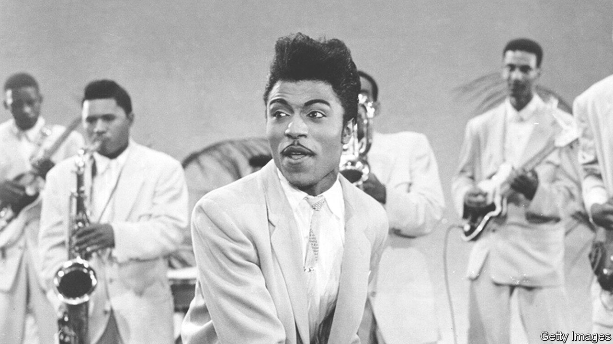

## Gonna have some fun tonight

# Little Richard died on May 9th

> The king of rock & roll and hero for a generation of musicians was 87

> May 21st 2020

WHAT WAS it, that thing he had? What was it that propelled him in 1955 from washing pots at the Greyhound bus station in Macon, Georgia, to being such a star that girls fainted to see him and he was paid $10,000 an hour? And from a cat that everyone laughed at, never good for anything but scrubbing dishes, into the inventor of the sound that formed a whole generation of music-makers, from the Beatles to James Brown to Elton John to the Rolling Stones? Because almost everybody agreed: he was the one.

It was partly the look that got him noticed, the pancake make-up and mascara round those wildly staring eyes, the pencil moustache, the pompadour rearing up on his head. He’d borrowed all that from doing drag acts in local vaudeville shows, together with his ever-growing dazzle of sequins, glass beads and neon-bright colours to catch whatever spotlight there was. Then came the crazy antics: jumping around, sticking one leg up on the piano as he played, pretending to shove his lead saxophonist off the stage, until by the end of the show he’d be a pool of water, dabbing his face with a hanky and asking, “Am I still pretty?” (His band, the Upsetters, also in make-up, would be fairly sweating, too.) But all that came second to the electrifying rhythm of his pounding hands, the right hand especially, the piano roaring and reverberating like a train, and the voice that roared with it, throat-scraping hoarse, rising time after time to a yelp like a whistle: “Lu-cille-uh! Please come back where you belong!”

The words often made no sense, but that didn’t matter. Rhythm ripped it all up, so fast and wild that you just had to dance. As he whooped in “Tutti Frutti”, the record that made his name, Whop bop b-luma b-lop bam bom! That was his thing, right there: mix boogie-woogie with rhythm & blues and a shot of gospel, add those yips and shouts (it was tricky at first to sing so hard, but he got used to it), crank the volume, speed it way up. Other singers had done pieces of this. He took his woo-ooh-ooh from Marion Williams, his yelps from Ruth Brown, general inspiration from Mahalia Jackson, but it was he who combined them to produce, between 1955 and 1958, a slew of hits—“Good Golly Miss Molly”, “Long Tall Sally”, “Lucille”, “The Girl Can’t Help It”—that defined a new sound for a new age, rock & roll.

Once turned on he never turned off, plugged into that energy 24/7. Inevitably it shook society up, and not just musically. His sexuality did that, too. He swerved around on whether he was gay or not, picking “omnisexual” as what came nearest, but he was proud to say that he had worn purple, and eyelashes, when no men were wearing that. He was the bronze Liberace, the Magnificent One; didn’t care two cents what people thought.

The make-up, though, had been partly to show he was no threat to white women, and his stardom challenged views on race even more. When he began, no Top 40 radio station would play black artists; his songs wouldn’t feature there unless they were covered by white singers like Pat Boone who didn’t have the rhythm or the speed, couldn’t get their mouths together. But white audiences accepted his music from the start, and he was the first to get played. At his shows in the South, still segregated, the white kids were so keen to get close to him that they would jump down from their balcony seats to dance with the blacks below.

The seeds of this liberating music had been in him a long time. “Tutti Frutti” had jumped around in his head since his boyhood in the slums of Macon, together with the songs of the washboard man (“Bam-a-lam-bam/You shall be free) and the high cries of the travelling grocer (“Blackeyed peas and a barrel of beans”). His songs were his experiences: “Good Golly Miss Molly” was something his old toothless Aunt Lulu said, when they put marijuana in her tobacco pipe. Rhythm & blues, “devil music”, was not allowed at home, but whatever music he seized on, he liked loud. At church he was barred once for hollering, and he liked to try out zippy interjections when he led the hymns. Crazy-noise-making, and his love of flouncing in curtains, led his father to kick him out of the house when he was 16 or so. He hadn’t yet dared try his music on the public, but he was already sure he had that little thing, his own thing, which he wanted the world to hear. It would get him the Cadillac he yearned for, at least. He did better than that; at 19 he had a record contract, and at 23 national fame.

In the event the stardom road zigged and zagged all over the place. The Spirit of the Lord kept butting in, sending dreams in which he was saved from crashing aeroplanes or warned of coming damnation. In 1957, while everyone was fawning over him, he suddenly threw it all up and went off to Alabama to become a minister. Four years later he was enticed back to showbiz and feted all over again, mobbed by 40,000 fans when he flew to Europe, and on later visits offering slots in his triumphant tours to both the fledgling Beatles and the fledgling Rolling Stones. (When he read the Bible backstage, the irreverent Beatles would sit reverently round just to enjoy the sound of the master’s voice.) By 1975, though, when he was spending $10,000 a month on cocaine, eating it, snorting it, freezing it, he returned to sobriety and travelled round preaching. Between the two pillars of his life, God and the half-dozen huge hits of his early career—which audiences never tired of—he bounced like a ball on a string.

But why, he thought more and more, should these be separate? God brought joy to the human race, but so did rock & roll. His music was a healer; it could make the blind see and the lame walk. When he put on vests of mirrors and billowing shirts, as he went on doing into the next century, he was winged like an angel, a beautiful Living Flame. He hardly needed an electric suit, though he had one. He could light the world fine as it was. Because the real secret, the real thing he had, was a magic power that made you dance yourself to glory. Whop bop b-luma b-lop bam bom! ■

## URL

https://www.economist.com/obituary/2020/05/21/little-richard-died-on-may-9th
