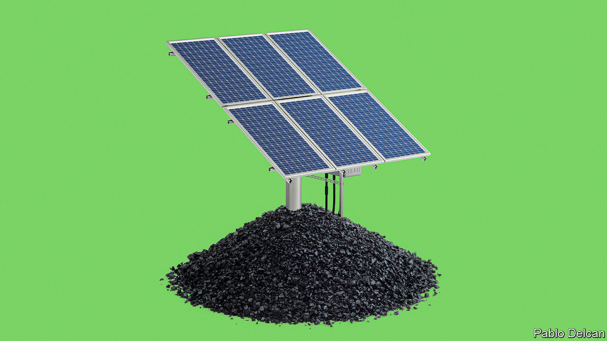
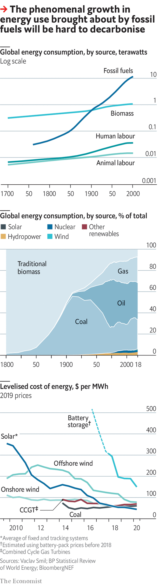

## Not-so-slow burn

# The world’s energy system must be transformed completely

> It has been changed before, but never as fast or fully as must happen now

> May 23rd 2020

FOR MORE than 100,000 years humans derived all their energy from what they hunted, gathered and grazed on or grew for themselves. Their own energy for moving things came from what they ate. Energy for light and heat came from burning the rest. In recent millennia they added energy from the flow of water and, later, air to the repertoire. But, important as water- and windmills were, they did little to change the overall energy picture. Global energy use broadly tracked the size of a population fed by farms and warmed by wood.

The combination of fossil fuels and machinery changed everything. According to calculations by Vaclav Smil, a scholar of energy systems at the University of Manitoba, between 1850 and 2000 the human world’s energy use increased by a factor of 15 or so.

The expansion was not homogeneous; over its course the mixture of fossil fuels used changed quite dramatically. These are the monumental shifts historians call “energy transitions”. They require huge amounts of infrastructure; they change the way the economy works; and they take place quite slowly.

James Watt patented his steam engine in 1769; coal did not exceed the share of total energy provided by “traditional biomass”—wood, peat, dung and the like—until the 1900s (see chart overleaf). It was not until the 1950s, a century after the first commercial oil well was drilled in Titusville, Pennsylvania, that crude oil came to represent 25% of humankind’s total primary energy. Energy transitions were slow largely because the growth in total energy use was fast. In the century it took oil to capture a quarter of the total, that total increased. They are also always incomplete. New fuels may reduce the share of the pie that old fuels control, but they rarely reduce the total energy those fuels supply. Much more “traditional biomass” is burned by the world’s poor today than was burned by the whole world in 1900.

To give the world a good chance of keeping global warming, measured against the temperature pre-coal, well below 2°C (3.6°F) will require an energy transition far larger and quicker than any before it. In the next 30-50 years 90% or more of the share of the world’s energy now being produced from fossil fuels will need to be provided by renewable-energy sources, nuclear power or fossil-fuel plants that bury their waste rather than exhaling it.

During this time, the pie will keep growing—but not necessarily as fast as it used to. The direct relationship between GDP and energy use, which held tight until the 1970s, has weakened over the past half century. It is possible for growth per person to continue without energy use per person increasing. Though the population is no longer growing as fast as it did at the 20th-century peak of its increase, it will still be the best part of 2bn higher by mid-century. And all those people should be able to aspire to modern energy services. Today more than 800m people still lack electricity—hence all that burning of traditional biomass.

The good news, however, is that governments say they are willing to push through the change. Previous transitions, though shaped by government policy at national levels, were mostly caused by the demand for new services that only a specific fuel could provide, such as petrol for engines.

The growth in renewable-generation capacity is the exception. It has not been driven by the fact that renewable electrons allow you to do things of which those from coal are not capable. It has largely been driven by government policy. This has not always had the near-term effects for which such policy should aim. Germany’s roll-out of renewables has been offset by its retreat from nuclear, and its emissions have risen. But subsidies there and elsewhere have boosted supply chains and lowered the cost of renewable technologies.

During the 2010s the levelised cost (that is the average lifetime cost of equipment, per megawatt hour of electricity generated) of solar, offshore wind and onshore wind fell by 87%, 62% and 56%, respectively, according to BloombergNEF, an energy-data outfit (see chart overleaf). This has allowed deployments that were unthinkable in the 2000s. Britain now has more than 2,000 offshore wind turbines. They are built by developers chosen based on how low a price they are willing to take for their electricity (the government pledges to make the cost up if the market price falls below it).

In 2015 winning bids were well over £100 ($123) per MWh, far higher than the cost of fossil-fuel electricity. Thanks to predictable policy, fierce competition and technical progress, a recent auction brought a bid as low as £39.65 per MWh, roughly the level of average wholesale power prices. Solar and onshore wind are even less expensive. About two-thirds of the world’s population live in countries where renewables represent the cheapest source of new power generation, says BloombergNEF.

Solar power is the really spectacular achiever, outstripping the expectations of its most fervent boosters. Ramez Naam, a bullish solar investor, recently recalibrated his expectations to foresee a future of “insanely cheap” solar power. By 2030, he reckons, in sunny parts of the world, building large new solar installations from scratch will be a cheaper way of getting electricity than operating fully depreciated fossil-fuel plants, let alone building new ones. Michael Liebreich, a consultant on renewable energies, speculates about a “renewable singularity” in which cheap renewable electricity opens up new markets that demand new capacity which makes electricity cheaper still.

Even without such speculative wonders, the effect of renewables is appreciable. Together with natural gas, which America’s fracking revolution has made cheaper, solar and wind are already squeezing coal, the energy sector’s biggest emitter (a megawatt of coal produces a stream of emissions twice the size of that given off by a megawatt of gas). In 2018 coal’s share of global energy supply fell to 27%, the lowest in 15 years. The pressure that they can apply to oil is not yet as great, because oil mostly drives cars, and electric cars are still rare. But as that changes, renewables will come for oil, as they are already coming for gas.

There are stumbling blocks. Neither the sun nor the wind produces energy consistently. Germany’s solar-power installations produce five times more electricity in the summer than they do in the winter, when demand for electricity is at its peak. Wind strengths vary not just from day to day but from season to season and, to some extent, year to year. This amounts to a speed bump for renewables, not a blockade. Long transmission lines that keep losses low by working at very high voltages can move electricity from oversupplied areas to those where demand is surging. Lithium-ion batteries can store extra energy and release it as needed. The economic stimulus China announced in March includes both ultra-high-voltage grids and electric-vehicle-charging infrastructure.

As the sun and wind account for a larger share of power, renewables might store power by splitting water to create hydrogen to be burned later. More ambitiously, if technologies for pulling carbon dioxide back out of the air improve, such hydrogen could be combined with that scavenged carbon to make fossil-free fuels.

In doing so, they might help remedy the other problem with renewables. There are some emissions which even very cheap electricity cannot replace. Lithium-ion batteries are too bulky to power big planes on long flights, which is where artificial fuels might come in. Some industrial processes, such as cement-making, give out carbon dioxide by their very nature. They may require technology that intercepts the carbon dioxide before it gets into the atmosphere and squirrels it away underground. When emissions cannot be avoided—as may be the case with some of those from farmland—they will need to be offset by removing carbon dioxide from the atmosphere either with trees or technology.

None of this happens, though, without investment. The International Renewable Energy Agency, an advisory group, estimates that $800bn of investment in renewables is needed each year until 2050 for the world to be on course for less than 2°C of warming, with more than twice that needed for electric infrastructure and efficiency. In 2019 investment in renewables was $250bn. The big oil and gas firms invested twice as much in fossil-fuel extraction. 

If governments want to limit climate change, therefore, they must do more. They do not have to do everything. If policy choices show that the road away from fossil fuels is right, private capital will follow. Investors are already wary of fossil-fuel companies, eyeing meagre returns and the possibility that action on climate change will leave firms with depreciating assets.

But governments need to make the signals clear. Around the world, they currently provide more than $400bn a year in direct support for fossil-fuel consumption, more than twice what they spend subsidising renewable production. A price on carbon, which hastens the day when new renewables are cheaper than old fossil-fuel plants, is another crucial step. So is research spending aimed at those emissions which are hard to electrify away. Governments have played a large role in the development of solar panels, wind turbines and fracking. There is a lot more to do.

However much they do, though, and however well they do it, they will not stop the climate change at today’s temperature of 1°C above the pre-industrial. Indeed, they will need to expand their efforts greatly to meet the 2°C target; on today’s policies, the rise by the end of the century looks closer to 3°C. This means that as well as trying to limit climate change, the world also needs to learn how to adapt to it. ■

Correction (May 22nd 2020): This article previously stated that Britain had 10,000 offshore wind turbines. In fact that is the total number of turbines; only 2,016 are offshore. We're sorry for the error.

## URL

https://www.economist.com/schools-brief/2020/05/23/the-worlds-energy-system-must-be-transformed-completely
