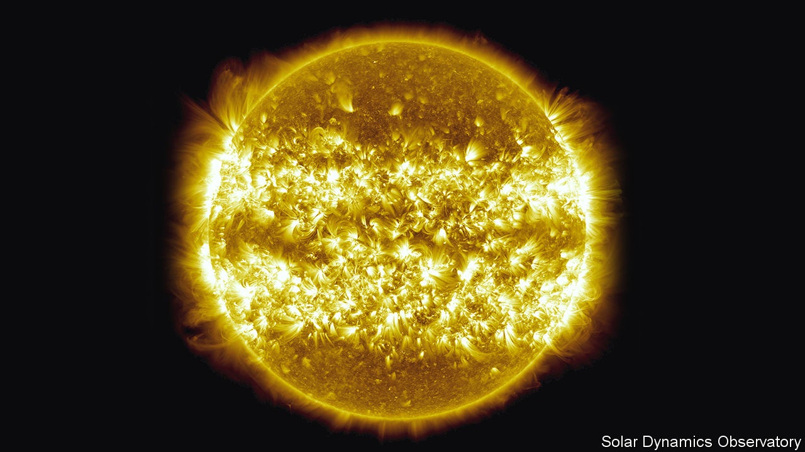

## Solar’s new power

# New solar cells extract more energy from sunshine

> Much greater efficiency is coming

> May 21st 2020

SOLAR ENERGY has had a good crisis. In many parts of the world skies clear of pollution have helped photovoltaic power stations, which convert light into electricity, become more productive and reliable. Declining demand, meanwhile, has seen coal- and gas-fired stations taken offline. In Britain, on April 20th, solar generation peaked at 9.7 gigawatts. At the moment this happened that represented almost 30% of the country’s electricity supply—ten times the usual proportion. In Germany the proportion of solar in the mix reached 23% for an entire week in April, compared with an average of about 8% during 2019.

Though temporary, such figures are impressive. Solar power, they suggest, has come of age. In some ways, however, despite solar’s new and shiny image, this is the victory of an old technology.

The first practical solar cell was made in the 1950s at Bell Labs in New Jersey. It had an efficiency of 6% and was horrendously expensive. It did, though, prove to have a killer application in powering the satellites of the superpowers in the forthcoming space race. That kept interest alive.

Gradually, costs came down, efficiencies tripled to 17-20% and applications widened, until the point, now arrived at, where grid managers faced with surplus capacity are preferring solar to fossil-fuel generation. For all that they have got better in detail, though, solar cells have stayed the same in principle. Two layers of ultrapure (99.9999%) silicon, each doped with an additive to make it semiconducting, absorb light and use the energy from this to move electrons across the junction between them, thus generating an electric current.

For gridscale electricity produced in standard solar farms this arrangement is likely to continue. But many people think solar energy has wider potential than that. Some want to redesign solar farms in radical ways. Others see it as having small-scale applications that do not require connection to a grid. Both of these approaches will require efficiencies that standard silicon has never managed to achieve. But both will permit high prices for cells that do so.

One way to boost a cell’s efficiency is to add layers tuned to different parts of the solar spectrum. This means reaching beyond silicon to other materials. So-called III-V semiconductors, made of elements from group III of the periodic table (aluminium, gallium and indium) and group V (phosphorus and arsenic) are one approach. Indeed, gallium arsenide is already used in applications like satellites. John Geisz and his colleagues at the National Renewable Energy Laboratory, in Colorado, have produced a six-junction cell containing various III-V mixtures, each with different light-absorbing properties. This cell has an efficiency of 47.1% in laboratory conditions—a new record, which the researchers reported in Nature Energy in April. With further work, they reckon, an efficiency of more than 50% should be possible.

Intriguingly, the efficiency of Dr Geisz’s cell rises as more light is concentrated on it. Laid out in standard solar farms it would manage a bit under 40%. The 47% figure comes when it is bathed in illumination equivalent to 143 suns. Roughly speaking, then, a six-junction cell with a suitable arrangement of mirrors concentrating the sun’s light onto it could turn out the same amount of electricity as a standard silicon cell that had 400 times the area. Those are the sorts of numbers that disruptive technologies are made of.

Another promising group of materials for making new types of solar cells are perovskites. The original substance of this name is a mineral, calcium titanium oxide, discovered in the Ural mountains in 1839 and called after Count Lev Perovski, a Russian mineralogist. As is often the way with minerals, though, the basic crystal lattice involved can be created from many sorts of atoms. “Perovskite” has thus now become a generic term for any of these variants.

Not all perovskites are semiconductors. But a group based on a metal, such as tin, and a halogen, such as chlorine, bromine or iodine, do have that property. The ingredients of these metal-halide perovskites are, moreover, abundant and inexpensive. One of the leaders in the field of making cells out of them is Oxford PV, a British firm founded in 2010 to exploit work done on perovskites by Henry Snaith of Oxford University. The firm’s design is a hybrid structure, known as a tandem cell, that coats a silicon layer with perovskite.

This brings two advantages. One is that, like a multilayered III-V cell, a perovskite-silicon tandem cell divides up the job of capturing sunlight. The upper, perovskite, layer is tweaked to absorb light from the blue end of the spectrum. The lower, silicon, layer mops up the remaining wavelengths towards the red end. This makes for high efficiency. In a test in 2018 such a tandem cell set a new record for its type with an efficiency of 28%. Eventually, the firm’s engineers think, they can push this into the “mid-30s”.

The second advantage of piggybacking the perovskite on silicon is that the cells are fairly easy to make into solar panels using standard industrial processes. That helps keep them competitive with conventional solar panels. A new factory that will do just this is currently under construction in Germany. The hope is that—the pandemic provided—the first panels made in this plant will go on sale next year.

Whether an efficiency in the mid-30s will be enough to displace silicon cells from part of their existing market remains to be seen. Perovskites may, however, have applications doing jobs that silicon cannot manage. For instance, they work well in low light intensities. This has permitted a group led by Thomas Brown of Tor Vergata University of Rome and John Fahlteich of the Fraunhofer Institute’s campus in Dresden, Germany, to develop versions which operate at the levels of illumination found inside buildings. The amount of energy in artificial lighting is vastly less than that in sunshine. Nevertheless, Dr Brown and Dr Fahlteich have found, according to a paper they published this month in Cell Reports Physical Science, that their cells can achieve a conversion efficiency of up to 22.6%, thereby producing enough juice to run small, low-power devices like wireless sensors and remote-control units, which would otherwise require batteries.

Though it may seem odd to turn artificial, indoor lighting into electricity, given that it has been created from electricity in the first place, the truth is that all such light which does not end up entering a human eye is wasted. This approach simply reduces the level of waste. With the growth of the so-called internet of things, which relies on many different types of sensors, wireless control systems and other bits of electronic kit, such an approach could have wide application. If it works, the label “batteries not included” will go from being a warning to a recommendation.■

## URL

https://www.economist.com/science-and-technology/2020/05/21/new-solar-cells-extract-more-energy-from-sunshine
