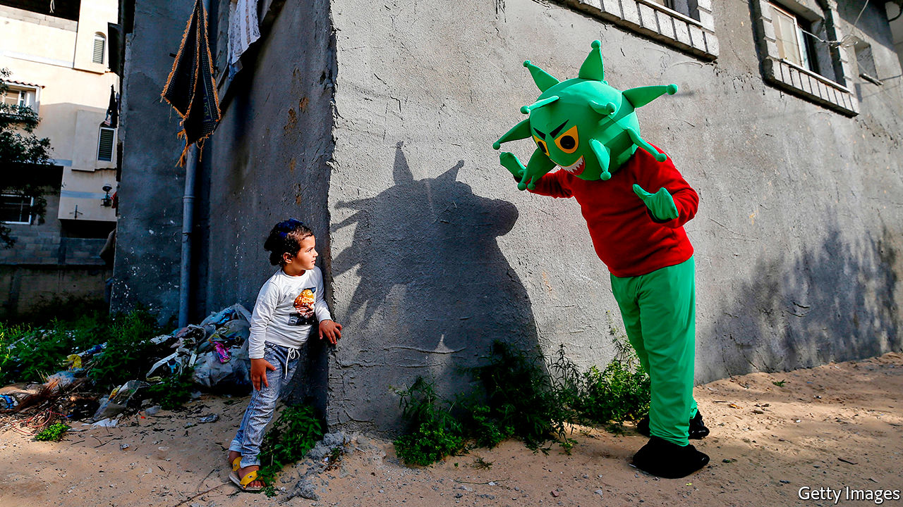

## Suffer the little children

# Thoughts that the young are not much affected by SARS-CoV-2 look wrong

> It seems to manifest as a rare syndrome called Kawasaki disease

> May 23rd 2020

Editor’s note: Some of our covid-19 coverage is free for readers of The Economist Today, our daily [newsletter](https://www.economist.com/https://my.economist.com/user#newsletter). For more stories and our pandemic tracker, see our [hub](https://www.economist.com//news/2020/03/11/the-economists-coverage-of-the-coronavirus)

SOMETIME IN FEBRUARY or early March a six-month-old girl was admitted to a hospital in the Stanford area of California. She had a fever, a blotchy rash, mild congestion and cracked lips, and was refusing to eat. Her doctors diagnosed Kawasaki disease, a rare paediatric illness originally identified in Japan in 1967.

Kawasaki disease is poorly understood, but is suspected to be the result of an overreaction by the immune system to some as-yet-unidentified stimulus—which some past evidence suggests may be a coronavirus. If untreated (which is usually a result of misdiagnosis, precisely because it is so rare), it can result in potentially lethal cardiac complications. Recognise it in time to treat it, though, and patients normally recover. And in this case it was recognised, and the patient was treated appropriately. Moreover, as part of that treatment—because, although she had no respiratory problems she did have a fever—her doctors screened her for covid-19. The tests came back positive.

Not long after this incident, doctors in New York City started reporting a surge in cases of Kawasaki disease. In a typical year, New York might see a few dozen instances. The city’s health department has now confirmed 147 cases since the covid-19 epidemic began—though how many of these were in children infected with SARS-CoV-2 is unknown. In Britain, meanwhile, the South Thames Retrieval Service, which provides intensive care to children in parts of south-east England, including London, handled eight Kawasaki cases during a ten-day period in mid-April. All these patients, one of whom died, tested negative for the virus, but positive for antibodies related to it.

South Thames would normally expect to see one or two Kawasaki patients in a period like this, so eight might just about have been written off as a blip—except for the overlap with those antibodies and the fact that, in the week after the team concerned submitted their report, they documented a further 12 cases. Something odd, it seems, is going on.

The strongest evidence yet that something odd is indeed going on comes from Italy, in the form of a paper published in the Lancet by Lorenzo D’Antiga, a paediatrician at Pope John XXIII hospital in Bergamo. This city has one of the worst local covid-19 epidemics in the country. Dr D’Antiga noted early on in it that children with Kawasaki-like symptoms were arriving at his hospital at a substantially increased rate.

Between the beginning of 2015 and February 17th of this year Pope John XXIII had admitted only 19 such patients. Between February 18th and April 20th it received ten. This is equivalent to a monthly incidence 30 times that of the previous five years. Nor was the number of these cases the only odd thing. The previous 19 had had an average age, on presentation at the hospital, of three. The 2020 patients have an average age of seven-and-a-half.

Spotting this anomaly led Dr D’Antiga to collect nose swabs and blood samples from his Kawasaki patients, regardless of their other symptoms, in order to search for signs of the virus. The results were intriguing. Only two of the swabs tested positive—an indication that a patient has a current, active infection. Eight of the ten children, though, had pertinent antibodies. These included the two with positive nose swabs. But the other six had clearly been infected in the past. Moreover, further blood samples revealed that nine of the ten recent patients, including the two with negative antibody tests, had markedly reduced white-blood-cell and lymphocyte levels—traits commonly seen in adult covid-19 patients who are severely ill.

How far the implications of all this extend is not yet clear. The elevated Kawasaki caseload may be seized on by those who would like to keep schools closed in the face of the epidemic. The illness does, nevertheless, remain rare, and recognising it early leads to a good prognosis. That argues for vigilance, rather than the continued interruption of children’s education. More positively, understanding how the virus interacts with the immune system to produce these symptoms may help to develop weapons with which it can be defeated.■

## URL

https://www.economist.com/science-and-technology/2020/05/23/thoughts-that-the-young-are-not-much-affected-by-sars-cov-2-look-wrong
