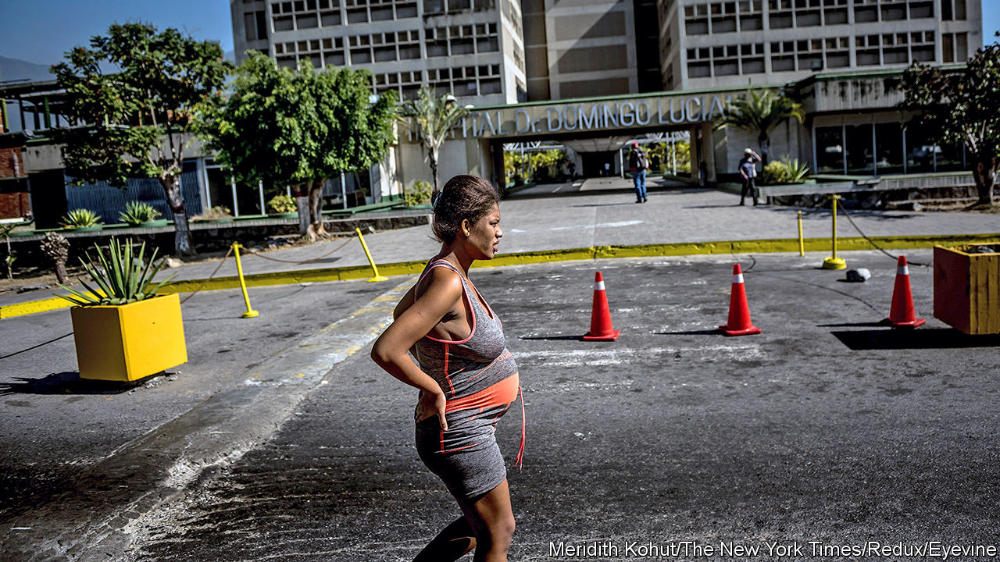

## Birth pangs

# Latin America ponders how to fight “obstetric violence”

> The region has lots of laws to improve treatment of expectant mothers. They are not working

> May 21st 2020

“COME ON, SMILE! This is the most important day of your life.” The midwife was upbeat. But Agustina, a 38-year-old comedian and brand-new mother, was shaken. It was 2012; she had just undergone a Caesarean section at a hospital in Argentina. Her obstetrician, she believes, had made the surgery more likely by inserting hormones into her vagina during a check-up, without explanation.

Two men performed the dangerous Kristeller manoeuvre, pushing down on her belly. She fainted. An assistant lightly slapped her face to keep her awake. Another tied her arm to the bed. None of it felt right. But, she says, “I thought the doctor is like your boss: you do what he tells you.”

Her ordeal was not unusual. Surveys in Latin American countries have found that between a quarter and a third of women who give birth suffer abuse at some point in the process. In one from 2016, 24% of Mexican women reported abuse in their last childbirth and 17% reported non-consensual care. A common form of mistreatment was humiliating comments by staff, reported by 7% of women. Other bad practices were withholding of painkillers without explanation (which 5% of women experienced) and forced contraception and sterilisation after childbirth (4%). A tenth of women who had C-sections said they had not given consent. Very young, unmarried and poor women in public hospitals were likeliest to suffer. Activists denounce what they call “obstetric violence”, a term they apply not only to violent acts. 

Such abuse is, perversely, a consequence of progress. Better health care reduced maternal and infant mortality. Yet it also reinforced a culture that treats doctors as infallible, patients as passive and medical intervention as the first resort, even when harmful or against a woman’s wishes. Covid-19 may make the problem worse.

Mistreatment of expectant mothers is not confined to Latin America. A fifth of recent mothers in Italy report abuses. In Ethiopia three-quarters do. What makes the region unusual is decades of activism that have led to laws that seek to reduce abuse. In Brazil, a movement to “humanise childbirth”, led by feminists and public-health experts, has been active for at least 30 years. Later campaigns sought to “educate by law”, says Roberto Castro of the National Autonomous University of Mexico. Statutory changes would make people more aware of the problem, and therefore more likely to put pressure on doctors and other carers to behave well.

In 2007 Venezuela became the first country to define “obstetric violence” in law and make it a criminal offence. There it means the “appropriation of women’s bodies and reproductive processes by health professionals”. Similar laws followed in Argentina, Bolivia and Panama. Other measures are more practical. In 2001 Uruguay gave mothers-to-be the right to have a companion during delivery. This month Puebla, a Mexican state, classified as obstetric violence filming a birth without the mother’s consent. 

There is little evidence the laws are working. Few governments release data on implementation. The Mexican states of Tlaxcala and Morelos, among the five where abuse was most prevalent, according to the national survey, reported receiving no formal complaints, says the Information Group on Reproductive Choice, a nonprofit. Courts have been reluctant to go after doctors unless they have physically harmed the mother or baby, in part because other misdeeds cannot be proved using medical records. Rare punishments of doctors do not improve the conditions under which they operate, which is more important, says Arachu Castro of Tulane University in New Orleans. In Mexico some clinics are so overstretched that women give birth on pavements and lawns outside them. During the pandemic in some places some rights, like having a companion or choosing vaginal delivery, have been suspended.

Venezuela’s ruined health system makes a mockery of its “humanised-birth policy”. Women often have to bring their own medical supplies, such as antiseptics, to delivery rooms. When the country’s obstetric-violence law was enacted, Rogelio Pérez-D’Gregorio, a former head of the Society of Obstetrics and Gynecology, advised obstetricians to protect themselves by making note of missing medications and other problems beyond their control. 

Such deficits do not explain why women like Agustina, who gave birth at a well-appointed private clinic, suffer as they do. Mr Castro blames an “authoritarian medical disposition”, instilled at medical schools in male and female doctors alike. Critics say that teachers often emphasise technical prowess rather than patients’ welfare. Complaints to prosecutors in Brazil revealed that doctors-to-be were taught to perform episiotomies, surgical cuts to the perineum, to practise their skills, whether or not patients needed them. 

While activists focus on pressure and punishment, some governments and international agencies are trying to be less confrontational, starting with the language they use to describe the problem. Last year Rio de Janeiro’s Regional Council of Medicine, which supervises doctors, declared that the term “obstetric violence” was “invented to defame” them. The Pan American Health Organisation prefers to talk of “abuse during childbirth” because “many times just mentioning [obstetric violence] closes to us the possibility of dialogue”, says Bremen De Mucio, an adviser to the group. It plans to launch a seminar on respectful maternal care by October.

Governments are beginning to emphasise training. Brazil’s ministry of health has started a programme that stresses women’s rights in obstetrics in about 100 teaching hospitals. A similar programme in Argentina contributed to declines in infant and maternal mortality.

But progress is slow. When Agustina got pregnant again, in 2014, she changed obstetricians and hospitals and wrote a birth plan. It included a vaginal delivery and immediate skin-to-skin contact with her baby, who would drink breast milk, not formula. The hospital rejected all her requests. After a birth by C-section, a female doctor threatened to report Agustina to child-protection services. She left “screaming in my mind”, unable to work and struggling to bond with her baby. Her marriage ended. In 2016 she filed a lawsuit against her doctors, the hospital and the health insurers, the first case of its kind in Argentina. She is still awaiting a verdict.■