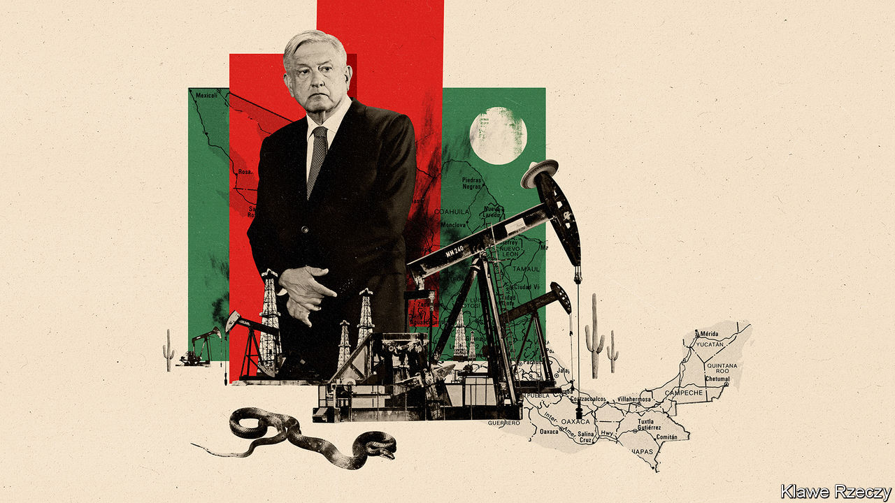

## Betting on black

# Nothing can shake AMLO’s fossil-fuel fixation

> Mexico’s president is thwarting the development of renewable energy

> May 21st 2020MEXICO CITY

THE PANDEMIC has given environmentalists some cause to cheer. Demand for fossil fuels has plunged. Dispatches of solar and wind energy are up a bit. In Mexico the weather is bright and breezy but the mood in the renewables industry is anything but. Instead of taking advantage of the pandemic to speed up the shift from oil to renewable energy, the country’s populist president, Andrés Manuel López Obrador, is doing roughly the opposite.

On May 15th Mexico’s energy ministry published rules for the national grid, bypassing the normal process of consultation. One orders its controller, CENACE, to choose security over “economic efficiency” when deciding which power to dispatch. Another increases “operational reserves”, backup plants that must run at all times. Both rules disadvantage renewable power and give priority to dirtier, more expensive energy from plants run by the Federal Electricity Commission (CFE), says Julio Valle of the Mexican Wind Energy Association.

These are the latest in a series of blows to Mexico’s renewable-energy industry. The fourth round of auctions for permits to supply renewable energy to the grid, scheduled for late 2018, was cancelled by the López Obrador administration, which had recently taken office. Last month CENACE said it would suspend the inspections that solar and wind farms must undergo to begin operating. All this has unnerved investors in Mexican renewables. The wind industry had expected to triple its capacity to 15GW by 2024. Now it is likely to reach little more than half that figure, says Mr Valle.

Before Mr López Obrador, who is often called AMLO, took over hopes were high. His predecessor, Enrique Peña Nieto, opened up oil and gas to private investment but also set ambitious clean-energy targets and let private wind and solar producers sell power to the grid. The most recent auction for renewables, in 2017, produced some of the lowest green-power prices ever recorded, and the cheapest electricity in Mexico. The country has abundant sun and wind. Its capacity to generate electricity from them has tripled since 2015 to 10.9GW, providing almost 15% of the total. That progress will have to continue if Mexico, the world’s 11th-largest emitter of greenhouse gases, is to meet its (unambitious) commitment to raise emissions by no more than 9% from 2010 to 2030.

But renewables represent much of what AMLO dislikes. Generators are privately owned, often by foreigners. Control is dispersed. Solar and wind farms seem risky. With the 9% drop in electricity demand during the pandemic, surges of power could cause blackouts, the government claims. (Renewables’ share is too small to pose a risk, the industry retorts.) In March, on a visit to a wind farm in the north, AMLO lamented turbines’ “visual pollution”.

Instead, he finds beauty in oil wells. He is openly nostalgic for the days when Pemex, the state oil company, was the engine of Mexico’s prosperity. It pumped from wells offshore from the state of Tabasco, his birthplace. Oil and gas have symbolised sovereignty since President Lázaro Cárdenas expropriated the industry in 1938. AMLO wants to maintain CFE’s share of electricity generation at 54%, its level when he took office, and plans to build seven oil- and gas-fired plants. Centralised, oil-fuelled power boosts AMLO’s political power, points out Duncan Wood of the Wilson Centre’s Mexico Institute in Washington.

The beleaguered state oil firm can expect almost bottomless support. AMLO wants to raise its production by a third to 2.4m bpd by 2024. Although he has been reluctant to boost government spending during the pandemic, since becoming president he has promised $15bn-worth of aid to the company. He plans to spend $8bn to build an oil refinery in Tabasco.

There is little sign that these bets will pay off. Even before oil prices slumped Pemex was in trouble. Its most profitable wells have dried up. The market for the heavy crude it increasingly produces is shrinking. When processed in Mexico’s outmoded refineries, it yields high-sulphur “bunker oil”. In January the International Maritime Organisation banned ships from using this. Refusing to have the crude refined in the United States, Pemex is stuck with oil that few want to buy. Analysts suspect the CFE is being told to use it, displacing natural gas (and shutting down an opportunity for renewables).

Pemex’s cost of production has nearly tripled over the past decade. Factoring in other costs, like taxes and pensions, Pemex needs a price of $70 to break even, says John Padilla of IPD, a consultancy. The pandemic plunge has brought it down to below $30. Pemex made a loss of $23bn in the first three months of 2020. In April Mexico nearly derailed a global agreement on production cuts by refusing to reduce output.

Oil prices may recover, but Pemex’s problems will not go away. More efficient and cleaner producers of oil will have the edge over Mexico as the world reduces its consumption. AMLO’s successor may have to bet on green.■