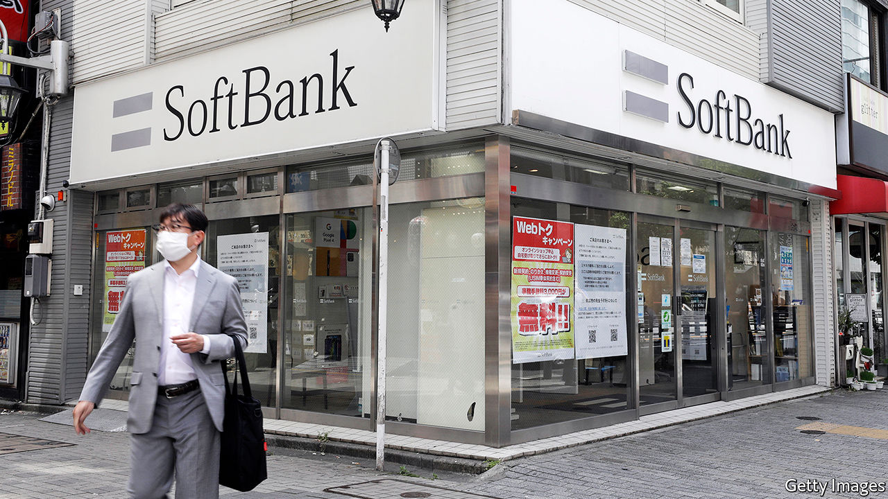

# Business this week

> May 21st 2020

SoftBank reported an annual net loss of ¥962bn ($8.8bn), mostly because of bad investments its Vision Fund made in WeWork, Uber, Didi and other tech firms. The Japanese conglomerate might not pay a dividend to shareholders for the first time since becoming a public company in 1994. Jack Ma, the founder of Alibaba, a Chinese internet giant, is to step down from SoftBank’s board as a director, an unexpected departure from a position he held for 13 years. SoftBank was an early investor in Alibaba and may use its stake in the company to fund a share buy-back programme. See [article](https://www.economist.com//business/2020/05/21/softbank-is-a-big-beneficiary-of-the-feds-pandemic-response).

Foxconn, the world’s biggest contract electronics manufacturer, which assembles products for Apple, Samsung and others, said it was over the worst of the covid-19 crisis and that all its factories in China have resumed normal operations. Net profit for the first three months of the year plunged by 90% compared with the same quarter last year.

A truce was called in a dispute between unions and Amazon in France, allowing the online retailer to reopen warehouses in the country that had been shut since mid-April. Amazon has made significant changes to allay workers’ fears that the buildings are unsafe during the covid-19 outbreak. Staff are having their temperatures checked, are required to wear masks, and their hours are being staggered in order to prevent crowding.

A surge in demand for food, fitness products and video games helped Walmart chalk up a 9% rise in sales for the three months ending April, year on year. The retailer said it had shifted some items over a few hours at a rate it normally sees in a few days. Target reported a similar rise in revenue, spurred by digital sales. The lockdown is producing winners and losers. J.C. Penney, a 118-year-old department-store chain, filed for bankruptcy protection, joining a list of collapsed businesses that includes J. Crew, Neiman Marcus and Gold’s Gym. See [article](https://www.economist.com//business/2020/05/23/walmart-ekes-out-an-edge-in-groceries-during-the-pandemic).

In total, retail sales in America plummeted by 16.4% in April over March, worse than economists had expected and the biggest decline since the current data series began in 1992.

The World Bank appointed Carmen Reinhart, a professor at Harvard, as its new chief economist. Born in Cuba, Ms Reinhart moved to America aged ten and has written widely about financial crises, boom and bust, and contagion.

London’s public-transport operator was granted a £1.6bn ($2bn) bail-out after the mayor, Sadiq Khan, threatened to cut services if the government didn’t help. Transport for London has said it expects a funding gap of “over £4bn” in 2020-21 because of the fall in passenger revenue amid the pandemic. Meanwhile, as travel restrictions in the city were relaxed, TfL listed 20 Tube stations it said commuters should try to avoid because of overcrowding.

In a co-ordinated effort, several national regulators in Europe, including in France, lifted a ban on short-selling that had been introduced during the stockmarket rout in March.

Despite the uncertainty in stockmarkets, JAB Holding, a privately held German conglomerate, launched an IPO of its JDE Peet’s coffee business, which includes the Senseo and Kenco brands. The listing in Amsterdam could eventually raise up to €2bn ($2.2bn) in total, which would make it Europe’s biggest IPO this year.

The number of people claiming unemployment benefit in Britain rose by 69% in April to 2.1m, the highest monthly increase ever. The number in paid employment dropped by nearly half a million, while median monthly pay fell by 3%, down from a 0.75% drop in March. Annual inflation plunged to 0.8%, fuelling speculation that the Bank of England might introduce a negative interest rate for the first time when it next meets. See [article](https://www.economist.com//finance-and-economics/2020/05/23/should-the-fed-cut-rates-below-zero).

Rolls-Royce cut 9,000 jobs and predicted that it will take several years for demand for its aircraft engines to return to pre-pandemic levels. The number of job losses, a sixth of its workforce, is more drastic than had been expected.

Uber announced that another 3,000 jobs would go at its offices around the world on top of the 3,700 lay-offs it had made only recently. Together the redundancies account for a quarter of its staff. The company is to focus on its ride-hailing and food-delivery businesses and ditch its job-matching service and artificial-intelligence unit.

TikTok poached a senior executive from Disney to be its new boss. Kevin Mayer oversaw Disney’s thrust into streaming and had been in the running to replace Bob Iger as CEO (the job went to Bob Chapek). He joins TikTok amid a surge in users viewing its dance, comedy and other “talent” short videos. It reached 2bn downloads last month, as bored locked-down teenagers flocked to the app in droves.

## URL

https://www.economist.com/the-world-this-week/2020/05/21/business-this-week
