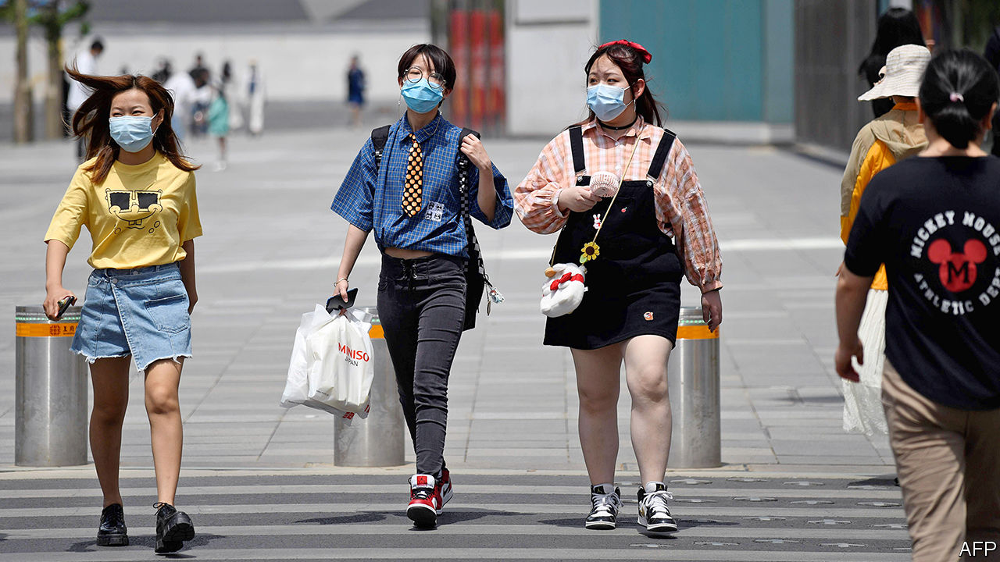
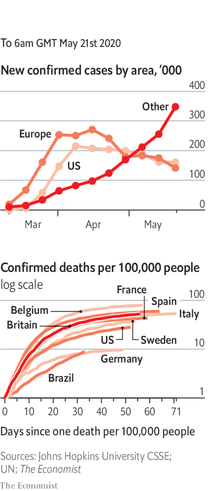

# Politics this week

> May 21st 2020

At the World Health Organisation’s annual summit (held remotely), China accepted an Australian-led motion calling for an inquiry into the origins of covid-19. This marked a climbdown by the Chinese government in the face of widespread demands for such a probe. Earlier, Donald Trump once again threatened to pull America out of the WHO unless it took unspecified steps to show “independence from China”. Despite its success in tackling the coronavirus, Taiwan was not invited to this year’s meeting.

China imposed tariffs on Australian barley on the day the WHO considered the Australian motion. China maintains that such tariffs have nothing to do with Australian criticism of its rulers. See [article](https://www.economist.com//asia/2020/05/21/china-punishes-australia-for-promoting-an-inquiry-into-covid-19).

A police watchdog in Hong Kong issued a report on the force’s handling of protests last year. It found no serious problem with police tactics, which involved lots of rubber bullets. Opposition politicians called it a whitewash. In the territory’s legislature, pro-government politicians took control of an important committee. They are expected to put forward a bill making it a crime to insult the Chinese national anthem. Some pro-democracy legislators were evicted after scuffling with guards.

The two men who both claimed to be the president of Afghanistan after a disputed election in September, Ashraf Ghani and Abdullah Abdullah, struck a power-sharing deal. Mr Ghani will remain president, while Mr Abdullah will take charge of peace negotiations with the Taliban. See [article](https://www.economist.com//asia/2020/05/21/afghanistans-two-rival-presidents-reach-a-deal).

Malaysia’s parliament met for the first time since Muhyiddin Yassin was appointed prime minister on March 1st. But it adjourned without voting on a no-confidence motion put forward by the prime minister whom Mr Muhyiddin replaced, Mahathir Mohamad. See [article](https://www.economist.com//leaders/2020/05/21/malaysia-needs-a-legitimate-government-to-fight-covid-19).

Cyclone Amphan, the most powerful storm to gather over the Bay of Bengal in 20 years, made landfall near the city of Kolkata in India. Initial reports suggested relatively few casualties, thanks to Indian and Bangladeshi efforts to evacuate people in its path.

Marco Rubio took over as chairman of the Senate Intelligence Committee, when Richard Burr stepped down amid an FBI inquiry into claims he benefited from a briefing about the emerging covid-19 threat in mid-February by selling stock.

Angela Merkel and Emmanuel Macron put forward a joint plan for a €500bn ($546bn) fund to help countries in the European Union recover from the pandemic. The money is to be provided as grants, not loans, and will be borrowed by the EU as a whole from markets. The “frugal four” (Austria, Denmark, the Netherlands and Sweden) are unhappy with the proposal, which requires unanimous agreement. See [article](https://www.economist.com//europe/2020/05/21/the-merkel-macron-plan-to-bail-out-europe-is-surprisingly-ambitious).

Italy greatly eased its lockdown, allowing most shops, restaurants and even hairdressers to reopen, though with strict controls. To many people’s surprise, the government said it hopes to allow flights to and from the country to resume soon. Greece and Portugal also indicated they would reopen to tourists.

After a year of political deadlock Israel swore in a new government. Binyamin Netanyahu will continue to serve as prime minister for 18 months. His former rival, Benny Gantz, will be his deputy, before taking over the top job. As part of the coalition deal the government can seek approval for annexing parts of the West Bank. Mahmoud Abbas, the Palestinian president, responded by threatening to pull out of agreements and security arrangements with Israel. See [article](https://www.economist.com//middle-east-and-africa/2020/05/21/how-fast-will-israels-new-government-proceed-with-annexation).

Forces aligned with the internationally recognised government in Libya captured an important air base from the forces of Khalifa Haftar, a rebellious general. General Haftar’s men then pulled out of parts of Tripoli, the capital, which they have tried to seize.

Police in the Democratic Republic of Congo killed 55 people in raids on a religious sect that had urged its followers, mostly ethnic Kongo, to drive members of other ethnicities from their homes.

The prime minister of Lesotho, Thomas Thabane, resigned after battling to stay in power despite claims he was involved in the murder of his ex-wife.

Nelson Teich quit as Brazil’s health minister after just one month in the job. The country’s president, Jair Bolsonaro, sacked the previous minister, who had pushed for stronger action against covid-19. The president and Mr Teich were also at odds. Brazil’s almost 300,000 confirmed cases are the third-highest number in the world.

El Salvador’s Supreme Court suspended an order from the president, Nayib Bukele, to extend a state of emergency, ruling that he must seek the approval of the Legislative Assembly. The legislature then passed a law to hasten the economy’s reopening, which Mr Bukele said he would veto.

Researchers in Argentina found fossils of an undiscovered type of megaraptor (large carnivorous dinosaur)in Patagonia. The dinosaur lived 70m years ago, was ten metres long and had 40cm claws. Megaraptors were slimmer than the Tyrannosaurus rex, and more prepared to race “with long tails to help them maintain balance”.

The Chinese city of Shulan was put under a strict lockdown after an outbreak of covid-19.

Infections in Russia surged to a cumulative total of 310,000. See [article](https://www.economist.com//europe/2020/05/21/russias-covid-19-outbreak-is-far-worse-than-the-kremlin-admits).

Protests erupted in a poor suburb of Santiago, Chile’s capital, over food shortages caused by the lockdown.

Donald Trump said he was taking hydroxychloroquine, a malaria drug, to ward off covid-19. Doctors warned that this is unsafe. See [article](https://www.economist.com//united-states/2020/05/23/how-the-worlds-premier-public-health-agency-was-handcuffed). 

America’s House of Representatives is to allow remote voting for the first time.

Captain Tom Moore, a war veteran who walked laps of his garden ahead of his 100th birthday to raise money for Britain’s health service, was awarded a knighthood. Captain Tom’s quest went viral, raising £32m ($39m), and cheering up a nation.

## URL

https://www.economist.com/the-world-this-week/2020/05/21/politics-this-week
