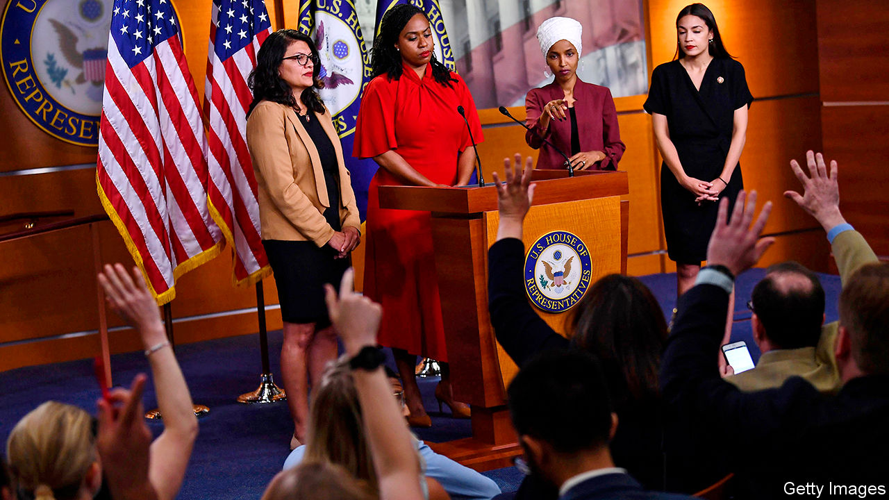

## Squad goals

# Donald Trump’s favourite freshmen face primaries

> Some high-profile left-wing House members are drawing challenges from the centre

> May 21st 2020WASHINGTON, DC

SIX DAYS after she was elected to Congress in November 2018, Alexandria Ocasio-Cortez posted a picture of herself with three other freshmen Democrats—Rashida Tlaib, Ayanna Pressley and Ilhan Omar—and tagged it simply, “Squad”. The name stuck, not least with Donald Trump, who called them “a very Racist group of troublemakers who are young, inexperienced and not very smart”, and urged them to “go back and help fix the totally broken and crime infested places from which they came.”

The quartet have revelled in Mr Trump’s contempt, and occasionally matched his vulgarity: hours after being sworn in, Ms Tlaib vowed to “impeach the motherfucker”. Many saw them as avatars of a new progressive era. In fact, they all replaced incumbents from safe Democratic seats; the Democrats retook the House in 2018 thanks to moderates from swing districts. And with the Squad’s first re-election just months away, three have drawn primary challengers—suggesting that it is not only Republicans who object to their politics.

The nickname links the four in America’s political imagination. But aside from being progressive, non-white women, they differ markedly from each other. Ms Pressley, who is running unchallenged, is an institutionalist who spent 13 years working for John Kerry when he was a senator. In 2009 she became the first black woman ever elected to Boston’s City Council. During her first year in office she introduced more legislation than her fellow Squad members, while keeping the lowest profile—the sort of approach that makes possible a long congressional career.

Ms Ocasio-Cortez, by contrast, has perhaps the highest profile of any representative other than Nancy Pelosi, the House speaker. She is a punctilious questioner and a skilled orator, overflowing with ambition and charisma. Those qualities, combined with her social-media game, made her a star. But her challenger, Michelle Caruso-Cabrera, believes her far-left politics are “robbing the district of opportunities”. Ms Ocasio-Cortez helped lead a fight against Amazon’s second headquarters, with its promise of 25,000 jobs nearby.

Ms Caruso-Cabrera has also dinged her opponent for hypocrisy, accusing her of staying in “a luxury apartment with a Whole Foods in the lobby” in Washington, while the virus wreaks havoc in her district. On this charge, Ms Caruso-Cabrera risks hurling rocks through glass walls. She did not move to the district until late 2019; before then, she lived for several years in the Trump International Hotel and Tower, on the south-west corner of Central Park. Ms Caruso-Cabrera is well-funded but, Ms Ocasio-Cortez’s primary dispatch of Joe Crowley last time round notwithstanding, New York is usually kind to its incumbents.

Ms Omar did not defeat an incumbent; she handily won a six-way primary for an open seat. Before becoming the first Somali-American elected to Congress, she was the first elected to Minnesota’s House of Representatives. Her colourful headdresses and pointed challenges to American foreign policy have made her both instantly recognisable and divisive.

Antone Melton-Meaux, a 47-year-old lawyer and the most serious of her primary opponents, blames Ms Omar for not “work[ing] with the party in a collaborative way...Being a progressive is about progress, meaning getting things done.” Nekima Levy Armstrong, a prominent civil-rights lawyer who headed Minneapolis’s NAACP chapter, has endorsed him, citing both his credentials and Ms Omar’s “lack of presence when it’s time to vote”. But Ms Omar won more votes in 2018 than any other freshman; she will be hard to defeat.

Ms Tlaib is probably the most endangered of the four. In 2018 she defeated Brenda Jones, the Detroit city-council president, by one point in a six-way primary that split the (majority) African-American vote. That contest also featured Bill Wild, the mayor of Westland, a mostly white city in the district’s western edge, who will not be running. Ms Jones is the sole opponent this time. If she can consolidate the African-American vote and capture a critical mass of Mr Wild’s voters, she will win.

Yet should Mr Trump lose in November, Squad members who return to Congress may get less attention. They would no longer have a president who boosts their profiles by insulting them. They would be outspoken progressives in an age of resurgent centrism. Where’s the fun in that?■

## URL

https://www.economist.com/united-states/2020/05/21/donald-trumps-favourite-freshmen-face-primaries
