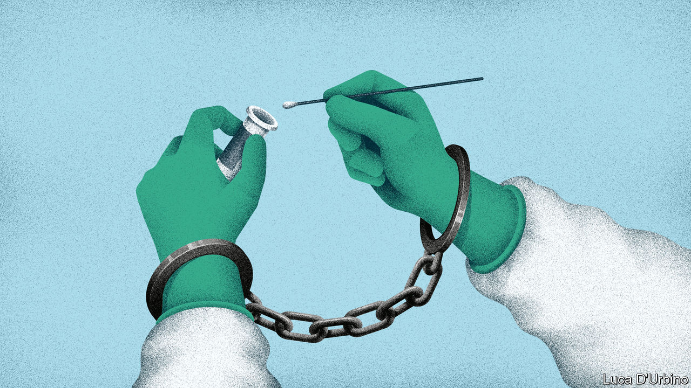

## To hell with experts

# How the world’s premier public-health agency was handcuffed

> The CDC has been absent with leave during the spread of covid-19

> May 23rd 2020

Editor’s note: Some of our covid-19 coverage is free for readers of The Economist Today, our daily [newsletter](https://www.economist.com/https://my.economist.com/user#newsletter). For more stories and our pandemic tracker, see our [hub](https://www.economist.com//news/2020/03/11/the-economists-coverage-of-the-coronavirus)

IN 2014 TOM FRIEDEN, the head of the Centres for Disease Control and Prevention (CDC), appeared almost daily to brief the public about the Ebola virus, the last pandemic to hit the United States before the coronavirus. His agency formulated policy for dealing with Ebola, and also embodied it. The CDC trained 6,500 people in America and 25,000 in West Africa to look after victims. The vaccine that finally treated the disease was tested in a CDC laboratory. The end of the outbreak confirmed the agency as the world’s leading public-health body.

Contrast that with what has happened during the coronavirus outbreak. On May 17th a senior White House official, the director of trade policy, said the CDC “really let the country down”. The administration gutted CDC guidelines telling restaurants, child-care centres and others how to reopen, reducing them from more than 50 pages to six. The CDC has been muzzled, says Jeremy Konyndyk of the Centre for Global Development, a think-tank. It has held no public briefings since mid-March. Meanwhile, the first testing kits that the World Health Organisation is distributing came from Germany.

What used to be America’s most prestigious public-health body has been relegated to one voice among many in the clamour of the White House. The result is to squander expertise, compound confusion about who, if anyone, is in charge of the federal response to the virus and make the reopening of the country riskier than it need be.

America is slowly passing its peak of infection. As it does so, Donald Trump is signalling that governors should take the lead in reopening states. In public-health terms, however, states play only a secondary role; state and city public-health departments mostly do routine things such as providing vaccines for children and hygiene certificates for restaurants. Combating an emergency, by running laboratories or conducting epidemiological research, is financed by the federal government; 55% of state and local public-health spending comes from federal sources. In public health, therefore, the CDC is by far the most important agency and state health departments depend upon it. Some are seeing sharp falls in the number of people testing positive for the virus, including New York and New Jersey. They may be in relatively good shape. But in parts of the South and Midwest, the number of new cases or hospitalisations is rising. Here, the diminishing of the CDC may imperil recovery.

How was the agency brought so low? On February 5th, the CDC sent to state laboratories a testing kit for covid-19 that it had been working on at headquarters. Something was wrong with one of the reagents and state labs could not get the test to work. The Food and Drug Administration (FDA), which regulates medical devices, including tests, then dithered for three weeks before allowing private and university laboratories to work on the problem, which they soon fixed. But when tests did become available, the CDC restricted them to a handful of Americans. By the time the rules were relaxed, the CDC had missed the vital first stages of the epidemic; community transmission was rife.

The agency was at fault. But so were others: the FDA and the head of the Department of Health and Human Services, who has political responsibility. President Trump, who is taking hydroxychloroquine, an anti-malarial drug not approved against the coronavirus, hardly needs an excuse to ignore medical science. But whoever was at fault, the episode widened a gap of distrust between the CDC and the White House.

According to the Washington Post, Deborah Birx, co-ordinator of the White House’s coronavirus task-force, says “There is nothing from the CDC I can trust.” The administration has set up a parallel data-gathering operation, asking a private company to provide statistics on hospital capacity, covid-19 deaths and so on, which the CDC already has. Marc Lipsitch of the Harvard Chan School of Public Health talks of “the handcuffing of a great institution”.

There is a second explanation for the CDC’s marginalisation: money. Though the agency’s own budget has been protected, a wider squeeze on public-health funding has undermined its ability to help states.

Public health is chronically under-funded. In 2018 America spent less than $300 per person on it, compared with over $10,000 on all health care, according to the Trust for America’s Health (TFAH), a not-for-profit group. In the decade to 2017, jobs in public health fell by 50,000.

Mr Trump has proposed cutting the CDC’s budget each year by between 10% and 20%, but Congress has protected the agency. The CDC’s budget has been flat since 2016, and this year emergency-spending bills will provide an extra $6bn over the next five years. However, the two main programmes for helping state and local health-care systems prepare for emergencies, Public Health Emergency Preparedness and the Hospital Preparedness Programme, have been cut by over 50% in real terms since 2003. This has forced states to scale back emergency preparation and left the CDC bearing more of that burden.

It is struggling. Though the agency continues to churn out advice—its website has had 1.2bn clicks since the start of the epidemic—John Auerbach of TFAH, who has worked in state and city health departments for decades, says departments can no longer get the help they need from the CDC. Instead, they are turning to less-reliable and often-conflicting advice, producing a muddle of different rules.

The combination of financial pressure and White House indifference has scuppered any chance America had to produce a national strategy for covid-19. In the past the CDC would have been central to that effort. Now, it is competing with a White House task-force and a group headed by the president’s son-in-law for Mr Trump’s fitful attention. The institution with the largest concentration of scientific expertise has been sidelined, and state health departments are getting flawed advice.■