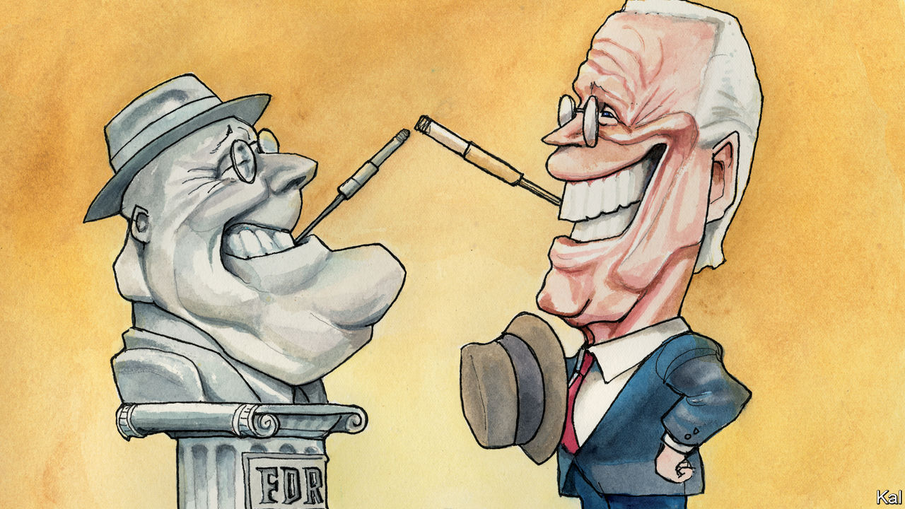

## Lexington

# Joe Biden’s good pandemic

> The Democratic champion looks a better candidate holed up in his basement than he did on the trail

> May 23rd 2020

IN 1932 A genial but uninspiring pillar of the Democratic establishment, shadowed by concerns over his physical frailty, wrested the presidency from his unpopular Republican opponent during a depression. Few had high hopes for Franklin D. Roosevelt. “He is a pleasant man who, without any important qualifications for the office, would very much like to be president,” one commentator observed. Yet the “new deal for the American worker” he promised (while providing few details of what it might entail) would be transformational. Could history be about to repeat itself?

Democrats seem increasingly gripped by that idea—actively encouraged by their latest amiable, down-the-line and rather creaky nominee. The health and economic catastrophe America is grappling with may “eclipse what FDR faced”, Joe Biden told CNN from his basement refuge in Delaware last month. During daily Zoom sessions, he and his policy team are now drawing up plans to deal with it, with an apparent confidence and ambition markedly absent from his primary campaign. “It’s striking how much time Joe is devoting to governing,” says Senator Chris Coons of Delaware, a Biden confidant.

For the most part, the former vice-president is said to be focused on what the crisis might look like by January, when the next administration takes office. He has a lot of relevant experience and expertise to call on, since the administration he deputised in took office during the Great Recession. Mr Biden was personally responsible for administering the $787bn stimulus it launched.

Yet he and his advisers also claim to be looking beyond this crisis to the many structural problems it has exposed: in health-care provision, economic security, disaster response and long-term planning, for example. Mr Biden’s much-pilloried claim that “nothing would fundamentally change” under his leadership has been jettisoned. “He has clearly signalled that just getting back to where we were is not acceptable,” says one of his economic advisers, Jared Bernstein.

Comparisons with the New Deal are liable to be overwrought. Roosevelt built a safety-net almost from scratch, at a time when 2m Americans had been forced into vagrancy. Many times that number are now receiving more money in emergency handouts than they were in wages. Yet, as an effort to capture the enormity of a disaster that has destroyed over 36m jobs, and which will surely facilitate more change than America’s choked political system would otherwise have allowed, Mr Biden’s self-interested harking back to the 1930s does not feel inappropriate. It is just one of the ways in which the pandemic appears to have given a much-needed sense of purpose to his candidacy.

When he entered his Wilmington bunker, two months ago, he had all but captured the Democratic nomination. Yet he had three big worries. The core Democratic claim that Mr Trump was a threat to America was belied by the strength of the economy, including near-zero unemployment. The Democratic coalition also looked dangerously split, with many on the left hostile to Mr Biden. And notwithstanding his impending victory, he had shown himself to be an uninspiring, at times incoherent, candidate. His claim to the highest office seemed to boil down to his being more realistic than Bernie Sanders and less unhinged than Donald Trump. Yet none of those problems now pertains to anything like the same degree.

With the economy on life-support, the covid-19 death-toll rising and Mr Trump pushing bleach injections, his presidency has become self-incriminating. Hence the president’s worsening poll numbers—especially among the older Americans who are most vulnerable to the virus—even as Mr Biden’s campaign has struggled to maintain prominence. Meanwhile, the left appears to be falling into line. Mr Sanders’s prompt concession, almost as soon as the pandemic made campaigning impossible, has played a part in that. But so has Mr Biden’s peacemaking.

He has adopted a couple of left-wing proposals, including an idea of Senator Elizabeth Warren’s to allow student debt to be written off in the event of bankruptcy. Last week he launched a clutch of study groups in tandem with Mr Sanders, to look at health care, immigration, climate and other issues. Notwithstanding the involvement of lefties such as Congresswoman Alexandria Ocasio-Cortez in that project, he is in no danger of adopting Medicare-for-All or the Green New Deal, say those familiar with his thinking. But he is expected to make further accommodations to the left. Ms Warren, with whom he is in regular communication, could be offered a place in his cabinet.

Mr Biden’s new, covid-induced sense of mission may prove to be even more broadly appealing. That is not only because the experience and administrative competence the former vice-president is drawing on have never looked more indispensable. It also appears to represent a coherent way to explain the rattlebag of progressive policies he has advanced (notwithstanding his erstwhile claim to be a continuity candidate). In the shadow of the pandemic, his two boldest proposals, to establish universal health care and a serious national climate-change policy, might be considered to have a common logic. Both are overdue efforts to protect Americans against the sorts of massive economic shock they have now suffered twice in a little over a decade—a pattern that climate risk alone suggests is likely to endure.

In the light of that probability, it is somewhat sobering to consider how modest such developments would actually be. Democrats have been trying to pass them for years. The rest of the rich world takes such measures for granted. They would hardly be comparable to the transformative New Deal. Yet in the constrained realm of American policymaking they would still be enormous advances. And Mr Biden’s quietly rising fortunes suggest that this order of change is an increasingly realistic prospect.■

Dig deeper:

## URL

https://www.economist.com/united-states/2020/05/23/joe-bidens-good-pandemic
