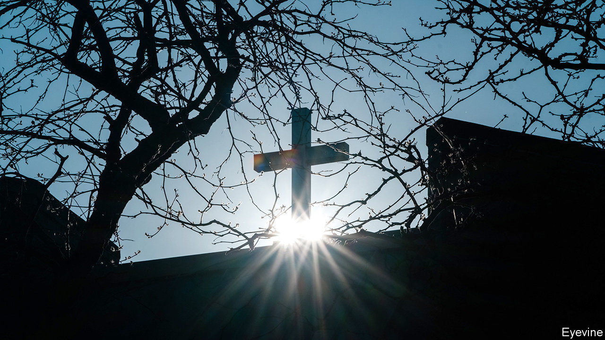
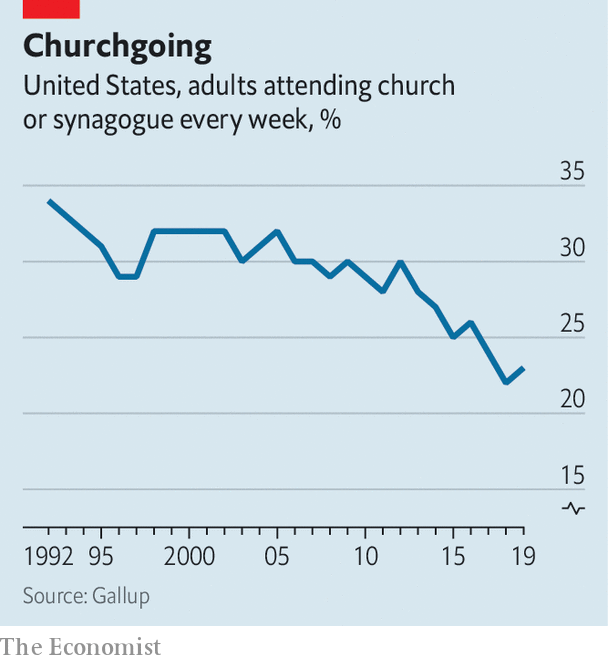

## Sunday slump

# The virus is accelerating dechurching in America

> When it comes to organised religion, the US is looking less and less exceptional

> May 23rd 2020WASHINGTON, DC

LIVING IN THE shadow of Disney’s Magic Kingdom has mostly been a happy experience for Community Presbyterian church in Celebration, Orlando. Its handsome white building, with storybook steeple, was part-funded by a pious niece of Walt. The nearby theme parks have supplied the church with many of its 800-odd members as well as a steady stream of visitors—in the winter, when tourists flock to Florida, the congregation often swells to 1,500. But when Walt Disney World closed in mid-March and the church did too, its fortunes took a dive.

Its income, which comes chiefly from weekly donations, plummeted. Several employees lost their jobs. Among them was Bill Vanderbush, one of two pastors at the church. “You know, as a pastor, that you are living on the generosity of those around you,” he says. “To lose your job when people are suffering is the nature of ministry.”

His words may prove prophetic. The covid-19 pandemic has hammered churches of all sizes and denominations across America. Most, even those that had encouraged their members to shell out online before the pandemic hit, have seen their incomes plunge. Many do not have sufficient cash reserves to tide them over for more than a few months. And reopening is unlikely to bring the relief that it will to other parts of the economy. In many churches the majority of worshippers are old; if a vaccine is not developed soon, or is less effective in the elderly, many may be reluctant to go to church in future.

The result could be a significant reduction in the number of churches in America. David Kinnaman, the president of Barna Group, an evangelical research outfit, reckons that as many as one in five churches—and one in three mainline ones—could close for good within the next 18 months.

This would represent a rapid acceleration of a long-term decline in American religiosity. Though the process of secularisation has been slower to take hold in America than in other parts of the rich world, it is now well under way. According to Pew Research, the share of Americans who say they attend religious services at least once or twice a month has dropped by seven points over the past decade to 45%. The share who go to church every Sunday is a lot lower: some pollsters put it at 20%. Though the decline is evident among all demographic groups, it appears to be fastest among poor whites.

The institutions that were already seeing the sharp end of this decline will be the first to go. Many of them will be Catholic. Successive clerical sex-abuse scandals have stopped many from going to mass or from going as regularly as they used. That has hit church coffers, reducing the financial support parishes give their dioceses, many of which have been bankrupted by payouts to victims of abuse, leaving them, in turn, less able to support struggling churches. Vocations to the priesthood, meanwhile, which are falling across all mainline churches, have all but disappeared in many Catholic dioceses.

The end can be swift. After the last priest of St Casimir’s in Lansing, Michigan, retired last year and it became clear there were no priests available to replace him permanently, parishioners wondered whether the 99-year-old church would have to close. Within weeks of lockdown it had done so. “It’s almost like a death in the family,” says Greg Perkowski, a member of the church council.

The closure of North Highland Presbyterian church in Denver, Colorado, formed in 2010 out of the merger of two churches, was also abrupt. It had redeveloped its buildings into rental spaces to bolster its income and was “just beginning to make it” when it closed on April 30th, says Ashley Taylor, the pastor. She expects that the buildings, in a gentrifying part of the city, will become apartments.

But the pandemic may also lead to the closure of churches that might otherwise have survived for years. Few organisations of any kind have been ready for the shock of sudden, weeks’ long closure, but many even vibrant churches seem to be particularly ill-prepared. David King, assistant professor of philanthropic studies at Indiana University-Purdue University in Indianapolis says that 39% of all congregations do not have enough cash to survive more than three months.

In the case of small, urban churches this is often because putting aside money that would otherwise be spent on services for the poor is anathema, says Justin Giboney, a political strategist in Atlanta, Georgia. He has helped launch Churches Helping Churches, which has so far provided 121 churches with grants of $3,000 each. Anecdotal evidence suggests that smaller churches have had less success applying for small-business loans under the government’s CARES Act, which, to the fury of some advocates of the separation of church and state, are available to religious outfits.

Big churches can also find themselves suddenly close to the edge. Many have been walloped by the closure of their peripheral businesses, like preschools. Some mega-churches, with big running costs, are heavily mortgaged. It seems likely that, among the small minority of churches that defied orders to close, some were driven by financial considerations as much as by religious-liberty ones.

Which churches will escape unscathed from the pandemic? Small congregations, despite their immediate vulnerability, may prove more robust; many already have part-time pastors and are less likely to be attached to a particular space. Mark Chaves, professor of sociology, religion and divinity at Duke University, reckons that multi-site churches, which have pioneered the use of video sermons broadcast in different church buildings, will also lose fewer members—and their cash.

Yet despite the growth of such outfits, they do not yet provide most American Christians with religious comfort. Though a majority of churches have moved services online, many report falling levels of engagement. The longer parishioners endure a weekly struggle with tech and fail to attain the sense of connection that took them to church in the first place, the likelier they will be to give the whole thing a miss.■

Editor’s note: Some of our covid-19 coverage is free for readers of The Economist Today, our daily [newsletter](https://www.economist.com/https://my.economist.com/user#newsletter). For more stories and our pandemic tracker, see our [hub](https://www.economist.com//news/2020/03/11/the-economists-coverage-of-the-coronavirus)

## URL

https://www.economist.com/united-states/2020/05/23/the-virus-is-accelerating-dechurching-in-america
