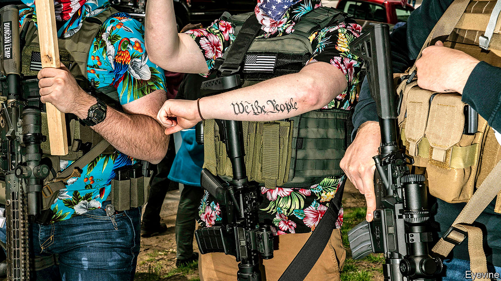

## A boog’s life

# Why some protesters in America wear Hawaiian shirts

> Accelerationism, the boogaloo and the meaning of the extreme right

> May 23rd 2020

IN MORE THAN 30 of America’s 50 state capitals crowds have been gathering to protest against stay-at-home orders, buoyed by tweets from the president encouraging them to “liberate” their states. A few among them, toting assault weapons, are dressed incongruously in Hawaiian shirts. They might seem comical were it not for the fact that, in some corners of the internet, such leisurewear is recognised as the uniform of the extreme right.

A fractious movement by nature, America’s extreme right has responded to covid-19 by carrying out Zoom-bombings (ie, interrupting videoconference meetings), encouraging others to infect police officers and Jews, and seeking to disrupt government activities, including New York City’s 311 line for non-emergency information and National Guard operations. In March a man with ties to neo-Nazi groups was killed in a shoot-out with FBI officers who were attempting to arrest him for planning to bomb a hospital in Missouri. Though he had considered a variety of targets, the outbreak of covid-19 persuaded him to strike a hospital to gain extra publicity.

Some among the far-right style themselves as “Boogaloo Boys” or “Boojahdeen”. This refers to a belief in an imminent “boogaloo”: an armed insurrection against the American government, a race war, or both. The term is tortuously derived from “Breakin’ 2: Electric Boogaloo”, a film about breakdancing made in 1984. Boogaloo boys imagine the forthcoming confrontation as a repeat of the civil war. The Hawaiian shirts that dot the crowds are a reference to “the big luau”, another name for the “boogaloo”, which celebrates pig (police) roasts. (A luau is a traditional Hawaiian feast.)

The shirt-wearers are usually adherents of accelerationism, a strange marriage of Marxism and neo-Nazism which holds that the contradictions of the economic and political order will cause it to collapse. From the ruins, a nation built on blood and soil will arise. They see the virus both as proof of accelerationism’s truth and an excellent opportunity to hasten the system’s demise.

Followers encourage any act that will “accelerate” this breakdown (an idea borrowed from Lenin). These include the spreading of disinformation and conspiracy theories, attacks on infrastructure (such as that on New York’s 311 line) and lone-wolf terrorism. The would-be hospital bomber was a believer. So was the gunman who attacked a synagogue in Poway, California, last year. All this is spread through an ever-changing litany of internet memes, ranging from George Washington dressed as one of their ranks to Ronald McDonald with a machinegun on his lap. A significant presence in the online gaming world helps attract young recruits.

Protests against stay-at-home orders provide another opportunity to expand. The vast majority of people in attendance are ordinary Americans. But demonstrations decrying overreach by the state also tend to draw radical libertarians, militiamen and Second Amendment die-hards who worry that lockdowns will lead to tyranny and the confiscation of firearms. Extremists think these groups are susceptible to their more radical ideology. The New Jersey European Heritage Association, a white-supremacist group, has been spotted as far away as Florida handing out propaganda. Press reports lumping ordinary protesters in with the extreme right may also help to create a general sense of grievance, on which extremists can prey.■

Editor’s note: Some of our covid-19 coverage is free for readers of The Economist Today, our daily [newsletter](https://www.economist.com/https://my.economist.com/user#newsletter). For more stories and our pandemic tracker, see our [hub](https://www.economist.com//news/2020/03/11/the-economists-coverage-of-the-coronavirus)