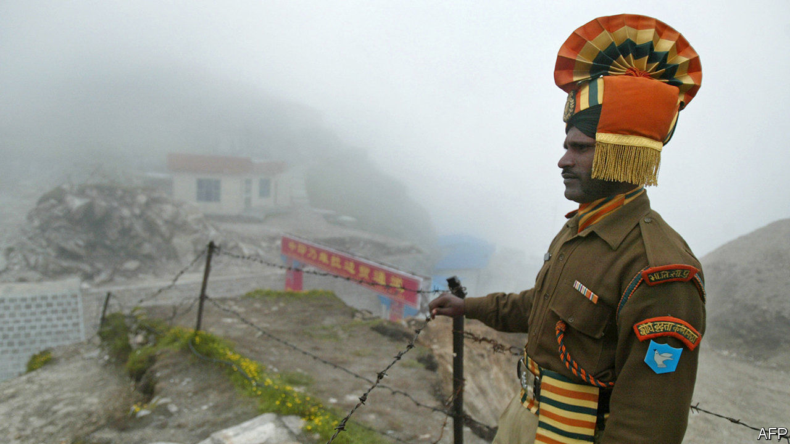
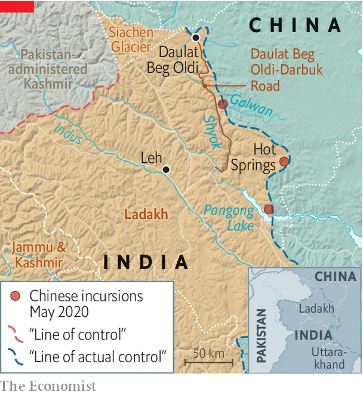

## Mountain claimers

# A border dispute between India and China is getting more serious

> China is nibbling away at Indian territory and digging in

> May 28th 2020

WHEN INDIAN and Chinese soldiers brawled at Pangong lake high in the Himalayas earlier this month—a punch-up serious enough to leave many in hospital—General M.M. Naravane, India’s army chief, was unworried. Such “temporary and short-duration face-offs” happened from time to time in remote stretches of the 4,000km (2,500 miles) border between the two countries, he said. Both sides had “disengaged”. But a week later he dashed north to the headquarters of the 14th Corps in nearby Leh, the regional capital, suggesting that something more serious was afoot.

According to Indian press accounts, Chinese troops have crossed the undefined border with India at several points, some reportedly penetrating 3-4km over punishing terrain. They are said to have destroyed Indian posts and bridges, and dug in with tents and trenches. Incursions have been reported at the confluence of the Galwan and Shyok rivers, the Hot Springs area and Pangong lake, the site of the original scrap (see map).

There is considerable uncertainty over the precise size and location of the forces involved, but Ajai Shukla, a former army colonel now with the Business Standard, an Indian newspaper, estimates that three Chinese brigades—each comprising thousands rather than hundreds of soldiers—might be involved, one several hundred kilometres to the south near the Indian state of Uttarakhand. Though this might evoke images of an invading land army, the bulk of troops are likely to be to the rear, on the Chinese side, in support of intruders nibbling at Indian territory.

General Naravane is correct to say that face-offs are not unusual. But the present imbroglio is odd both because of the scale of forces involved and because some of the incursions are occurring in an area, west of the Galwan river valley, that China was not thought to claim. In fact, the valley was overrun by China in a brief border war in 1962, but handed back—unlike several big chunks of territory that India still claims but China continues to occupy. On May 25th the Global Times, a state-run tabloid in Beijing, asserted: “The Galwan Valley region is Chinese territory.”

One reason for China’s ire may be the uptick in the Indian army’s construction work on the Indian side of the border. In particular, the road to Daulat Beg Oldi, the world’s highest airstrip and the site of a Sino-Indian standoff in 2013, was completed last year. The road, which runs along the Shyok river to the west of the Chinese positions in the Galwan valley, makes it easier for India to move troops for routine patrols or reinforcement in a crisis.

The recent construction of offshoots from that road running towards the border probably triggered the Chinese intrusions. “The situation remains tense,” notes P. Stobdan, a former Indian diplomat, with “troops ... chasing each other in high-speed patrol boats” on Pangong lake. ■

## URL

https://www.economist.com/asia/2020/05/28/a-border-dispute-between-india-and-china-is-getting-more-serious
