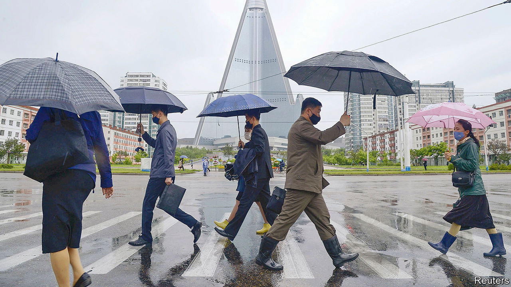

## Running out of juche

# Standoffish North Korea discovers the limits of self-reliance

> Economic damage is forcing it to lift a self-imposed quarantine

> May 28th 2020SEOUL

THE ECONOMY was not on the agenda when Kim Jong Un, North Korea’s dictator, appeared at a party meeting on May 23rd after his second three-week absence from public view in as many months. According to state media, the Supreme Leader promoted several military officials and laid out plans to beef up the North’s nuclear deterrent. That was exactly the sort of action Mr Kim should avoid, America’s national security adviser responded, if he wanted North Korea to have a “great economy”.

Over the past few months, the North’s economy has looked even less great than usual. The leadership’s decision in January to shut the country off from the world to prevent the spread of covid-19 (of which North Korea continues to claim to have no cases) has meant sealing the border with China, through which it conducts almost all its trade. Beside causing hardship for ordinary North Koreans, the self-imposed blockade also seems to have affected privileged people in Pyongyang, the capital. The government’s attempt to limit the impact on state coffers through a compulsory bond-buying scheme seems to have exacerbated the problem. North Korea’s cherished policy of juche, or self-reliance, may have reached its limits.

Even before the pandemic hit, the most recent tightening of sanctions had reduced North Korea’s trade with China. According to Chinese customs data, exports to the North declined from just under $350m in the first two months of 2016 to less than $250m during the same period in 2019. Imports from North Korea dropped from $350m to less than $50m in the same period. These numbers do not tell the full story, because they exclude deliveries of crude oil from China via pipeline. Nor do they include smuggling by ordinary North Koreans, nor the regime’s illicit trading activities, such as ship-to-ship transfers of oil on the high seas.

Even so, sanctions seemed to be causing pain. In his New Year speech, Mr Kim warned his people that leaner days lay ahead and that the country needed to become still more self-reliant—a break with the promises of growth and prosperity that had previously marked his tenure.

The decision in January to close the Chinese border has compounded the problem, by bringing official trade between the two countries almost to a halt. Imports from China dropped below $200m in January and February and below $20m in March. Exports disappeared almost completely. The lockdown also seems to have ended what little private-sector smuggling there had been, with traders in China reporting nigh-on-insurmountable controls.

The impact of these developments on life in North Korea is even harder to discern than usual, given that the border restrictions have also reduced the already meagre flow of information out of the country. There are no signs of an acute shortage of food and other essentials, but prices have gyrated. In the border town of Hyesan, the price of a kilo of rice rose by more than 20% between January and April, according to DailyNK, a website specialising in news from North Korea. The price of petrol also jumped, it reports, and the North Korean currency, the won, tumbled against the Chinese yuan and the American dollar. Big regional differences in prices suggest there may have been restrictions on domestic movement as well as the border closure, says Teodora Gyupchanova of NKDB, an NGO in Seoul.

The impact on livelihoods is likely to be compounded by the fact that late spring is traditionally the lean season in North Korea, when winter stores run low but few crops are ready to harvest. In early April Rodong Sinmun, the government’s mouthpiece, which had been printing lots of its usual reports about the over-fulfilment of production plans, admitted that the people were suffering “hardships”. It said the country “lagged behind” others in economic development and would require an extra dose of “self-reliance” to overcome this failing.

Reports of panic-buying of imported goods in Pyongyang’s glitzy department stores suggested shortages, or at least pervasive rumours that such items might soon be in short supply. There were also reports of rising prices for Chinese-made goods in other parts of the country. Factories that make consumer goods, such as clothes and shoes, have been encouraged to find alternatives to imported raw materials, rather than waiting for the border to reopen.

Meanwhile, the apparent shortage of foreign currency has probably been hampering progress on pet projects such as new holiday resorts, which are designed to please cronies of the regime. It has responded by tapping reserves held by businesses. It has launched an extensive bond-buying programme to finance more than half the annual budget, with some firms compelled to use their foreign-currency reserves to purchase government debt. Given North Korea’s patchy record of repaying its debts and the methods used to persuade people to buy the bonds (one mining boss has reportedly been executed for refusing), the programme looks like little more than a polite form of expropriation.

Chris Green of the University of Leiden believes that it may be part of a longer-term strategy to restore state control over the economy. “There was a time early on in the Kim Jong Un era [when] big enterprises were allowed to accumulate their own hard-currency supply, but that is apparently no longer desirable.” However, North Korea’s entrepreneurs, used to the regime’s periodic attempts to seize their money, are adept at hiding it.

Whether the government was having trouble funding itself, or was worried that the officials who form the bedrock of the regime were upset about the shortages of imported goods, Mr Kim seems to have decided that complete isolation is unsustainable. Restrictions on the border appear to be easing, with some goods reportedly getting through again in recent weeks. Prices for rice and petrol have fallen. Of course, the looser restrictions might yet result in some less sought-after imports, such as cases of covid-19. ■

## URL

https://www.economist.com/asia/2020/05/28/standoffish-north-korea-discovers-the-limits-of-self-reliance
