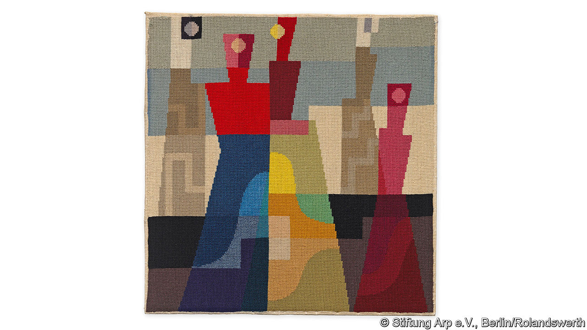

## Still lives

# It takes planning, not just talent, to be remembered as a great artist

> Marketing the work of dead artists is increasingly big business

> May 28th 2020

SOPHIE TAEUBER-ARP may be the most influential artist you’ve never heard of. Her joyously colourful geometric paintings, her elaborate dance routines and gift for sculpture, textile design (see picture) and architecture put her at the centre of the Dada movement in the 1920s. She was a close friend of Jean Cocteau and Marcel Duchamp. Then, in 1943, she died of carbon-monoxide poisoning from a badly installed stove in the Swiss home of a fellow artist. She was 53.

Her career was eclipsed by that of her husband, Hans Arp, who lived until 1966. The art market has all but ignored her. In the past quarter-century only seven of her paintings and six sculptures have come up for sale. Amid soaring prices, her auction record has been stuck since 2003.

All that is set to change. Hauser & Wirth, a leading commercial gallery, will now be representing Taeuber-Arp’s estate. As a first step a major travelling retrospective will open next spring, pandemic permitting, at the Kunstmuseum Basel. It will then go on to Tate Modern in London before appearing at the Museum of Modern Art (MOMA) in New York in 2022.

The conscious shaping and building of artists’ legacies is a recent trend. For centuries lasting artistic fame was a haphazard prospect, depending on myth and connections as well as talent. Johannes Vermeer was unknown for two centuries after he died in 1675, until Édouard Manet and Camille Pissarro noticed his quiet painterly eye. Vincent van Gogh sold only one picture before killing himself in 1890, but later became a megastar. By contrast, G.F. Watts, the Englishman who made the bronze equestrian statue called “Physical Energy” in Hyde Park, was one of the most famous artists of the Victorian age. He died in 1904 and his reputation has sunk ever since.

An important shift occurred after Mark Rothko, one of the great American abstract expressionists, committed suicide in 1970. Rather than seeking separate help with his artistic legacy, Rothko had entered into an agreement with his financial adviser, who after his death secretly sold much of his work on the cheap to the Marlborough Gallery. Rothko’s children sued, and Marlborough and the artist’s executors were eventually ordered to pay $9.2m in damages. But it took over a decade before Rothko’s dealer, Pace Gallery, began representing the estate. In 12 shows held since, Pace’s founder, Arne Glimcher, has demonstrated the breadth of Rothko’s vision, from his surrealism to his darkest murals. In 2012 Christie’s sold one of his works for $86.9m.

The Rothko case highlighted the risks for artists of not thinking clearly enough while they can about life after death. Galleries began advising the heirs of people they represented while those artists were alive. As the market in post-war and contemporary art has boomed, artists’ estates have become big business. These days some galleries tout for estate work; some even poach estates from others by winning over executors. About a third of the 90 or so artists represented by Hauser & Wirth are dead; it has signed up 12 estates in the past four years. Pace has 30, including Rothko’s; David Zwirner has 24 and Gagosian 16.

Before they map out exhibitions to show off dead artists, galleries commission a scholarly survey to pin down the location of every piece they made. The aim is to ensure that a supply is available for sale or “placing”, as they prefer to call the essential business of securing representation in the best museums and private collections.

Their most creative contribution lies in conjuring up a “context” for the deceased—fashioning a narrative for today’s viewers, helping them reassess the past through the lens of the present, so that the artists fit into a familiar pantheon. “Art history likes to put a label on people,” says Iwan Wirth. “If people can’t find that label, it’s very hard. You need to be able to tell a story.”

To help it develop compelling contexts, Hauser & Wirth represents clusters of connected artists, such as Taeuber-Arp, her husband and Max Bill (in whose house she died). Zwirner is expert at drawing out links and influences, ushering collectors from the blue paintings of Ad Reinhardt to the monochrome geometry of Josef Albers to the grey corrugated sculptures of Jan Schoonhoven, and on to the minimalism of Donald Judd and Dan Flavin, all of whose estates the gallery represents.

Gagosian uses its reach to put on museum-quality shows devoted to periods of an artist’s output that may have been overlooked. Its exhibition in 2009 of Picasso’s “Mousquetaire” paintings, long derided as the mud-coloured final scribblings of a lazy old man, reshaped how these works—many made in a day—are seen. (The gallery does not represent Picasso’s estate, but works closely with his heirs.) As collectors were coaxed by Gagosian into wanting a late Picasso, prices surged. On average, these pieces fetched two-thirds more at auction in the decade after the “Mousquetaire” show than in the one before it.

Galleries are often paid a flat fee to represent an estate. As they become the go-to outlet for an artist’s work, they also make commissions buying or selling it for others. Since 2018, when Zwirner took on the estate of Joan Mitchell (who died in 1992), it has sold more than 20 of her paintings, almost half consigned by the estate and the rest by other collectors. Her auction record is now $16.6m, having barely scraped $10m before Zwirner took charge.

Prices are only one way to measure the impact of legacy management. Another is exposure—or the lack of it. Scott Burton, an innovative American sculptor, left his estate to MOMA when he died of AIDS in 1989. But the museum has hardly ever promoted his work, and today he is virtually forgotten. Clyfford Still, a great but curmudgeonly abstract expressionist, avoided dealers and insisted on selling his work himself. When he died in 1980 he left 825 paintings and more than 1,500 works on paper to whichever American city would build a museum to him alone (stipulating that it have neither a shop nor a café). For over 30 years his art was locked away; only since 2011, when the Clyfford Still Museum opened in Denver, has it been shown regularly. Even now, though, there is hardly any market in Still’s work.

In their quest to do better by estates and reputations, the big galleries’ focus has thus far been on Still’s fellow abstract expressionists, the long-undervalued Italian modernists and the 20th-century Brazilian women now gaining world renown. The results have piqued the interest of living artists and set off a search among the dead for candidates deserving the same treatment—such as the post-war Japanese Gutai movement, or once-neglected African-American artists who have recently come to prominence. “We’re looking at opportunities that never existed before,” says Allan Schwartzman, an art adviser based in New York. “We’re just at the beginning.” ■

## URL

https://www.economist.com/books-and-arts/2020/05/28/it-takes-planning-not-just-talent-to-be-remembered-as-a-great-artist
