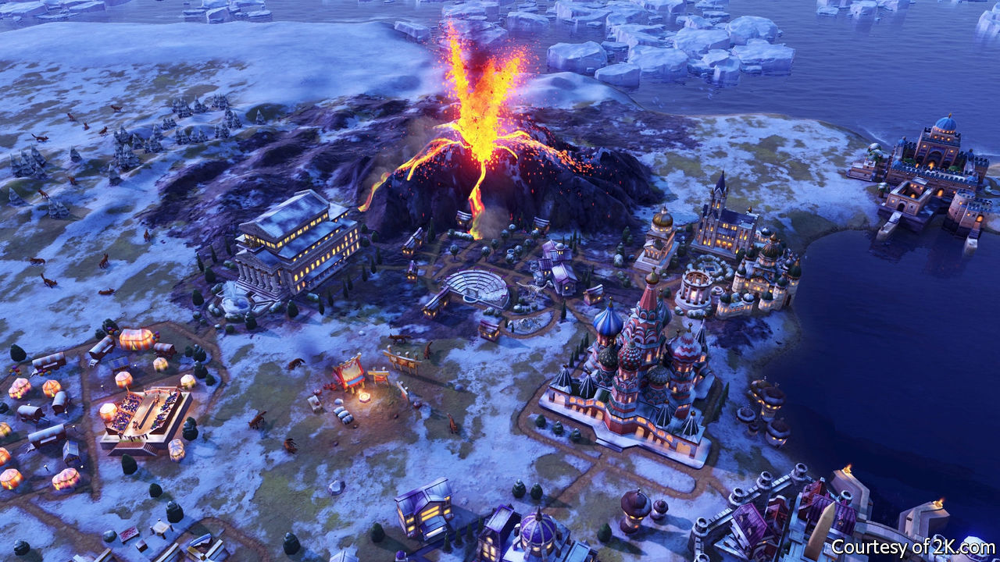

## Home Entertainment

# Take over the world in “Civilization”

> In the video game, at least, your fate, and the world’s, are in your hands

> May 30th 2020

FOR MAX WEBER, a German social theorist, it was the Protestant work ethic that powered capitalism and thus Europe’s success in conquering the world. In “Guns, Germs and Steel” Jared Diamond thought the key to dominance was geography. For Daron Acemoglu and James Robinson, authors of “Why Nations Fail”, the important thing is inclusive institutions—governments designed to serve a whole nation, not just a venal elite.

For the players of “Civilization VI”, the latest in a series of video-games that has now lasted almost three decades, such debates are more than academic. The format lets participants take control of a band of settlers in 4000BC and build them into an empire, ultimately trying to take over the world. In one sense it is a more complicated version of the game “Risk”. But in another it is a sort of history simulator. Follow Mr Diamond’s advice and settle in the right environment—around fertile plains and mountains—and your people will thrive. But Messrs Acemoglu and Robinson are useful, too: unless you choose the right institutions you will eventually be overcome.

For the past couple of months your correspondent has been playing several rounds of “Civilization” with friends through the “cloud game” function, which works a little like old-fashioned chess-by-mail. Games stretch over weeks, with turns played several times a day. Cities rise and fall; wars rage; WhatsApp buzzes with negotiations and propaganda. It is the perfect diversion for life under lockdown. Taking your cherished people into battle injects some drama into monotonous days.

The game’s makers try to take their cues from history, says Ed Beach, the lead designer. Play as Gilgamesh, king of ancient Sumeria, and you start with a powerful war cart, inspired by ancient carvings, with which to conquer your neighbours. Play as Queen Victoria and you can build a trading empire backed by redcoats. But fun comes ahead of strict accuracy, says Mr Beach. In the first version of the game, a bug meant Gandhi was accidentally made the most likely historical leader to start a nuclear war, a feature retained ever since.

In that initial version, released as the Soviet Union collapsed in 1991, there were two paths to victory. You could conquer the world, or you could be first to send human settlers to the stars. Adopting liberal democracy, which brought big scientific benefits, was generally the easiest way to win. When it became clear that history had not ended, the game evolved. You can win by converting everybody to your religion or seducing them with your culture. In the latest version players can supplant democracy with “synthetic technocracy” or “corporate libertarianism”.

Perhaps what “Civilization” offers most in these queasy times is a world in which leaders’ decisions determine a nation’s fate. When your armies are routed and your cities sacked, you can usually tell what you got wrong. You can even plan for natural disasters. In real life, sadly, history often moves of its own accord. ■

## URL

https://www.economist.com/books-and-arts/2020/05/30/take-over-the-world-in-civilization
