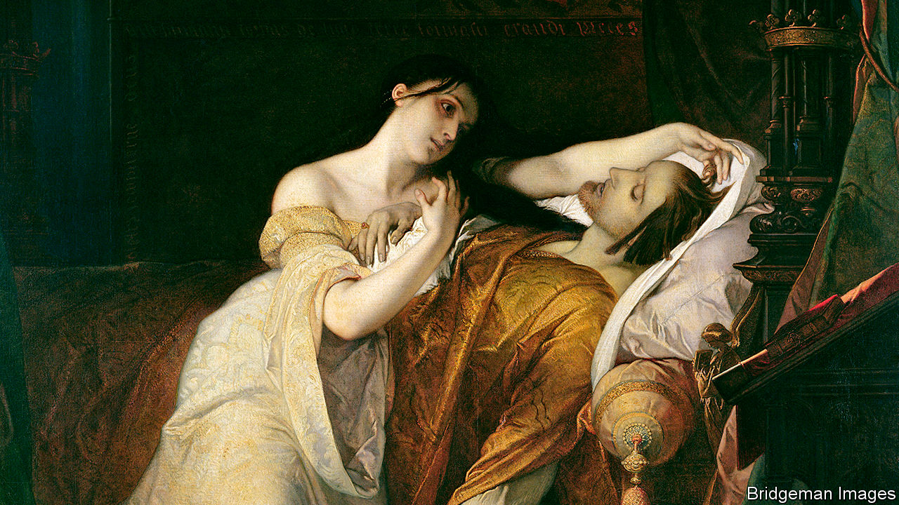

## A breed apart

# The Habsburgs’ marriages consolidated lands as well as faulty genes

> European history is unimaginable without the once-imperious family

> May 28th 2020

The Habsburgs. By Martyn Rady. Allen Lane; 416 pages; £30. To be published in America by Basic Books in August; $32.

THERE WERE early hints that the union of Philip of Habsburg with Juana the Mad (pictured) in 1496 might not be a happy one. It says a lot about the aristocracy of the era that the main problem came less from the bride’s line than from the groom’s: Philip counted among his ancestors such unpromising genetic material as Albert the Lame, Leopold the Fat and, in an age that excelled in the honest epithet, Frederick of the Empty Pockets.

Sure enough, the union proved disastrous. Eventually its worst sufferer was Don Carlos, the couple’s deformed and mentally delusional great-grandchild, in whom ancestral inbreedings echoed. The family anxiously treated its young heir to the most sophisticated medical cures then available but, despite being made to share a bed with the wizened body of a mummified saint, Don Carlos did not recover. Nor did the reputation of the Habsburgs.

Martyn Rady’s new book is billed as “the definitive history” of the clan. Not, it must be said, a hotly contested title. Once the names of Europe’s most powerful families—the Bourbons and Battenbergs and Garibaldis—were known across the world. Today, beyond the biscuit tin, they are largely forgotten.

Except, that is, for their eccentric matchmaking. If you have ever wondered why marrying your uncle is inadvisable, the Habsburgs can enlighten you. For centuries they experimented with marriages between first cousins, second cousins and cousins so multiply intertwined that the traditional familial vocabulary breaks down. A mother might double as a cousin; the wife of Leopold I referred to him throughout their marriage as “Uncle”.

The result was less a family tree, branching and widening, than a convoluted web. At one point the mortality rate of Habsburg children reached 80%, four times the average of the time. Of those who lived, many were hideously misshapen, with the infamous drooping lip and jutting Habsburg jaw. It is one of the abiding puzzles of European history that its aristocrats, so good at breeding horses, should have been so bad at breeding themselves.

However, the same marriages that consolidated faulty genes also consolidated lands. A list of the territories ruled by Charles V in 1521 notes that he was “King in Germany, of Castile, Aragon, Leon...”; the text runs to 13 further lines and still ends with a breezy “etc”. Look at a map of Europe between the 13th and 17th centuries and you see Habsburg territory spread, glacially slow but relentless, until a vast proportion of the continent was covered.

Like a glacier, their rule could have a chilling effect on the lands beneath it. Voltaire famously pointed out that the Holy Roman Empire was neither holy, nor Roman, nor an empire; but the Habsburgs, who presided over it for more than 300 years, often had other ideas. In the 16th century Philip II, convinced he had a divine mission to preserve Catholicism, exported the Spanish Inquisition to the New World. It did its job so effectively that even tattoos were censored. Over that entire century the output of the printing presses in Lima and Mexico City was limited to fewer than 200 titles, most unbearably dull.

In recounting these stories, Mr Rady may at times overestimate his readers’ familiarity with his material and, perhaps, their appetite for it. “Leopold I”, he writes, “is often criticised for spending too much on opera and too little on architecture, but this is unfair”—a useful corrective to the Leopold-and-opera camp but less interesting for others. Elsewhere his book seems exhaustive as much as definitive.

Nonetheless, it has fascinating moments. The story of the Habsburgs, whose last emperor died in 1922, is indelibly inscribed in European history. Dante popped a Habsburg in his Purgatory, Titian immortalised them and Velazquez painted for them. The creator of the original Mechanical Turk made his metaphor to amuse them. Pre-20th century Europe is unthinkable without the Habsburgs—as indeed is 20th-century Europe. For on June 28th 1914 a Habsburg named Archduke Franz Ferdinand got into an open-topped car and went for a drive in Sarajevo. ■

## URL

https://www.economist.com/books-and-arts/2020/05/28/the-habsburgs-marriages-consolidated-lands-as-well-as-faulty-genes
