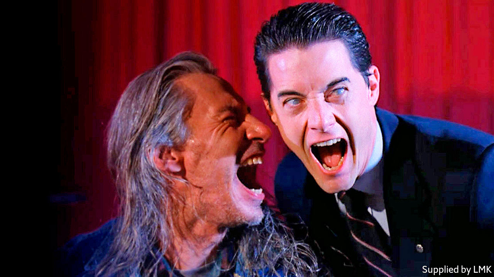

## Home Entertainment

# The world of “Twin Peaks” chimes eerily with the mood of the lockdown

> In David Lynch’s show, as in quarantine, time moves at a different pace

> May 30th 2020

AFTER MONTHS of quarantine even the most unremarkable household fixtures may acquire numinous qualities—the ominous front door, say, or the beckoning fridge. That the mundane can be pregnant with mystery is an item of faith for David Lynch, co-creator (with Mark Frost) of “Twin Peaks”, a television drama first broadcast 30 years ago. No wonder that, according to American viewing figures, a fresh generation is discovering its delights.

“Twin Peaks” is set in a small town in Washington state, full of timber-bearing trucks, big skies, shimmering waterfalls and obscure secrets. A quest to find the killer of Laura Palmer, a high-school homecoming queen with a dark side, propels the narrative. But it is the extraordinary array of characters, scenes and motifs that capture the imagination.

Dale Cooper (Kyle MacLachlan), the coffee-loving FBI agent charged with solving the murder, blends lovable earnestness with a deep sense of moral purpose. Killer BOB, a murderous demon played by a set hand who caught Mr Lynch’s eye, haunted the nightmares of viewers for years. The series’ most captivating sequence, a spooky dream in which Cooper encounters a backwards-talking dwarf with a taste for snappy jazz, was memorable enough to earn a caricature on “The Simpsons”.

The defining feature of “Twin Peaks” is its seamless switching of registers, from melodrama to horror to police procedural, sometimes within a single scene. Angelo Badalamenti’s masterful soundtrack, slipping joyously from ominous synth patterns to groovy bebop, pulls off the same feat. Almost everything is suffused with what David Foster Wallace, an author and fan, called “ambient spiritual antimatter”. It is there in the sound design, the eccentric plot lines and especially in Mr Lynch’s patient, inquisitive camerawork, which invests everyday images—traffic lights changing from green to red, a rotating ceiling fan—with an almost mystical aura.

Few shows have been more influential. The lesson of “Twin Peaks”—that respecting the audience’s intelligence can reap rewards—inspired “The Wire” and “The Sopranos”. Its fusion of the quotidian and supernatural recurs in “The X-Files” and “Stranger Things”. Its stature has only grown over the years, spawning all the paraphernalia of the cult classic, from fan conventions to all-night watch parties (Mr MacLachlan hosted a virtual one in April).

Mr Lynch’s own interest waned after the suits at ABC, the network that first aired the programme, forced him to identify Laura’s killer part-way through the second season; so did the quality of the drama. A third season, broadcast in 2017, contains flashes of brilliance but its experiments test the patience. Highlights include a three-minute segment of a barman sweeping up peanut shells. In Mr Lynch’s world, as in a lockdown, time operates at a different pace. ■