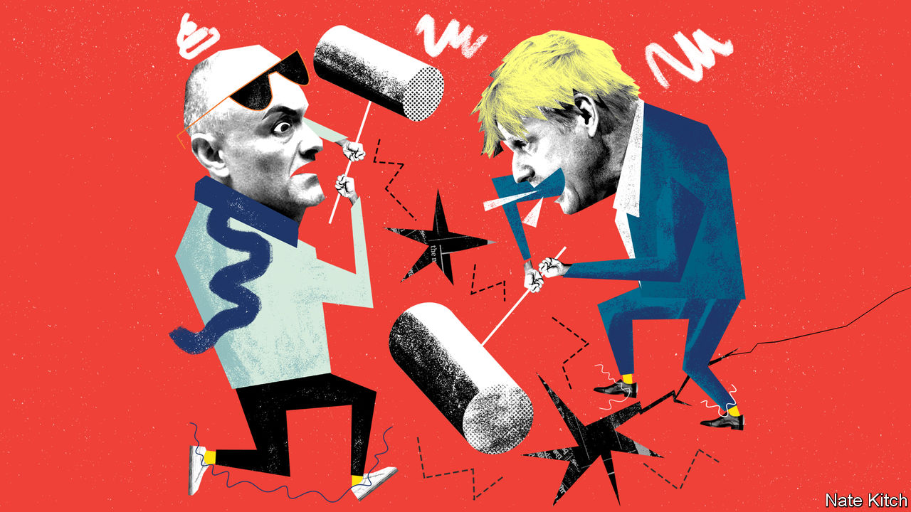

## Bagehot

# Dominic Cummings and Boris Johnson: united by a shared contempt for rules

> Both believe that great men ought to be free of everyday restrictions

> May 28th 2020

SENIOR ADVISERS are supposed to act as lightning conductors for their bosses. Dominic Cummings is a lightning generator. He has repeatedly produced sparks that have badly singed Boris Johnson—by arguing that Parliament should be prorogued, picking fights with every institution in the land and trying to hire an infant eugenicist as a Downing Street adviser. But nothing he’s done has matched his decision to drive his family 270 miles north during the lockdown, defying the government’s slogan at the time, “stay home, protect the NHS, save lives”, that he helped devise.

On May 25th Mr Cummings tried to defuse the crisis by conducting an hour-long press conference in the Downing Street garden. But like so much that Mr Cummings does his intervention only added to the brouhaha. Why was the prime minister allowing a back-room aide a platform that is usually reserved for visiting dignitaries? Why did Mr Cummings’s account of his movements, which involved the bizarre claim that he took a side-trip from Durham to Barnard Castle to test his eyesight, make so little sense?

Britain is obsessed by the Cummings affair because it turns on two things that are noxious in all democracies, but doubly so in one as class-obsessed as Britain: entitlement and hypocrisy. Caroline Nokes, one of many Tory MPs who have criticised Mr Cummings, proclaimed that “there cannot be one rule for most of us and wiggle room for others”. Metro, a middle-of-the-road newspaper, splashed “stay elite” on its cover, a play on the government’s new slogan, “stay alert”. Mr Johnson’s approval rating has fallen by 20 points since the scandal broke.

The government calculates that this storm will eventually blow over. Mr Johnson has an 87-seat majority and does not have to face the electorate for another four years. There will be plenty of dramas between now and then. But the story is nevertheless revealing about the nature of the two men who sit at the apex of British government and the bond that unites them. Both have a long-standing habit of breaking rules whenever it suits them. Both are pseudo-populists who see the masses as bit players—rather like the extras in “Ben Hur” or “Spartacus”—in a world that is largely made by great men. Even if this incident burns itself out, their peculiar project will eventually be torn apart by its internal contradictions.

Mr Cummings has spent his life in politics breaking things—big things like Britain’s membership of the European Union, but also small things like rules and regulations. He was declared in contempt of Parliament for refusing to appear before the House of Commons committee of privileges over his leadership of the Vote Leave campaign. David Cameron called him a “career psychopath” and refused to allow him to continue to work for Michael Gove as a special adviser. A senior civil servant dubbed him a “mutant virus”. A prominent Tory MP settled for “an unelected foul-mouthed oaf”.

This enthusiasm for breaking rules is the result of intellectual conviction. Mr Cummings’s blog is, among other things, an essay on why the rules that bind lesser mortals should not apply to him. He argues that history is driven forward by high-IQ mavericks who can see a new world gestating in the womb of the old. He is in awe of great scientists and mathematicians who revolutionise entire intellectual fields. But his own role models are Promethean statesmen who create new political orders—Bismarck is a particular favourite—or visionaries within government who create high-performance organisations free from the chains of bureaucracy. This champion of populism is, in fact, engaged in a mission to turn Britain into a “meritocratic technopolis”, as he puts it. Mr Cummings takes particular pleasure in quoting William James’s dictum: “When superior intellect and a psychopathic temperament coalesce...we have the best possible conditions for the kind of effective genius that gets into the biographical dictionaries.”

Mr Johnson has been equally keen on breaking rules. He was sacked by the editor of the Times for making up a quote and by the leader of the Conservatives for lying about an affair. He has fathered an unspecified number of children. When he worked as a freelance car-reviewer for GQ magazine his editors complained about the ridiculous number of parking tickets he acquired. Conrad Black, the proprietor of the Spectator when he was the editor, described him as “ineffably duplicitous”.

Mr Johnson’s critics smell an Etonian sense of entitlement in all this. Yet one of the most striking things about Mr Johnson is his willingness to upset his own class in pursuit of his personal ambitions. If the leadership of the Conservative Party were still determined by the magic circle of establishment grandees who ruled it in the 1950s, rather than the 150,000 or so Daily Telegraph readers who make up the party’s membership, he would still be lounging on the backbenches. Helen Thompson, a Cambridge academic, has called him “a pagan whose singular character and embrace of risk sets him apart from his caste.”

Mr Johnson shares Mr Cummings’s enthusiasm for great men who are willing to make big bets. In his biography of Churchill he celebrates his hero’s combination of genius and “death-defying self-belief”. Yet there is a difference. If Mr Cummings wants to change the world, Mr Johnson simply wants to put himself in charge of it. As he writes of Churchill: “His enemies detected in him a titanic egotism, a desire to find whatever wave or wavelet he could, and surf it long after it had dissolved into spume on the beach…”

One of the problems with this vision is that it is hard to reconcile with the humdrum work of running a government. A willingness to break rules may serve you when you’re trying to up-end the old order but it becomes a problem when you’re trying to administer a new one. This is particularly true if you’re engaged in a fight against a plague that demands everybody should obey the same rules, regardless of whether or not they are “the kind of effective genius that gets into the biographical dictionaries”. ■

Editor’s note: Some of our covid-19 coverage is free for readers of The Economist Today, our daily [newsletter](https://www.economist.com/https://my.economist.com/user#newsletter). For more stories and our pandemic tracker, see our [coronavirus hub](https://www.economist.com//news/2020/03/11/the-economists-coverage-of-the-coronavirus)