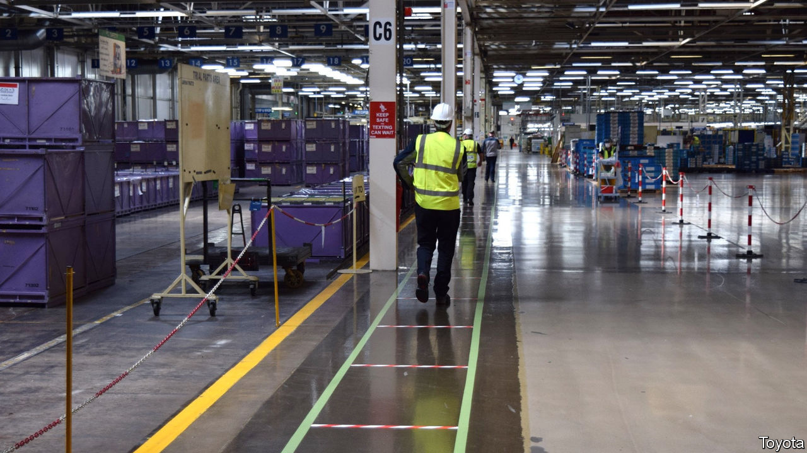

## Manufacturing

# How covid-19 is changing carmaking

> Firms are getting back to work, but work is slower

> May 28th 2020

CAR ASSEMBLY lines are not designed for social distancing. But firms whose factories stood idle for several weeks are starting to make vehicles again. In a capital-intensive industry in which production processes have been refined to maximise efficiency, even small changes to prevent the spread of covid-19 will make it hard to operate at former levels.

The SMMT, an industry body, reckons that Britain will churn out just over 1m vehicles in 2020, nearly 20% fewer than last year. Revving up is easier for some. Smaller makers of pricier cars tend to have more flexible production processes than bigger firms. Lotus (see box) and Bentley reopened their factories on May 11th. Jaguar Land Rover and BMW’s Mini restarted a couple of weeks ago and Toyota’s plant in Burnaston near Derby got back to work on May 26th. A restart is imminent at Vauxhall-Opel’s plant in Ellesmere Port in Cheshire. Nissan in Sunderland will follow in a couple of weeks.

Adaptation to ensure social distancing starts at the factory gate or before. Arrival, departure and break times are particularly difficult to manage. So carmakers are requiring employees to change into workwear at home to minimise close contact at work. Some firms want them to make their own lunch until canteens can reopen. Eating areas, with gaps between individual tables, resemble exam halls. At Ellesmere Port, where there were two entrances and car parks, there will now be five of each; work will end half an hour early to prevent one shift meeting the other on the way in.

In some areas—such as the body shop, where cars’ shells are welded together by robots—social distancing is fairly easy. Elsewhere keeping people 2m apart is hard. Some car bosses privately moan that the difference between the distance recommended in Britain and the 1.5 metres that is standard in European factories puts them at a disadvantage. Floor markers, one-way systems, temperature checks and plastic screens will become common. Some firms are making gloves, masks and protective goggles mandatory.

Processes are also being rearranged. Mini will slow its line to allow the tasks once done by five or six people at a time to be completed individually. Full personal protective equipment will also be employed where necessary, such as at Ellesmere Port where final assembly of interiors requires a person on each side of the car with its doors open.

Keeping plants clean is now a focus for all firms. One of the engineers at Toyota UK has devised a “multitool” resembling a knuckle-duster with a hook that can be 3D printed on-site and used to open doors, to press the button on vending machines and microwave ovens and to carry out a range of other tasks without skin contact. Toyota will take an extra half an hour between shifts to clean equipment. Vauxhall will stop the line every hour for five minutes to do the same.

Carmakers are starting slowly and tentatively, partly to test new procedures and partly because the level of demand is still unclear. A crumb of comfort for Vauxhall, which relies heavily on the home market, is the recent announcement that Britain’s car showrooms will open for business again on June 1st. But as four-fifths of British-made vehicles are destined for export, global demand and the logistics of getting cars abroad to countries at different stages of lockdown will matter more.

If demand rebounds carmakers may struggle to keep up. Toyota reckons it will take three months before it hits previous production levels. Others reckon output will probably be permanently crimped but by how much is unclear. Vauxhall will start by making 125 cars a day at Ellesmere Port compared to 360 before the virus struck. It expects to get back to only 85% of its previous output. Adapting factories and work patterns, supplying protective gear and the like, comes at a cost. But the alternative, for now, is not making cars at all.■

Editor’s note: Some of our covid-19 coverage is free for readers of The Economist Today, our daily [newsletter](https://www.economist.com/https://my.economist.com/user#newsletter). For more stories and our pandemic tracker, see our [coronavirus hub](https://www.economist.com//news/2020/03/11/the-economists-coverage-of-the-coronavirus)

## URL

https://www.economist.com/britain/2020/05/28/how-covid-19-is-changing-carmaking
