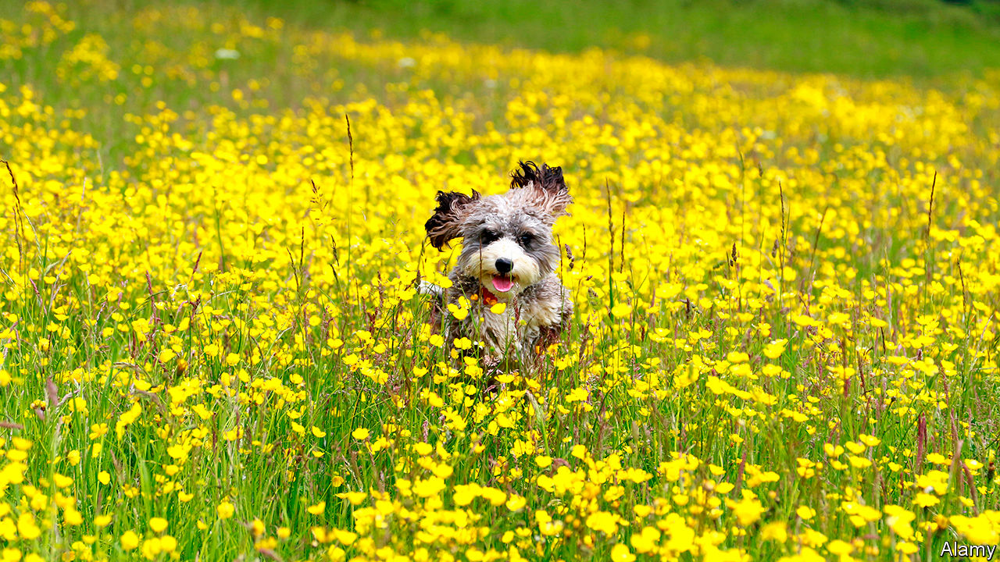
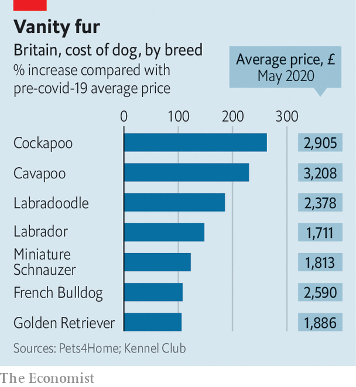

## The dog business

# Rising puppy prices

> Demand is up, and the canine supply chain is vulnerable

> May 28th 2020

“I DESPERATELY WANTED a Labrador or a Basset hound,” says Imogen Patton, a maternity nurse from Somerset. “I had to give up, because all the breeders said their pups were sold out before they were even born.”

A dearth of puppies was not among the shortages anticipated as a result of the crisis, but Britain is suffering from one. Families looking for ways to entertain their offspring and adult children worried about lonely aged parents are after them. But rocketing prices are driven up not just by the increase in demand: dog-market developments have made the supply chain vulnerable to disruption.

Pedigree hounds used to be working dogs—breeds created by Victorian aristocrats in a period of heady innovation that produced most modern canines. Pet dogs were mongrels, until rising disposable incomes turned pups into luxury items and drove up demand for Kennel Club-registered breeds. In the past decade a new trend has emerged: the designer crossbreed. These posh mongrels with pure-blood parents are outstripping their pedigree Kennel Club cousins in popularity (see chart). But they are just as difficult to produce.

In contrast with the parents of bog-standard mongrels, which have little trouble hooking up, pedigree bitches and studs are often separated by geography. Lockdown has created an unexpected barrier. “I couldn’t travel to visit the stud dog,” laments Julia Porter, a breeder of Norfolk terriers from Herefordshire. Stranded miles from suitable partners, her pooches have been spared a spring of pregnant servitude.

Even where breeders own both stud and bitch and the puppy production-line is therefore unimpeded, there is some reluctance to satisfy the onrush of new customers. “Some people, you can just tell by the language—‘have you got any pups for sale’ or ‘have you got any girls’—and you can tell by the grammar and spelling,” says Brian Dash, who breeds Labrador retrievers. By contrast Stephen Charlton, who breeds Cockapoos (cocker spaniel-poodle crosses, pictured), does not screen his customers’ grammar. “I’ve never had to shine a spotlight on anybody to see if they are worthy of having a puppy,” he says. “That mentality is prevalent within the Kennel Club’s high-end, behind-closed-doors breeding world.”

Yet many breeders are concerned that lockdown will prevent new puppies from socialising with other puppies, and that owners will dump them once lockdown is lifted. “The only safe thing a breeder can do at the moment is hang on a few more weeks,” says Esther Bannister, a German-shepherd breeder. “I’ve actually told the Kennel Club to take my name off their ‘Find A Puppy’ list.” The reticence of some is driving up prices for more mercenary breeders. “‘Greeders’ is what I would call them,” says Mr Charlton, who worries that unscrupulous profiteers are turning the trade into a “click and collect’’ delivery service.

One consequence may be new sources of supply. The Dogs Trust, a charity, fears that criminal gangs are now bringing pregnant dogs into the country from Romania. Another is that some customers are trading down. “People are selling German shepherds that aren’t even pedigrees,” says Catriona Stevens, an outraged breeder. Perhaps even the authentic mongrel will have its day again.■

Editor’s note: Some of our covid-19 coverage is free for readers of The Economist Today, our daily [newsletter](https://www.economist.com/https://my.economist.com/user#newsletter). For more stories and our pandemic tracker, see our [coronavirus hub](https://www.economist.com//news/2020/03/11/the-economists-coverage-of-the-coronavirus)

## URL

https://www.economist.com/britain/2020/05/28/rising-puppy-prices
