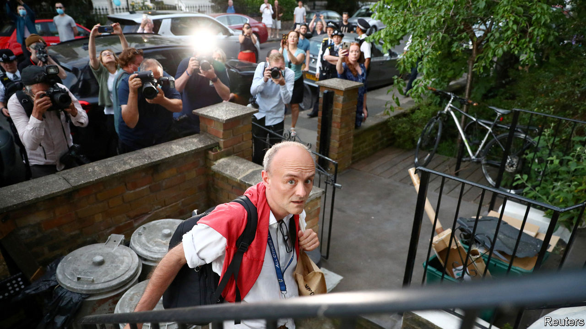

## Politics

# The damage Dominic Cummings has done to Boris Johnson

> Arrogance and populism don’t go

> May 28th 2020

DOWNING STREET aides have a habit of creating headaches for their bosses. Damian McBride, Gordon Brown’s pressman, quit over a smear campaign. Andy Coulson, who did the same job for David Cameron, resigned over his role in the tabloid phone-hacking scandal. Such rows are often complex, who-knew-what-when stories that delight insiders, but which the public would soon forget.

Boris Johnson hopes that’s so in Dominic Cummings’s case. His chief aide drove 270 miles from London to his parents’ farm in late March, while most Britons were following the government’s edict to “stay home”. More than three dozen Tory MPs have protested and a minister has resigned. Cabinet ministers have been rolled out to defend the aide, a spectacle described as “humiliating and degrading” by William Wragg, the Tory chair of Parliament’s Public Administration and Constitutional Affairs Committee. Mr Johnson’s approval ratings are bleeding. More than half of voters, including a majority of Leavers, think Mr Cummings should go.

Mr Johnson is determined he should not. On May 27th he told MPs it was time to “move on” from the “political ding-dong about what one adviser may or may not have done”. Yet this affair feels less like a backstairs intrigue and more like the parliamentary expenses scandal of 2009, which undermined confidence in lawmakers. Like those MPs who billed the taxpayer for Mars Bars and swimming-pool maintenance, Mr Cummings’s wrongdoing is pretty trivial. (Breach of the lockdown laws, which he denies, carries a £30 ($37) fine for first offenders who pay promptly.) But the public, many of whom have sacrificed the opportunity to meet newborn grandchildren, visit dying relatives or attend funerals in order to follow the rules, could instantly grasp the story.

As in 2009, anger has mixed with ridicule. Mr Cummings’s claim he drove to Barnard Castle, a beauty spot, on his wife’s birthday in order to test his eyesight is the butt of jokes and memes online. Just 8% of Britons accept the alibi, a similar proportion to those who believe the earth is flat.

Mr Johnson’s administration—which he calls the “people’s government”—is particularly vulnerable to accusations of hypocrisy. He and his aide owe victory in the EU referendum and 2019 election to harnessing suburban England’s resentment of political elites. Mr Cummings’s fiery blogs rail against ministers who treat voters with contempt, are deaf to popular anger and fail to fire incompetent officials. His stammering defence at a press conference on May 25th that the “stay home” regulation was open to interpretation appeared a parody of the behaviour he once denounced. Appeals to Britain’s culture war—dismissing the reports of his trip as “fake news” by “campaigning newspapers”—fell flat. Voters now think the Tories are more “out of touch” than Labour by a margin of two to one, a big shift since January.

Mr Johnson’s keenness to keep his adviser has demonstrated how remarkable a figure Mr Cummings is. His press conference in the Downing Street rose garden, a space normally reserved for foreign dignitaries, accorded him a status unusual for an adviser, whose code prohibits them from making public comments.

His importance lies in part in his vision, and Mr Johnson’s lack of one. Mr Johnson became prime minister with little idea what he wanted to do with the job, other than “Get Brexit Done”; his agenda for government—to “level up” poorer regions, boost scientific research and break hard with Europe—comes straight from his aide’s blogs. Mr Cummings has also built himself a formidable power base. Many Downing Street aides, working on communications, Brexit policy and in Mr Johnson’s private office, are loyal graduates of the Vote Leave campaign Mr Cummings ran, while independent-minded ministers and aides have been shoved out. Yet Mr Cummings’s power rested on his reputation as a strategic genius. This week he did not look so clever. ■

Editor’s note: Some of our covid-19 coverage is free for readers of The Economist Today, our daily [newsletter](https://www.economist.com/https://my.economist.com/user#newsletter). For more stories and our pandemic tracker, see our [coronavirus hub](https://www.economist.com//news/2020/03/11/the-economists-coverage-of-the-coronavirus)

## URL

https://www.economist.com/britain/2020/05/28/the-damage-dominic-cummings-has-done-to-boris-johnson
