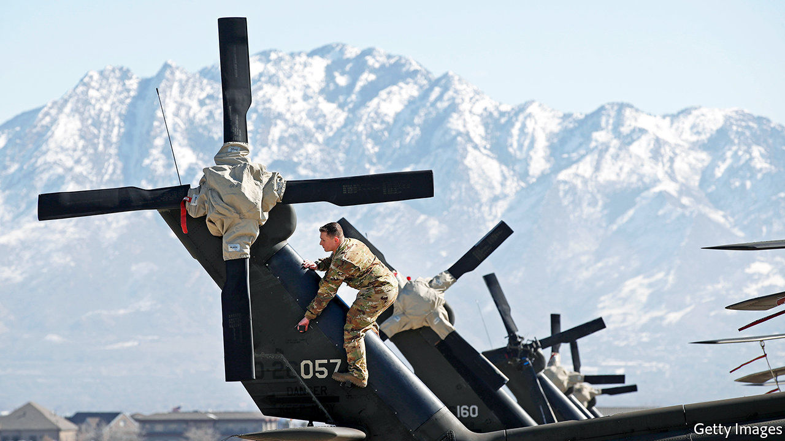

## AI manoeuvres

# Business lessons from the Pentagon

> How to introduce advanced technology into a stodgy organisation

> May 28th 2020ARLINGTON

A SMALL REVOLUTION has just occurred in America’s armed forces. They have, for the first time, deployed artificial intelligence (AI) to determine when a thorough check-up of a Black Hawk helicopter is in order. The algorithm, trained on maintenance records and sensor data, calculates how long the aircraft can fly safely in, say, a desert, before its engines should be cleaned to prevent sand melting into glass that could cause them to fail.

Such predictive maintenance is the most tangible product so far of the Joint AI Centre (JAIC). With 176 employees and an expected budget of $240m next fiscal year, up from $90m in this one, it lies at the heart of an ambitious effort to use machine learning and other AI to help the Pentagon run more efficiently and keep its technological edge, especially over China.

Yet when its first director, Lieutenant-General Jack Shanahan, steps down on June 1st, JAIC’s main output will not be whizz-bang software or even weapons, but infrastructure to develop them. “I did not want to create a classic insurgency organisation, but one that survives me,” says Lieut-General Shanahan. The way he has gone about it offers a case study in how large organisations struggle to adopt advanced technology.

Like many company bosses, top brass at the Department of Defence (DoD) in recent years began feeling technologically inadequate. Not just China but Western tech giants were showing them up, in particular Google. So in 2017 the Pentagon’s Defence Innovation Board (DIB), chaired by Eric Schmidt, who was also executive chairman of Google’s parent, Alphabet, at the time, called for JAIC’s creation. A year later the DIB got its way—ironically around the same time that mostly pacifist Googlers pushed their bosses to abandon work for “Project Maven”, a DoD effort to analyse drone footage.

Things have moved surprisingly briskly since, by the DoD’s sluggish standards. JAIC ranks are set to almost double within a few years, to 300 or so. Its budget is now assured until 2025. Like many corporations flirting with innovation, it has hired outside help, recently signing its first big contract, worth $800m over five years, with Booz Allen Hamilton, an information-technology consultancy.

Booz Allen’s job will be to pull together JAIC’s IT infrastructure into something like a workbench to build AI applications. This will tap various sources of data, AI’s lifeblood, from a helicopter’s sensors to the DoD’s supply-chain software. It will provide the computing power to crunch them. And it will offer software tools that let developers create, test and run AI systems.

As many corporate bosses have learned the hard way, the best technology is not worth much without the right processes to use it. So Nand Mulchandani, JAIC’s technology chief and a noted Silicon Valley serial entrepreneur, wants the group to function a bit like a venture-capital fund. That means investing in “product teams”, internal startups of sorts, which develop prototype applications that can then be scaled up by outside contractors.

The group is still a long way from “mission accomplished”. Some problems are specific to the Pentagon. JAIC still awaits its own processing power, which has been held up by a legal challenge from Amazon; the tech giant argues that its cloud service was unfairly passed over in favour of Microsoft’s rival offering. JAIC has yet to extricate itself from the fangs of the DoD’s procurement bureaucracy: if it cannot sign its own contracts, it will not be able to move fast enough. And it must be careful not to put off private-sector partners as it moves from uncontroversial projects such as helicopter maintenance or forecasting forest fires to thornier ones. “Joint warfighting operations”, for instance, accelerate the “sensor-to-shooter” loop—the time it takes from spotting a target until it is attacked. (Google no longer seems fazed: it recently won a Pentagon contract to provide pieces of cloud software.)

Other issues will sound familiar to chief executives. Recruiting data scientists is tough; most would rather work for big tech, not big government. The DoD’s digital collections are, like many legacy corporate systems, a shambles, as the RAND Corporation, a think-tank, concluded in a recent report. Data are often thrown away or stored locally (the initial Maven drone footage had to be collected at bases on CD-ROMs). They come in all sorts of formats and are badly catalogued. As in many big companies, a chief data officer is supposed to sort these things out, but can expect resistance. “Personnel might view data as a means of retaining power,” write the RAND authors.

Lieut-General Shanahan is proud of his work. So are early JAIC supporters like Mr Schmidt. He has since left Alphabet but still chairs the DIB—and calls the general a “real American hero” for getting as far as he has. Whoever takes over at JAIC nevertheless has their work cut out—as does Mr Mulchandani, who will stand in as director until the Senate confirms a military replacement, which may take some time. As Robert Work, a tech-savvy former deputy defence secretary, puts it: “The foundation is in place; now all they have to do is execute.” Many bosses know the feeling.■

## URL

https://www.economist.com/business/2020/05/28/business-lessons-from-the-pentagon
