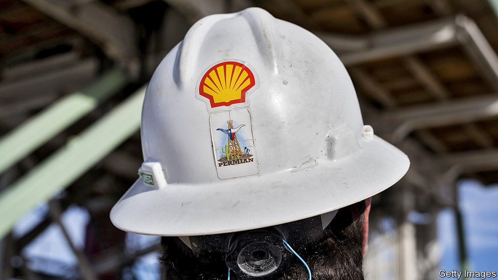
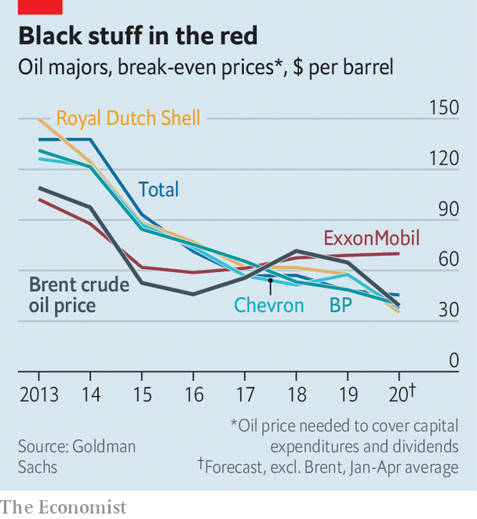

## Don’t worry, it’s all under control

# How big oil is trying to win back investors

> Supermajors claim their prospects are not as bleak as they seem

> May 28th 2020NEW YORK

THE ANNUAL shareholder meetings of ExxonMobil, Chevron and BP, all held on May 27th, each resembled a yearly check-up in a burning clinic. Covid-19 has caused the deepest collapse of demand for the oil giants’ products in history. In April Royal Dutch Shell, an Anglo-Dutch firm, cut its dividend for the first time since the second world war. On May 1st ExxonMobil reported its first loss since the mega-merger that formed the group in 1999.

Even before the pandemic investors were searching elsewhere for lower risk and higher returns. Energy was the worst-performing sector in the S&P 500 index in four of the past six years. Yet the supermajors argue that, for all that, their prospects aren’t bad.

They have half a point. Many of them have become more resilient since the last downturn, in 2014, pursuing more profitable projects and cutting costs. The oil price required to cover capital spending and dividends for the seven biggest—ExxonMobil, Shell, Chevron, Total, BP, Equinor and Eni—is about half what it was in 2013, reckons Goldman Sachs, an investment bank (see chart).

More oil firms are also preparing for a low-carbon future. In December Repsol of Spain pledged to reach net-zero emissions from its operations and the sale of its products by 2050. BP, Shell, Eni and Total have since announced their own commitments.

Moreover, as smaller oil firms reel from the virus, particularly in America’s shale basins, bigger ones may scoop up their assets. The supermajors’ spending cuts may slow their oil production. But that is only a problem if you think there is value in production growth, says Michele Della Vegna of Goldman Sachs. If excessive growth is the problem, he says, then cuts could be part of the solution.

There are two hitches. The break-even price for some firms, though lower than it was, remains high. ExxonMobil’s stands at $70, double what oil trades at today. And it is unclear how quickly—or if—supermajors should move away from oil investments. ExxonMobil and Chevron, America’s biggest oil firms, think not. Neither has set a goal for curbing emissions from the sale of their products. On May 27th ExxonMobil’s shareholders voted against splitting the roles of chairman and chief executive. Green investors had hoped an independent chairman might spur change.

European supermajors look like Birkenstocked tree-huggers in comparison. Still, their promises are loose. Italy’s Eni said in February that its oil-and-gas production would plateau by 2025, but left wriggle room for a “flexible decline” for oil thereafter. On May 5th Total vowed to reach net-zero—but only for products sold in Europe. Shareholders will consider a resolution for more expansive goals on May 29th. BP, under pressure from activists, is working to explain how it can meet climate targets.

The firms have a way to go. Norway’s Equinor devoted about 8% of capital spending last year to renewables; Shell’s figure was 2%. Meanwhile, a new type of rival is emerging. At $68bn, the market value of Iberdrola, a Spanish utility that develops solar and wind farms, has overtaken Eni’s and Equinor’s, and is chasing BP’s. ■