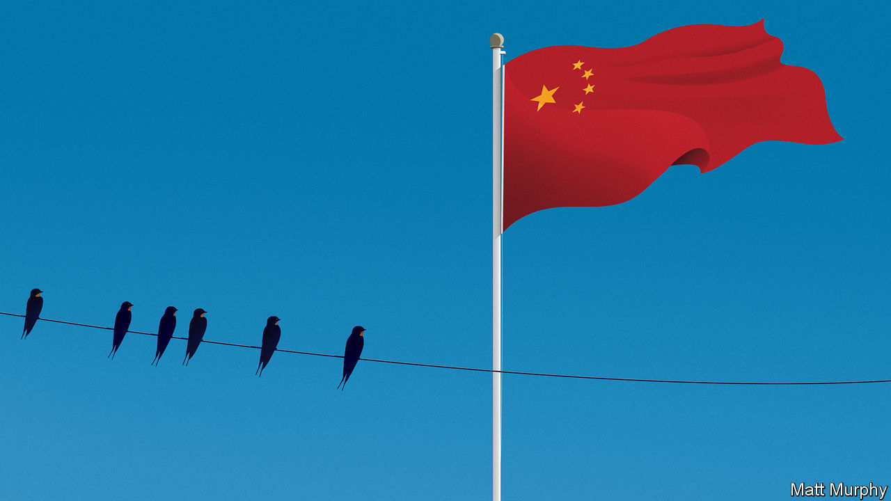
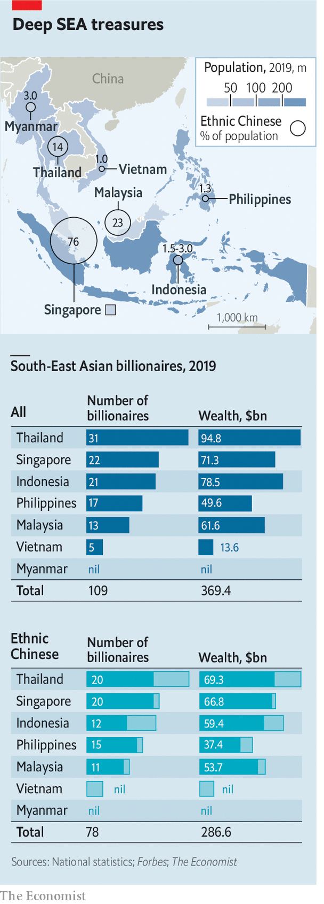

## Chinese diaspora Inc

# South-East Asian tycoons’ high-wire act

> Ethnic-Chinese business dynasties contend with competing demands from their adopted homes and their newly assertive ancestral land

> May 28th 2020SINGAPORE

IN 1919 CHIA EK CHOR moved to Bangkok and set up a small shop importing seeds from his home Chinese province of Guangdong. Two generations later the business, Charoen Pokphand (CP) Group, is Thailand’s pre-eminent conglomerate, peddling everything from chickens and pigs to cars and phones. The founding patriarch, who died in 1983, adopted a Thai version of the family name, Chearavanont. But he maintained a deep affection for his ancestral home. When recited in Mandarin, the first characters of his four sons’ names—Zhengmin, Daimin, Zhongmin, Guomin—spell out “fair, great China”.

The family’s bonds with China are not just emotional. Two-fifths of CP’s $68bn in annual revenues come via hundreds of Chinese subsidiaries running animal-feed factories, supermarkets and much else besides. CP holds a big stake in a Chinese technology-and-insurance giant, Ping An. And it is a favourite partner of Chinese investors in Thailand, including SAIC, a carmaker with which CP makes fancy MG sports cars and pickups.

The Chearavanonts’ past and present mirror those of other wealthy ethnic-Chinese clans in South-East Asia. Although they make up less than 10% of the region’s 650m or so people, they dominate swathes of its $3trn economy. Many have prospered thanks to familial ties with China—and vice versa. “China cultivates them and they cultivate China in turn,” says George Yeo, a former foreign minister of Singapore.

According to The Economist’s analysis of data from Forbes magazine, last year more than three-quarters of $369bn in South-East Asian billionaire wealth was controlled by huaren (a Mandarin term for “overseas Chinese” who are citizens of other countries). A lot resides in Singapore, a rich majority-huaren city-state. But plenty is spread from Indochina and Indonesia to the Philippines (see chart).

Malaysia’s Robert Kuok oversees an empire that spans everything from sugar to Shangri-La hotels. In Indonesia Lippo Group, owned by the Riady family, is active in banking, property and health care. On last year’s list 15 of 17 Filipino billionaires were ethnic Chinese; SM Group, run by the Sy clan, has high-end malls across China. Myanmar is too poor for billion-dollar fortunes, but many of its leading businessmen are Chinese-Burmese, like Serge Pun of Yoma, a property-to-banking concern, or Aik Htun of Shwe Taung Group, with interests in infrastructure and real estate.

These businesses have helped the region become China’s largest trading partner this year, surpassing the European Union. Slowing globalisation and anti-Chinese sentiment in the West—worsened by China’s early mishandling of covid-19 and now its power grab in Hong Kong (see [article](https://www.economist.com//china/2020/05/28/chinas-national-security-bill-for-hong-kong-is-an-attempt-to-terrify))—create an incentive for huaren and China to tighten their bonds.

It won’t be easy. President Xi Jinping’s ill-defined “Chinese dream” project to revive China’s greatness demands more fealty from the diaspora. At the same time the huaren’s adoptive polities are growing a bit more suspicious of their huge neighbour to the north. Forging new commercial ties in the land of their ancestors without drawing fire at home will require every ounce of the huaren’s famed political skills.

Although Chinese settlers first arrived in South-East Asia in the 15th century, many founders of today’s top huaren business dynasties fled south to escape poverty and violence in the early 1900s. Most assimilated culturally and, like Chia, took local names. They prospered first as traders, then in some cases by cosying up to power. Liem Sioe Liong of Salim Group, a noodles-to-finance conglomerate, enjoyed famously close ties with Suharto, Indonesia’s dictator from 1967 to 1998, picking up lucrative monopolies and licences in areas from flour-milling to clove imports.

Around the region such links helped the tycoons build vast, vertically integrated groups as Asia boomed in the 1990s. Together these constituted what has sometimes been described as a “bamboo network” of firms with Chinese roots, united by Confucian values of diligence and thrift. Trading and feuding with one another in turn, their bosses ended up dominating industries from farming to finance.

They also benefited mightily from China’s opening up. When this process began in the 1980s China’s Communist leaders turned to huaren tycoons for money and expertise. If Western capital played a part in China’s rise, diaspora investment mattered as much. In 1979 CP became the first foreign enterprise to set up in the Shenzhen special economic zone, where businesses could toy with a freeish market. As well as selling sugar, Mr Kuok soon began opening Shangri-La hotels in China, offering comfy, familiar rooming to business travellers. He now runs dozens of them there. Genting Group, another huaren house from Malaysia, is building a fancy hotel for China’s winter Olympics in 2022. All the while, China has been buying South-East Asia’s commodities, like rubber and palm oil, often from huaren groups. Indonesia’s Sinar Mas, run by the Widjaja family, is among China’s largest paper suppliers (it also sells instant noodles and protein bars).

Today China wants to move beyond such basics, says John Riady, whose grandfather, Mochtar, founded Lippo (which derives a fifth of its sales from China). Mr Riady, who heads the group’s property arm, speaks of a new stage in relations between China and ancestrally huaren businesses like his. China covets upscale investments, especially from companies with advanced technology. And huaren firms see Chinese tie-ups as a source of new ideas.

Take CP. It has built a gigantic state-of-the-art poultry-processing plant outside Beijing, where millions of fowl are minded by robots. Suphachai Chearavanont, the Thai group’s (third-generation) chief executive, says it has poured roughly $400m into Chinese startups in areas like biotechnology, data and logistics. Lippo has taken a small stake in Tencent, a Chinese internet giant.

As China has grown richer the huaren have also sought to bring Chinese investment back home. CP has struck deals with giants such as China Mobile, which bought a minority stake in the Thai firm’s mobile division. CP’s digital-payments business counts Ant Financial, an arm of Alibaba, the biggest of China’s technology titans, among its shareholders. Ant has also teamed up with Emtek, a media group controlled by Eddy Sariaatmadja, another huaren, to invest in mobile-payments and e-commerce businesses.

Chinese money is flowing to a new generation of huaren, too. Grab and Sea Group, two Singapore-based technology “unicorns” founded by ethnic-Chinese entrepreneurs, have been backed by Didi Chuxing, a ride-hailing firm, and Tencent, respectively. Alibaba has invested in Tokopedia, an Indonesian tech darling with huaren co-founders.

China is also pouring cash into South-East Asian infrastructure, as part of Mr Xi’s Belt and Road Initiative (BRI). Most BRI projects are built by Chinese state firms, but that still leaves opportunities for sharp-eyed locals. In Indonesia the Riadys are working with Chinese partners to erect an $18bn township outside Jakarta, next to a planned Chinese-built high-speed railway. In Myanmar Yoma’s Mr Pun is overseeing the construction of a new city outside the commercial capital, Yangon, with Chinese help. CP will soon begin laying big new tracks in Thailand with China Railway Construction Corporation. Although Chinese private lenders are, in the words of one tycoon, “very stingy” when it comes to bankrolling non-Chinese firms abroad, different rules are said to apply to Mr Xi’s pet projects. One “branded ‘BRI’ is more likely to get money”, says Mr Pun.

Such initiatives—and commercial ties with China more broadly—now draw more attention from the huaren’s home countries, not all of it positive. South-East Asian Chinese have long been accused of divided loyalties. After the Asian crash of 1997, when some overindebted groups folded leaving legions of unemployed, anger at the huaren-dominated monied elite sometimes boiled over into violence. In 1998 native Indonesians’ calls to curb KKN—short for “corruption, collusion and nepotism” in the local vernacular—led to race riots directed at ethnic-Chinese businesses.

Mercifully, ugly incidents like those are no longer common. But huaren wealth still breeds resentment. Malaysia’s long-standing bumiputera (“sons of the soil”) system of quotas and subsidies favouring poorer ethnic Malays did not stop some of the predominantly Muslim majority from launching a nasty “buy Muslim” campaign against ethnic-Chinese-owned businesses last year. Around the same time Indonesian security forces stymied a plot to bomb Chinese business centres in Jakarta. As the region grapples with deep coronavirus recessions, Chinese minorities could again become the object of popular ire.

Besides averting a backlash from their compatriots, huaren tycoons dealing with China must also take care not to upset Beijing. First Pacific, a financial firm partly owned by Salim Group, learned this the hard way when Albert Del Rosario, a Filipino former diplomat, flew to Hong Kong last year to attend its board meeting. A critic of China’s political system, Mr Del Rosario was turned back at Hong Kong’s airport. He subsequently resigned from the board.

During political unrest against Hong Kong’s Beijing-backed government last year, CP’s elderly patriarch (and Mr Suphachai’s father), Dhanin Chearavanont, took an unusual step and ran front-page ads in three Hong Kong newspapers condemning weeks of “violence and turmoil” caused by street protests. Many Hong Kong tycoons had been cajoled into making similar declarations. But the fact that a normally tight-lipped Mr Dhanin, who is semi-retired, did so may be seen as evidence of how sensitive dealing with China has become.

“We all need a kind of foreign policy to deal with big countries like China,” says Mr Riady, referring to big South-East Asian business houses like his own. Striking the right balance between their adopted countries and the ancestral land has been complicated further by Mr Xi’s designs for the diaspora. The Overseas Chinese Affairs Office was recently folded into the Communist Party’s shadowy United Front propaganda division. Many suspect that Mr Xi wants to muddy the distinction between huaren and huaqiao (Chinese nationals living abroad). Some huaren business leaders are handed roles on Chinese state bodies, such as the Chinese People’s Political Consultative Conference, a talking shop. Politicians in South-East Asia worry in private about “influence operations” from Beijing.

In fact, ties between China’s state and diaspora businesses are mostly the result of happenstance, not a master plan. Many tycoons, for instance, have roots in the southern province of Fujian. A hive of entrepreneurship and Mr Xi’s former fief as provincial leader, it is the perfect place to nurture relations with China’s business and political power-brokers. And for every affectionate Chearavanont there is a tycoon critical of China, whose ancestors fled persecution or revolution.

Some tycoons think that Chinese links make life easier. “Of course it helps,” says one. “It builds trust. We are all huaren after all.” Mr Yeo, who until recently worked at Kerry Logistics, part of the Kuok empire, sees “ethnic-Chinese businesses overseas benefiting hugely from China’s growth”.

Others deny Chinese heritage provides a business edge, and see themselves solely as Indonesians or Malaysians. “Chineseness” is seldom the main reason why one foreign firm makes money in China and another does not, says Marleen Dieleman, a scholar of family businesses at the National University of Singapore.

Indeed, most huaren are pragmatists who see a Chinese family history as useful but not predestining. Many are thinking beyond China. Their groups have become integrated into the world economy. CP employs 325,000 workers in 21 countries and, says Mr Suphachai, no longer recruits executives mostly from Bangkok’s bustling Chinatown but from elite American and Chinese universities. He boasts of foreign tie-ups from Japan to Britain. CP is expanding at home, too. In March it bought Tesco’s Thai and Malaysian supermarkets for $10.6bn. Mr Riady says Lippo is today best compared to multinationals like Ford or Goldman Sachs, which thrive in China without cultural connections.

This is more important now that many patriarchs are passing on (see [article](https://www.economist.com//business/2020/05/28/why-asian-business-dynasties-struggle-with-succession)). The younger generation, mostly educated in America and speaking patchy Mandarin, may find it harder to flit as deftly between their ancestral and adopted homes. Still, scions of huaren dynasties inherit connections and, often, commercial acumen—as well as caution. Salim Group’s founder, who died in 2012, liked to cite a Chinese proverb that “tall trees attract the wind”. As Chinese influence blows across South-East Asia, expect its business empires to watch their sprawling canopies carefully.■

## URL

https://www.economist.com/business/2020/05/28/south-east-asian-tycoons-high-wire-act
