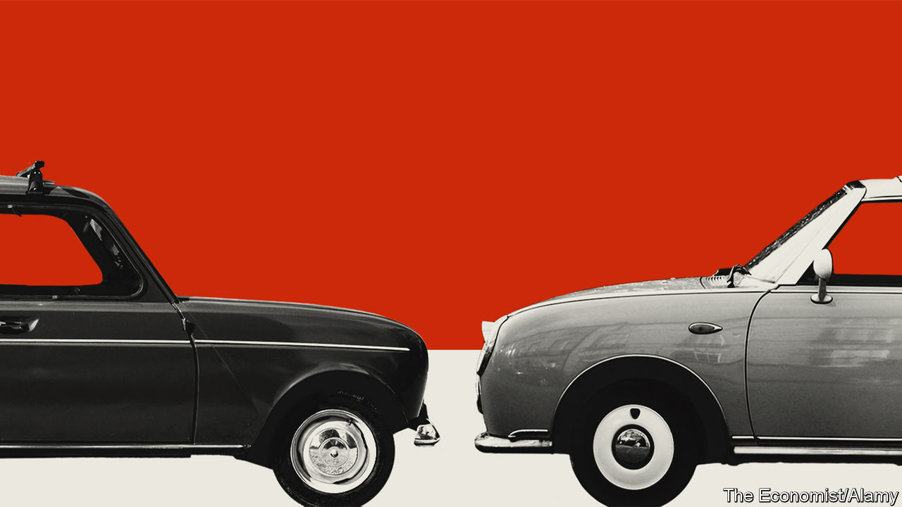

## Back to basics

# The Renault-Nissan alliance hunkers down

> The fraying Franco-Japanese carmaking union wants to give it another go

> May 28th 2020

THE PANDEMIC may create a kinder, more united society. That is certainly the effect on the Renault-Nissan-Mitsubishi alliance. It has been vying for the title of the world’s biggest carmaker while teetering on the brink of dissolution. The fear that covid-19 will damage some car firms beyond repair led the union to announce on May 27th that, like a couple about to divorce rekindling lost romance under lockdown, they would give it another go.

The alliance, started in 1999, was an attempt to avoid the pitfalls of a full merger. In carmaking these had often ended in tears. But the cross-shareholdings that held Renault and Nissan together in particular bred discontent. Renault, which is French, owns a controlling 43.4% of Nissan, a Japanese firm; Nissan has a non-voting 15% stake in Renault. Nissan, recently the main source of the group’s profits, resented the French government’s sway through a 15% stake in Renault. The three firms’ engineers rarely saw eye to eye, making joint projects hard to manage. When the man who ran the tie-up, Carlos Ghosn, was arrested in 2018 in Japan, accused of financial misconduct, the end seemed nigh.

The new plan both speeds up and slams the brakes on Mr Ghosn’s ambitions. The ex-boss’s merger plans are dead, says Jean-Dominique Senard, chairman of both the alliance and Renault. So is his attempt at world domination. The alliance will put profitability before volume, a strategy that helped turn around PSA Group, Renault’s French rival. Each member will focus on becoming a regional force, not a global one: Renault in Europe, Africa and South America; Nissan in North America, China and Japan; Mitsubishi in South-East Asia.

The three firms will also cut costs, moving beyond sharing platforms, the basic underpinning of cars, to sharing parts. Mr Senard reckons that this novel approach will shave €2bn ($2.2bn) from the cost of developing a new small SUV. In a few years all this will make the alliance “the most powerful combination of companies in the world”, he says. Investors like the sound of it. Nissan’s share price gained 12.5% on the day; Renault’s shot up by 17%.

The enthusiasm may be premature. The trio has suffered from a recent downturn in the global car market and the fallout from Mr Ghosn’s arrest. Now the virus may dent industry sales by 20% this year. On May 28th Nissan reported an annual operating loss of ¥40.5bn ($372m), the first time in the red since 2009. Renault is in even worse shape. Bruno Le Maire, France’s finance minister, said it could “disappear” without state support. Renault’s own awful results may be accompanied by details, expected on May 29th, of a €5bn rescue package.

That will irk Nissan, which also announced it would reduce production capacity by 20%, close factories and diminish its range of vehicles. Renault should do the same but will have to keep factories open in France to appease its big shareholder. Luca de Meo, who successfully ran SEAT, part of Germany’s Volkswagen Group, takes over as Renault’s boss on July 1st. The former marketer will need all his powers of persuasion to keep the peace.■