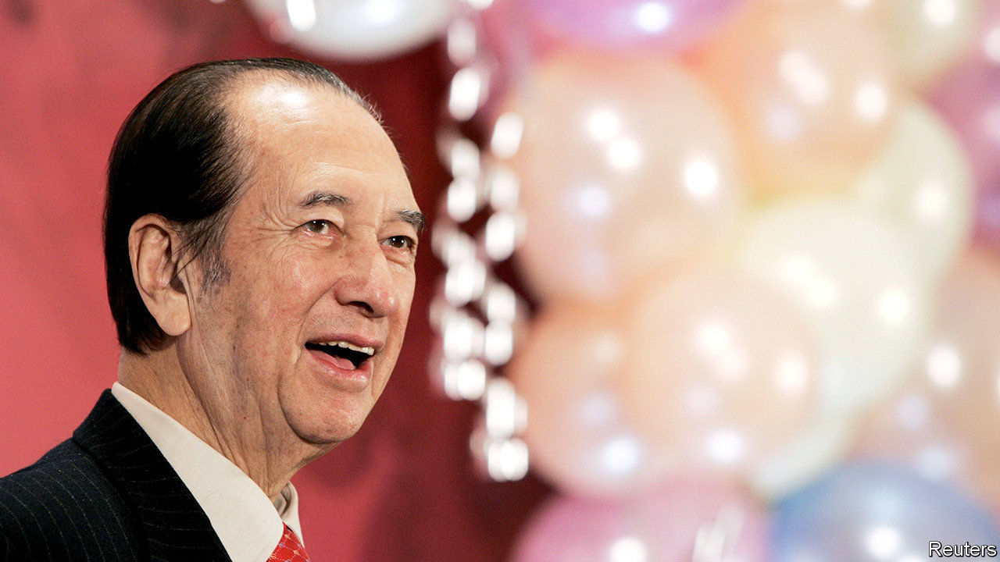

## Godfathers depart, too

# Why Asian business dynasties struggle with succession

> Stanley Ho, a Macau casino magnate, who died on May 26th, aged 98, offers clues

> May 28th 2020

MACAU WILL become the “Las Vegas of the Far East”, predicted Sheldon Adelson, an American casino magnate. In 2019 the Chinese territory’s $30bn in annual casino revenue was five times Vegas’s. Despite a slump in turnover this year as covid-19 emptied parlours, Macau’s rise looks poised to resume. It owes much to Stanley Ho, the charming scion of an illustrious Hong Kong clan. Thanks to the monopoly gambling licence he secured from Macau’s former Portuguese administrators in 1961 and held until 2002, STDM, his family’s main holding company, grew into Asia’s largest gambling empire.

Mr Ho died on May 26th, aged 98, leaving behind 14 children and a $6bn-plus fortune. A decade ago his last wife fought a bitter public battle against his second and third wives for control of SJM Holdings, the group’s publicly traded arm. His elder children joined the acrimonious spat, which ended in a truce.

Many Asian firms face similarly complex successions. Family concerns make up over half of all big businesses in Asia. Other recently departed patriarchs include Eka Tjipta Widjaja of Indonesia’s Sinar Mas Group, Henry Sy of SM Group in the Philippines and Shin Kyuk-ho of South Korea’s Lotte Group. Many other businesses have ageing leaders. Experts foresee a wave of turbulence.

Many patriarchs fear that anointing an heir apparent would weaken their grip on power or bring bad luck. Because Asian business dynasties tend to be quite new, many lack the institutional structures of European or American ones.

A deeper problem is their relationship-based management model. Bosses cultivate a personal rapport with politicians and financiers, which does not easily transfer from one generation to the next. Joseph Fan of the Chinese University of Hong Kong finds that family firms in Hong Kong, Singapore and Taiwan lose some 60% of their value during generational transitions.

Some of Asia’s geriatric bosses are keen to avoid this fate. Before retiring two years ago, Li Ka-shing, the 91-year-old doyen of corporate Hong Kong, simplified his web of businesses. He gave one of his sons clear control of CK Hutchinson Holdings and CK Asset Holdings, which contain most of his empire.