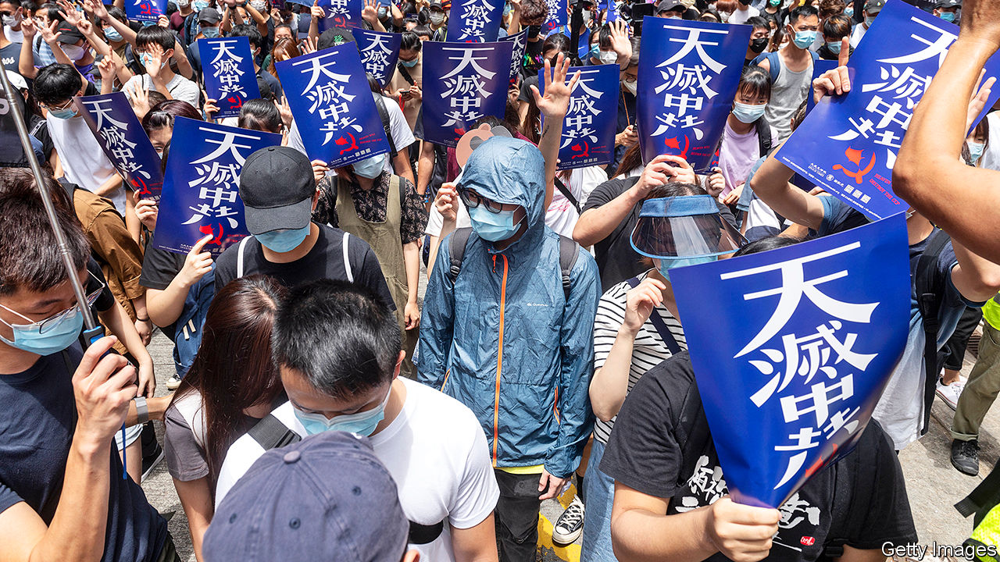
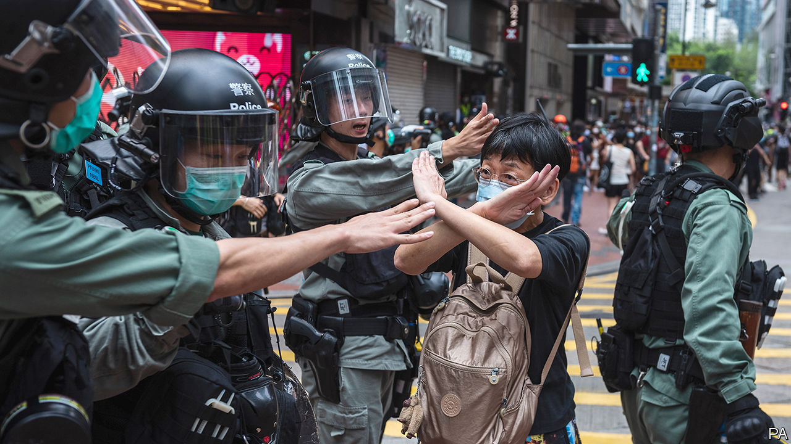
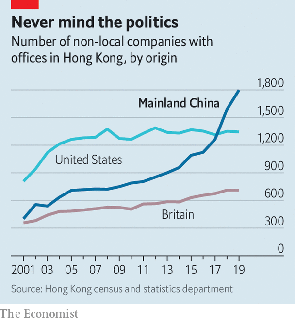
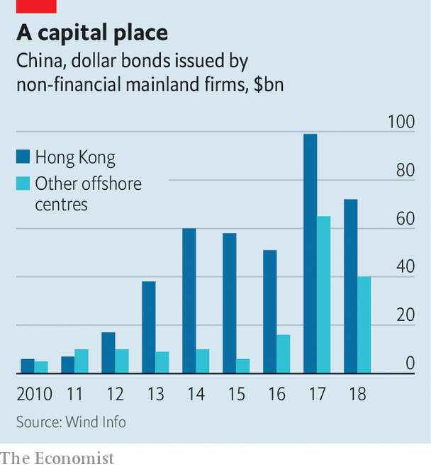

## Rule by fear

# China’s national-security bill for Hong Kong is an attempt to terrify

> It could turn the territory into a Sino-American battleground

> May 28th 2020HONG KONG

THE ARMOURED vehicles of China’s security forces have not rolled onto Hong Kong’s streets, as last year officials in Beijing hinted they might amid anti-government turmoil in the territory. But late in May Chinese officials may have done more than their troops would have to kill the notion of a “high degree of autonomy” in Hong Kong, which was promised when it returned to China in 1997. As Chinese legislators gathered in the capital for an annual, coronavirus-delayed meeting, the body’s standing committee dropped a bombshell.

The committee said it had reached a “decision” that China would impose a national-security law on Hong Kong. The territory’s own legislature would have no role in drafting it. The bill would prevent and punish “any conduct that seriously endangers national security”, including separatism, subversion of state power, terrorism and “activities by foreign and overseas forces” that “interfere” in Hong Kong’s affairs. It could be promulgated in Hong Kong as early as late June.

America is not waiting. On May 27th its secretary of state, Mike Pompeo, declared that “facts on the ground” showed Hong Kong was no longer autonomous. This opens a new front in the intensifying struggle between China and America. Mr Pompeo’s words mean that what many businesses in Hong Kong had once treated as unthinkable is becoming more possible. Namely, America could decide to impose the same tariffs, trade restrictions and visa requirements on Hong Kong as it does on the rest of China. That would cause as much if not more distress in the territory than the draconian new bill.

Officials in Beijing and Hong Kong have gone into overdrive to reassure foreign investors in the international city. Carrie Lam, its chief executive, used to say in private that if the central government were to impose a national-security law in this way, the perception would be highly negative. Now she finds herself arguing that by targeting acts of secession and interference by “external forces” (never defined), the new law is doing foreign business a favour. Last year’s open defiance of the police by protesters will no longer be tolerated. Hong Kong can go back to business.

Briefing diplomats, businesspeople and journalists on May 25th, China’s foreign-affairs commissioner in the territory, Xie Feng, said the new law would merely plug a legal “loophole” exploited by a “small minority of criminals” backed by dark foreign forces bent on splitting China. Foreign investors and other business folk, Mr Xie purred, had no reason to panic. On a more threatening note, he suggested that anyone who did sound the alarm was out to block China’s development. Mr Xie urged his audience to await “details” of the proposed legislation—then people would see there was nothing to worry about.

Yet as Margaret Ng, a barrister and former member of Hong Kong’s quasi-parliament, the Legislative Council (Legco), points out, the details are “almost irrelevant”. The proposed law, she says, would blow a hole both in the handover agreement that China signed with Britain, and in China’s own mini-constitution for Hong Kong, the Basic Law. It is fundamental to Hong Kong’s guarantees that it makes its own criminal laws and that people in the territory may be punished only under Hong Kong law by Hong Kong agencies.

The new bill would wreck that. True, the central government is making use of a clause in the Basic Law that allows it to legislate for Hong Kong. But that is permitted only in matters relating to diplomacy, defence and “other matters outside the limits” of Hong Kong’s autonomy. Democrats in Hong Kong argue that the proposed bill is within Hong Kong’s scope. Article 23 of the Basic Law says Hong Kong should enact laws “on its own” against treason, secession, sedition and subversion, as well as to prohibit ties between Hong Kong bodies and foreign political organisations (though an attempt to do so in 2003 was abandoned after a huge protest).

The central government, then, has no legal authority to add a national-security law to the Basic Law’s annexe. Hong Kong’s Bar Association also points to a lack of any assurance that the new bill will comply with the International Covenant on Civil and Political Rights, which the Basic Law pledges to uphold.

There is a final breach of Hong Kong’s legal and other norms. Mainland organisations may be set up in the territory to “safeguard” national security and oversee the new legislation. The implications are profound, including the possible stationing in Hong Kong of China’s secret police. It is hard to imagine how their will would not prevail in any matter relating to interpretation of the new bill and who should be targeted. The Basic Law says no arm of the central government may interfere in the administration of Hong Kong’s own affairs. But secret agents do, such as those who grabbed a Hong Kong bookseller in 2015 and spirited him away to the mainland.

Three broad and interconnected sets of questions now need answers. First, how will Hong Kongers react? As coronavirus restrictions ease, will anger erupt on the streets again? Second, how will companies doing business in Hong Kong respond? Can Hong Kong continue to serve as a global hub for finance, commerce and the media—a place comfortably apart from mainland China? Or will firms up sticks and run for Singapore or even Taiwan? Can China, indeed, count on Hong Kong as the pre-eminent place to raise “red” capital for its firms? Lastly, what steps might follow from Mr Pompeo’s pronouncement? What impact on the calculations of both citizens and businesses in Hong Kong might America’s actions have?

For Hong Kong’s young, the identity of a generation was forged in last year’s protests. These began in June in opposition to a draft bill that would have allowed Hong Kongers accused of crimes in China to be extradited, without recourse, to the mainland. The protests quickly snowballed into a broader rebellion against both the local and central government. Over time they became more violent—participants began using slings, arrows and petrol bombs against the police, who became ever readier to resort to tear-gas, rubber bullets, water cannon and occasional live rounds. Hong Kong had seen nothing like it since the Communist Party itself instigated riots in the British colony in the 1960s.

The protests eventually ebbed last year as activists turned their attention to elections for the territory’s district councils, the only tier of government fully elected by universal suffrage. Pro-democracy candidates swept them in a landslide, a powerful rebuff to the establishment and its backers in Beijing. A point had been made, and many protesters returned to their work or studies. Then, in January, when life looked like returning to something closer to normal, the pandemic struck. The authorities handled it well—there have been only four deaths from covid-19. An unintended blessing was that the cycles of confrontation subsided as people became cautious about leaving their homes.

But the central government will not let bygones be bygones. It has been tightening the screws on Hong Kong all year. In January President Xi Jinping installed a loyalist, Luo Huining, to head the central government’s outpost in Hong Kong, the Liaison Office. Once it was supposed merely to facilitate mainland enterprises’ dealings. Instead, it has grown to become Hong Kong’s pre-eminent centre of power. Its networks run through business, civil society, schools, newspapers and political parties. It controls Hong Kong’s largest publisher and bookstore chain.

In China’s provinces and major cities, the party secretary wields the real power—governors and mayors are secondary. So it is in Hong Kong. Once, the Liaison Office was barely heard. Now it pronounces on nearly everything and regularly denounces the pro-democracy camp. In April, when legal experts reminded the office that Article 22 of the Basic Law forbids interference by mainland entities in Hong Kong’s domestic affairs, the office said it was exempt from this rule. The Hong Kong government appeared embarrassed at first. But Mrs Lam later backed the Liaison Office’s position—confirming, by doing so, that it held more sway than her government.

Also that month, 15 grandees of the pro-democracy movement, including Martin Lee, Hong Kong’s best-known champion, and Ms Ng, the barrister, were arrested and accused of unlawful assembly. To many Hong Kongers the simultaneous rounding up of so many luminaries smacked of instructions from Beijing. In May the mainland intervened angrily when an exam for school leavers invited a nuanced view of Japan’s role in China’s pre-communist history. At China’s instruction, Legco is debating a law against insults to the national anthem (at international football matches, Hong Kong fans often boo the song).

That law had its second reading on May 27th. People who had planned to gather near Legco to protest against it and the new national-security bill were kept away by hundreds of police. At demonstrations elsewhere police fired pepper bullets and rounded up more than 360 people, including schoolchildren in uniform. As with attempted protests on May 24th (pictured), the first of any size this year, a new police tactic was apparent: move hard and fast, swamp the area and make mass arrests.

Given such methods, it is hard to predict whether protests can grow. Young Hong Kongers face dismal job prospects and see the space for political expression rapidly shrinking. They may see little to lose in one last summer of defiance before facing the full wrath of new anti-subversion laws. But to control covid-19 all public gatherings are banned, which makes it easier for the police to stop protests. The restriction will remain in place at least until June 4th, the anniversary of the crushing of the Tiananmen Square protests in 1989 which Hong Kongers traditionally mark with a mass vigil. Police have refused permission for the usual event. Thereafter, police will reject many applications for protests, as they did last year citing possible violence.

Furthermore, support for demonstrations may be ebbing. Last year the biggest ones attracted up to 2m people. This week office-workers groaned when managers urged them—once again—to work from home because of the risk of disruption to transport by protesters. After last year’s chaos and this year’s anti-virus measures, much of Hong Kong is desperate for normal life. Some ordinary folk with little interest in politics or love for China have cheered news of the national-security legislation.

A bellwether of public support for street action will be July 1st, the anniversary of the start of Chinese rule and a traditional day of protests. If many turn out, then it could be another long, hot summer. But after the arrests of nearly 9,000 people for offences related to the unrest, many of the most ardent demonstrators may be out of action. Some have fled to Taiwan.

As for business, Hong Kong’s foreign chambers of commerce were unusually vocal against last year’s extradition bill but now seem to be more muted. Mainland firms will certainly grin and bear it, and they are becoming the backbone of Hong Kong’s economy. The number of foreign firms with their Asian headquarters in Hong Kong fell last year. But in 2018 the number of mainland businesses with offices of any kind in the city eclipsed the number of American firms for the first time (see first chart). Mainland companies accounted for 73% of the Hong Kong stockmarket at the end of last year, compared with 60% five years before. Many mainland firms also turn to the city when selling their bonds (see second chart). In 2018 they were responsible for about 70% of the corporate bonds issued in Hong Kong, says Natixis, a French bank.

As tensions grow between China and America, Chinese firms seeking to raise capital abroad are increasingly drawn to Hong Kong rather than New York. Baidu, an online-search giant, may even delist from NASDAQ and offer its shares in the territory instead. Other Chinese tech firms, including NetEase, Ctrip and JD.com, may follow Alibaba in seeking a secondary listing in Hong Kong. At the other end of the territory’s business spectrum is refugee capital that has escaped the mainland to avoid scrutiny by the Chinese government. But if you are an individual hiding your money from officials on the mainland, “I’m not even sure you are still in Hong Kong by now,” says one observer.

The chances of national-security laws ensnaring foreign businesspeople may be remote. Yet fear had already been causing some to have second thoughts, even before the announcement about the security law. British businesses say they are struggling to persuade executives to move to Hong Kong. The cruel detention in China of Michael Kovrig and Michael Spavor, two Canadians who have been held since December 2018 as pawns against America’s bid to extradite the daughter of Huawei’s founder from Vancouver, deters some long-time residents of Hong Kong from crossing the border into the mainland. As a foreign official puts it: “Two foreigners have been detained without a specific charge for more than 530 days. And we are told everything is strictly according to law. So my question is: is this the way the national-security laws work? Are these the institutions that are coming to Hong Kong?”

Eyes now are on Washington. Mr Pompeo’s decision to notify Congress that Hong Kong is no longer autonomous sets a potent legal mechanism in motion. The Hong Kong Policy Act of 1992, amended and toughened last year, allows the American government to treat Hong Kong as a separate entity for trade and other purposes, as long as it is demonstrably freer than the rest of China. The White House must now lead a multi-agency discussion about which of Hong Kong’s privileges to revoke.

Any moves to end Hong Kong’s special privileges pose a dilemma. America could apply anti-dumping measures and other tariffs on the territory. But they are hard to deploy with precision and would not greatly affect mainland interests, says James Green, who was the head of trade policy at the American embassy in Beijing until 2018. Some speculation—including talk of Mr Trump using an executive order to make it more difficult to convert Hong Kong dollars into greenbacks—is hard to credit, because it would involve using legal powers usually reserved for pariah states like Iran or North Korea.

Among more likely measures are the imposition of sanctions on officials who abuse human rights in Hong Kong, such as by denying them visas and freezing their assets. Another possible step involves changes to Hong Kong’s status as a partner trusted to enforce controls on the export of sensitive items and technologies. American officials grumble that shell companies in the territory are shipping controlled items to Iran or mainland China, and say Hong Kong seems nervous of working closely with America in case that angers China. And the Senate is mulling a bipartisan bill that calls for sanctions against banks that have dealings with human-rights abusers in Hong Kong. Measures could even include cutting off access to America’s financial system.

Mr Trump may be cautious. He signed last year’s bill, which amended the Hong Kong Policy Act to give it more teeth, but only reluctantly. (He had earlier suggested he might veto it to promote a trade deal with China.) He may balk at an escalation. But but these are febrile, unpredictable times in the Sino-American relationship and American politics. As a congressional staffer puts it, television scenes of heads being cracked on Hong Kong’s streets could play into the “whole Democratic notion that President Trump is soft on autocrats and weak on human rights.” So more dramatic steps by America are growing more likely, as accusations in Beijing of foreign meddling grow shriller. Not only are Hong Kong’s freedoms in peril. So too are badly strained ties between the two great powers on which its future most depends. ■