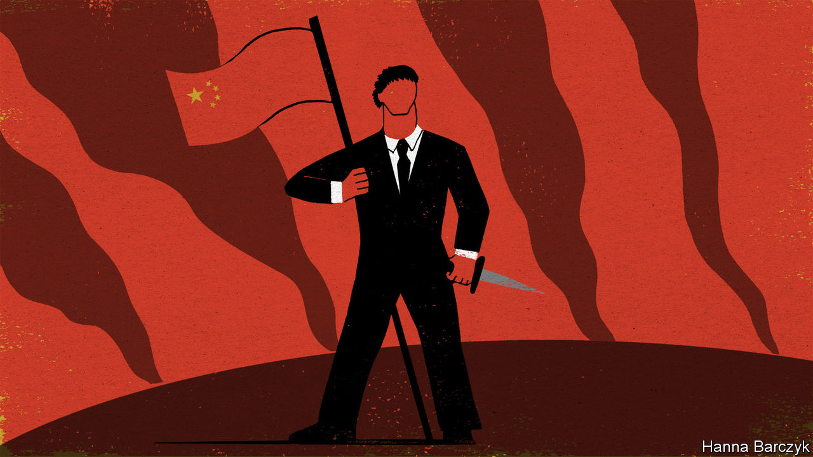

## Chaguan

# China’s “Wolf Warrior” diplomacy gamble

> Foreign policy is not like an action film

> May 28th 2020

LATE ONE night this week, Chaguan brewed strong green tea and rewatched the highest-grossing film in Chinese history, “Wolf Warrior 2”. This action flick is both preposterous and oddly compelling, offering clues about the sort of China that modern-day patriots yearn to see on screen. That China is formidable. At one point the film’s hero, Leng Feng, a retired Chinese commando, uses a home-made crossbow to take on African mercenaries armed with tanks. Then he kills their American boss, a murderous racist who—moments before Leng punches him to death—sneers: “People like you will always be inferior to people like me.” The China of the film is self-confident. A crowd-pleasing scene shows warships of the People’s Liberation Army steaming towards a war-torn, pandemic-stricken corner of Africa to evacuate Chinese citizens, past American warships fleeing in the opposite direction.

The China of the movie is respected. A climactic scene sees the hero halt a battle by sticking a Chinese flag on his arm and holding it aloft. He then leads a convoy of Chinese and African refugees to safety between two rival armies, as awestruck commanders bellow: “Hold your fire! It’s the Chinese!”

Three years after its release, this noisy fantasy is back in the news. In an era of crises, from a global pandemic to an ever sharper contest between China and America, Chinese envoys and state media have gone on the attack. Ambassadors and official mouthpieces have threatened and insulted governments and elected politicians on every continent. Some have promoted conspiracy theories that America’s army spread covid-19. In China, this trend is being dubbed “Wolf Warrior diplomacy” by fans and critics alike. Actually, that is an insult to wolf warriors.

It is not hard to find Chinese who cheer the foreign ministry’s pugnacious new style. Against that, some members of China’s foreign-policy establishment express alarm over this assertiveness, calling it a mistake born of inexperience. That is letting foreign ministry hotheads off too easily. A well-travelled bunch, China’s quarrel-picking diplomats know how they sound. They are using aggression as a signal that China has grown strong, and is tired of waiting for the world to show respect and deference. To diplomatic and national-security hawks in Beijing, if some countries have to feel pain in order to understand that China’s rise is inevitable and that resistance is futile (and that no help is coming from an America consumed with its own problems), then that pain is itself a useful education. Nor is this approach about to stop. Reporters at the annual meeting of China’s legislature, the National People’s Congress, asked the foreign minister, Wang Yi, about “Wolf Warrior diplomacy”. He did not endorse the term but embraced its spirit. China’s diplomats “never pick a fight or bully others, but we have principles and guts”, he said. “We will push back against any deliberate insult to resolutely defend our national honour and dignity.”

Leng the wolf warrior would only half approve. His China is not merely feared. It is admired because it is generous, in deed and in spirit. In the film, doctors at a Chinese-funded hospital have given their lives to develop a vaccine for a deadly virus. Tasked with rescuing Chinese workers from a remote factory, Leng brings their African wives and colleagues too, even lying that a local boy is his son to sneak him aboard a Chinese ship. The film is strikingly respectful of international law. A lantern-jawed naval commander launches missiles to save the day only when a radio operator shouts news from the Chinese ambassador: “Sir, we have received authorisation from the United Nations!” The film ends with a giant passport filling the screen, and a promise that China will use its strength to protect citizens in danger abroad. Some Chinese audiences so liked this magnanimous, self-confident vision of their country that they sang the national anthem in their cinema seats.

The real-world China of 2020 is not magnanimous. Start with notions of brotherhood with Africa. In April thousands of African traders living in the southern city of Guangzhou were tested for covid and forced into quarantine, regardless of their travel histories. Some Africans were left to sleep on the streets after being evicted by landlords. Others were told by Chinese police to delete social-media posts complaining about mistreatment. Rather than apologise, Chinese diplomats and state media went on the offensive, declaring that “so-called discrimination against Africans” never happened and blaming anti-China forces for spreading “fake news”.

Cinematic promises to protect Chinese worldwide are not being kept, either. With officials desperate to avoid importing covid cases from America or elsewhere, flights to China remain severely limited, stranding hundreds of thousands of students abroad. Their fate divides netizens on Chinese social media, with many scorning overseas students as spoiled, unpatriotic rich kids.

This pandemic is that rare event: a crisis that frightens every country on Earth. Alas, the moment finds China in an exhaustingly narcissistic mood. Mr Wang, the foreign minister, declares covid-19 an “all-round test” of China’s social system and governance, which China has comprehensively passed. Such swagger offends plenty of foreign governments, especially when they are told to thank and praise China before they are allowed to buy Chinese medical kit. As for rising geopolitical tensions, Chinese officials deny any connection with their assertiveness. Instead they place all blame on established powers sulking about relative decline.

China is not the only large country consumed with its own grievances. America First is a narcissistic slogan, too. But there is at least a bleak candour to President Donald Trump’s pitch to the world. Unblushing self-interest is his brand. In contrast Chinese envoys talk of being a responsible, globally minded major power. Then they turn round and stoke nationalism at home, and play the obnoxious bully abroad. Fighting as a lone wolf is dangerous in an action film. It is even riskier as a foreign policy. ■