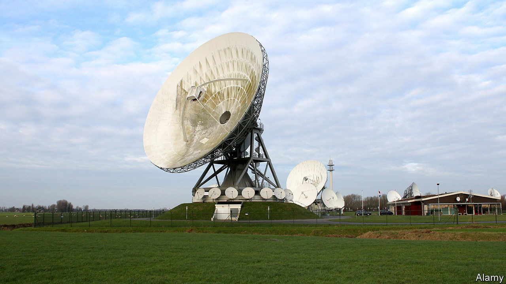

## To your good stealth

# A beery European spy club is revealed

> How the Danes, Swedes, Germans and Dutch shared secrets

> May 28th 2020

A DANE, A Swede, a German and a Dutchman walk into a bar. It is 1979 and spooks from the four countries are conferring in a Munich suburb over dark and malty lagers. For years they had co-operated in the business of signals intelligence, or SIGINT—intercepting messages and cracking codes—and wanted a name for their budding spy pact. “They looked at their glasses, filled with Doppelbock beer of the local brand Maximator,” writes Bart Jacobs, a Dutch computer-science professor, “and reached a decision.”

In a paper published last month, Mr Jacobs revealed the existence of the Maximator alliance for the first time. It was formed in 1976, when Denmark joined forces with Germany and Sweden to intercept and decipher messages sent by satellites. The Netherlands joined two years later, bringing its intercept stations in the Caribbean to the party. France came along in 1985. The group is alive and well today.

Maximator’s history is a fine illustration of the chicanery involved in good cryptology. As well as plucking signals out of the ether, the group would swap details of weaknesses in cipher machines which encrypted diplomatic and military messages. How did they know of those weaknesses? Crypto AG, a Swiss firm that dominated the global market, turns out to have been co-owned by the CIA and its German counterpart, the BND. They would sell rigged machines to friends and enemies alike, including several NATO countries. Without letting on how it knew, Germany slipped information about those machines’ flaws to its Maximator partners.

The revelation of Maximator is a reminder that the Five Eyes—a globe-girdling intelligence pact between America, Britain, Canada, Australia and New Zealand—is not the only game in town. Other eavesdropping alliances have coalesced around common goals, like the war in Afghanistan. For instance, the Fourteen Eyes, officially known as SIGINT Seniors Europe, brings together the countries in Five Eyes and Maximator, along with Spain, Norway, Belgium and Italy. “These groupings are not exclusive,” says a British insider, but “more of a patchwork focused on particular shared interests.” None is as wide-ranging and intimate as the Five Eyes.

Nevertheless, Maximator is staunchly European, something that carries certain advantages as transatlantic divisions grow wider. “German and French engineers work very well together,” notes Bernard Barbier, a former head of SIGINT for French intelligence, who once proposed a fused Franco-German spy agency. “In contrast,” he laments, “a British engineer with a French engineer is complicated.” Maximator also appears to have been especially secretive, unknown even to many people within the spy agencies involved. “I’ve seen some spectacular stuff that I think the Five Eyes would very much like to have,” says a former Dutch intelligence official. “And it couldn’t be shared.” ■