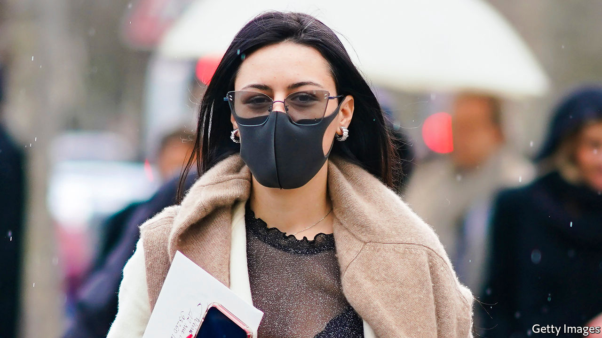

## Paris masked

# Covid masks give the French a new way to be chic

> They are compulsory, so they may as well be stylish

> May 30th 2020PARIS

A WOMAN CYCLES by in a pistachio-green mask that matches the colour of her bicycle. Masks in black, the perennial fall-back for the stylish, are the new staple in the fashionable quarters of the French capital. Since the government made mask-wearing compulsory on public transport on May 11th, elegant Parisians have ditched the mass-market pale-blue surgical ones for a dash of coronavirus chic.

Erik Schaix, a designer, sells couture models in charcoal-grey denim and batik print at his Paris boutique. They meet a demand “to get away from the pharmacy utility version”, says a sales assistant, and “add a bit of fantasy.” When Emmanuel Macron dropped in on a school wearing a navy-blue mask with a small French flag on the trim, its manufacturer was “flooded with calls” the next day, says Thomas Delise, who runs the firm. Based in eastern France, Bonneterie Chanteclair makes high-filtration masks approved by the French army, and Mr Delise had sent the president a mask on the chance he might wear it. Now the firm is launching that model in 44 different shades. A limited-edition mask with Breton stripes sold out in half an hour.

Mask-wearing presents a particular problem in France. “The Enlightenment ideal realised by the French revolution was built against the masks that aristocrats adorned themselves with,” argued Frédéric Keck, an anthropologist, in Le Monde. To the French, some suggest, the uncovered face represents modernity and liberation from religious, patriarchal or other prescriptions.

Yet Parisians have embraced the look with panache. “It’s the new statement T-shirt,” said Jean-Paul Gaultier, a designer. Home-made masks may even be a form of silent rebellion at the government’s original advice against mask-wearing. Parisians have a long history of defiant style even at times of disaster. In post-revolutionary France, aristocrats who had lost relatives to the guillotine are said to have attended “victims’ balls”, at which women tied a jaunty blood-red choker around the neck. Under Nazi occupation, Parisiennes fixed wooden wedges under their sandals to fashion high heels. Today’s mask may not be the accessory of choice. But Parisians are turning it into a choice accessory.

Editor’s note: Some of our covid-19 coverage is free for readers of The Economist Today, our daily [newsletter](https://www.economist.com/https://my.economist.com/user#newsletter). For more stories and our pandemic tracker, see our [coronavirus hub](https://www.economist.com//news/2020/03/11/the-economists-coverage-of-the-coronavirus)

## URL

https://www.economist.com/europe/2020/05/30/covid-masks-give-the-french-a-new-way-to-be-chic
