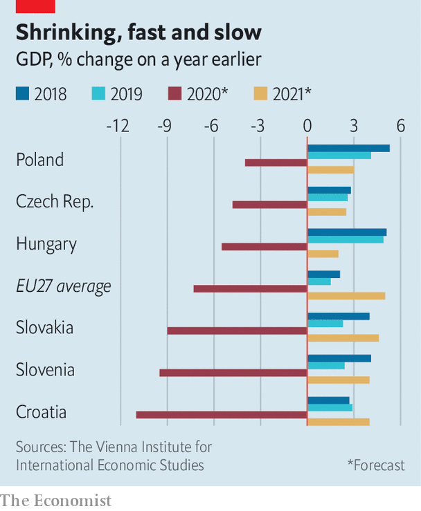

## Into the trough

# Eastern Europe’s covid-19 recession could match its post-communist one

> The whole EU faces a downturn, but the east is especially fragile

> May 28th 2020BERLIN

Editor’s note: Some of our covid-19 coverage is free for readers of The Economist Today, our daily [newsletter](https://www.economist.com/https://my.economist.com/user#newsletter). For more stories and our pandemic tracker, see our [coronavirus hub](https://www.economist.com//news/2020/03/11/the-economists-coverage-of-the-coronavirus)

EUROPE HAS so far been hit the hardest of any continent by covid-19, but the pandemic has been more tornado than hurricane, ravaging some areas while leaving others nearly unscathed. Eastern Europe has been less affected than the west, and even eastern Germany less than western Germany. Southern Europe has suffered more than the north. Gaps between neighbours can be striking: Spain’s excess mortality per person is more than triple that in Portugal, and France’s quadruple that in Germany. Economically, too, the impact is uneven. As forecasts of the pandemic’s economic damage emerge, central and eastern Europe look especially precarious.

It is not that the rest of the continent is doing well. In the first quarter of 2020 the EU suffered its deepest economic contraction on record. Its GDP shrank by 3.5% compared with the previous quarter. Europe’s biggest economy, Germany, dwindled by 2.2% in the same period. Figures for the second quarter, when lockdowns were at their most stringent, are expected to be much worse. Recent data suggest the union’s economic activity in March and April dropped by approximately 30% compared to the previous year. On May 6th the European Commission predicted a “deep, uneven recession”, with GDP this year contracting by 7.5% for the EU as a whole and a bit more in the part that uses the euro. Some forecasters are even gloomier: Morgan Stanley, an investment bank, sees the euro zone’s GDP falling by 11%.

The depth of each country’s recession will depend on the duration of its lockdown, the stringency of social distancing and the strength of consumption, explains Jacob Nell, an economist at Morgan Stanley. The bank thinks Germany’s economy will shrink by 8% in 2020, whereas France’s will contract by 11% and Italy’s by 15%. Germany’s lockdown was one of the lightest in Europe: factories and public transport operated throughout, and shops, restaurants, hairdressers, libraries, zoos and some schools have reopened. France, Spain and Italy forced far more of their economy into a covid coma.

Like Germany, eastern Europe has had low rates of infection and death, and is relaxing its lockdowns early. Slovakia, for instance, recorded just 1,513 confirmed cases of covid-19 and 28 deaths; neighbouring Austria had 16,557 cases and 643 deaths. Eastern Europeans did well in part because they knew they were vulnerable: fearing that the pandemic could quickly overwhelm their creaky health-care systems, they locked down hard and fast and contained the virus quickly. (Health-care expenditure per head in Poland and Hungary, for example, is about one-quarter that of Austria at purchasing-power parity.) It helped that few eastern Europeans ski at fancy resorts in Italy or Austria, which turned out to be coronavirus hotspots.

Yet the economic pain may be worse in much of the east than in the west. “Eastern Europeans dealt with the pandemic efficiently,” notes Richard Grieveson of the Vienna Institute for International Economic Studies (WIIW), “but this recession will be as bad as the transition recessions”—those following the collapse of communism. In the five years after the fall of the Berlin Wall in 1989, annual output in former Soviet-bloc countries fell by more than 40%.

Eastern European countries are vulnerable for three reasons. First, their economies are export-dependent, leaving them at the mercy of demand in other countries. As a proportion of GDP, exports of goods and services range from 96% in Slovakia and 85% in Hungary down to 67% in Bulgaria and 61% in Latvia. By way of comparison, in Spain the ratio is 35%.

A second reason is that eastern European governments have less capacity to finance rescue packages. They cannot run large deficits because investors are wary of lending to them. Most have low levels of public debt, but their credit ratings tend to be poor. Austria’s debt, as a percentage of GDP, is more than three times as high as Bulgaria’s. Yet its bonds are rated AA+ by Standard and Poor’s, a ratings agency, while Bulgaria’s are BBB.

Finally, many countries in the east rely heavily on one of the industries hardest hit by the pandemic: tourism. In Croatia, for example, it generates 25% of GDP. The WIIW thinks Croatia’s economy will contract by about 11% in 2020.

On the bright side, central Europe could benefit from its dependence on Germany, which is expected to recover quickly. It is by far the biggest trading partner of the Visegrad countries (the Czech Republic, Slovakia, Hungary and Poland). Morgan Stanley expects Germany to expand by 6.4% in 2021, and German businesses are growing more confident about this year’s outlook, according to a survey last week by the Ifo Institute. Being outside the euro zone has its advantages, too: the WIIW expects the Czech Republic and Poland to be helped by the devaluation of the koruna and the zloty (see chart).

Mr Grieveson thinks the crisis will fundamentally change some aspects of the region’s economies, sometimes for the better. Central and eastern Europe could benefit from “nearshoring” (moves by China-wary western European manufacturers to bring production closer to home). The rise in online shopping, which is expected to continue even after the pandemic abates, might help too. Related services, such as call centres and warehouses, could be outsourced to the region.

The Commission’s forecast notes that the recovery will be “uncertain”, especially in hard-hit countries that were weak before the pandemic struck. An incomplete recovery in one country, it warns, could dampen economic growth everywhere. It is a call to Europeans to do what Germans did after the fall of the Berlin Wall: help each other out for the benefit of all. ■

Editor’s Note (May 29th 2020): Mr Grieveson did not mean to imply that output in eastern Europe could shrink by 40% over five years, but that the single-year decline this year could be as bad as individual years in the early 1990s. The WIIW thinks the region will recover next year, as the accompanying chart shows.