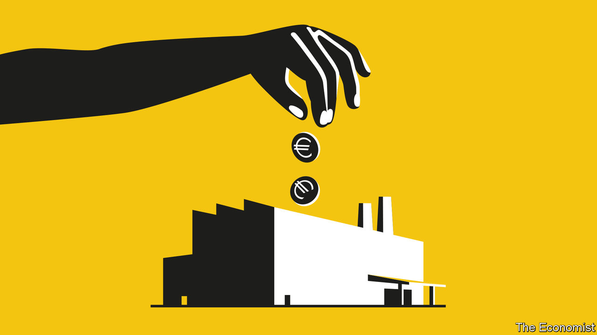
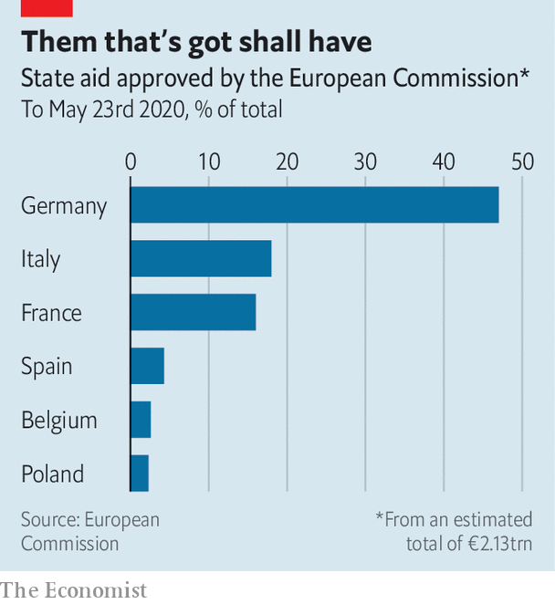

## The visible hand

# Europe’s habit of propping up firms may outlast the pandemic

> State-aid rules have been relaxed, and may stay so

> May 28th 2020

Editor’s note: Some of our covid-19 coverage is free for readers of The Economist Today, our daily [newsletter](https://www.economist.com/https://my.economist.com/user#newsletter). For more stories and our pandemic tracker, see our [coronavirus hub](https://www.economist.com//news/2020/03/11/the-economists-coverage-of-the-coronavirus)

IT NORMALLY TAKES the European Commission about six months to review an EU member state’s request to derogate from the rules against subsidising domestic industry. Not these days. Since the outbreak of covid-19 roiled economies everywhere, requests to circumvent “state-aid” rules are often approved in under 24 hours, even on weekends. A trickle of demands from all over the bloc has turned into a flood. Nearly 200 subsidy schemes and bail-outs worth over €2trn ($2.2trn), equivalent to Italy’s GDP, have been cleared by eurocrats.

The single market at the heart of the European economy is built partly on the premise that national governments do not unduly aid “their” firms. Policies preventing them from doing so date back to the very first flushes of European integration. Now Europe finds itself in uncharted policy territory. Never have the rules been loosened to the extent they have been today. Politicians are brokering aid packages to industry in a way no one in living memory has been allowed to do.

Trouble is: they might get used to it. Even before the crisis, Europe was moving in a dirigiste direction. Now a breach has opened in a set of rules that had curtailed politicians’ penchants for picking winners. When rules were loosened in past crises, notably in 2008, the state-aid regime quickly snapped back to its old self afterwards. But fewer countries support the principles behind state-aid rules nowadays. So the new relaxed norms may endure beyond the crisis, perhaps permanently. That would mark a new economic era for Europe.

European state-aid rules are a policymaking oddity. American states, for example, can and do try to poach companies from each other with promises of tax breaks, soft loans and the like. Europe went for the subsidy equivalent of a disarmament pact. All aid that isn’t expressly allowed to companies is banned, even to state-owned firms. Governments are regularly taken to task for everything from granting football clubs subsidised land to giving multinationals sweetheart tax deals. Policing this is one of the real powers wielded by Brussels, where the rules are enforced by the same commission officials who regulate antitrust.

Tensions have long brewed between that bit of the commission, overseen since 2014 by Margrethe Vestager, the competition commissioner, and some member states. France and Germany have repeatedly demanded competition rules be bent to allow the creation of “European champions”. They were furious last year when Ms Vestager blocked the planned merger of the rail bits of Siemens and Alstom.

Merging companies is one way to create champions, but gorging them with state aid is just as effective. That is now allowed, albeit temporarily. Granted, the goal right now is not to create champions so much as to prevent unnecessary bankruptcies and job losses. But if the rules remain eased for too long, the money sloshing to companies will aim less to rescue them in crisis than to boost their prospects afterwards.

Already some countries, notably Spain, have complained that the free-spending regime threatens the single market. That is because a few rich countries are doing most of the spending. Almost half the state aid paid out across Europe is done by Germany, which is big, wealthy and entered the crisis with relatively little debt. Smaller and poorer countries worry that their firms, which have not been so generously aided, will get gobbled up.

Politicians are busy untilting the playing field. On May 27th Ursula von der Leyen, the commission’s president, unveiled a €750bn package of loans and grants that will redistribute money from those with the ability to pay (Germany) to those struggling to (Spain). National capitals will now haggle over a final deal.

Ms Vestager says higher German spending has been on the EU’s wish-list for years. As for long-term risks to the state-aid regime, she emphasises that the easing of the rules is temporary. She has insisted that companies which were in bad shape before covid-19 struck cannot be rescued; troubled firms that get government bail-outs must pay them back. Those that get the most help cannot pay dividends or bonuses until they repay most of the state aid.

Old Brussels hands say the commission has little choice but to give states leeway in the crisis. “Governments will simply ignore EU rules if they don’t flex enough—that’s what the commission wants to avoid,” says one lawyer. Once everyone has bought into the system’s fast-track approval process, the rules can be tightened, for example by demanding that aid to companies is gradually withdrawn.

The aftermath of the crisis of 2008 gives backers of the state-aid regime confidence that such tightening will happen. But this time looks different. A decade ago Europe was in the ascendant, implementing its new fundamental treaty. Aid had gone mainly to unpopular banks seen to have gamed the system, so throttling that aid was politically easy. Fiscal weaknesses had yet to be exposed by the euro crisis.

In 2020, by contrast, bail-outs are seen as necessary and companies blameless. The crisis has amplified voices demanding that supply chains be repatriated to Europe, which would be easier if states could pay more subsidies. Britain, which long backed vigorous curbs on state aid, has left the club. Southern Europe gets nailed by state-aid rules regularly, and would not mind seeing the back of them. Ireland and the Netherlands have fallen foul of Ms Vestager for giving tax breaks to multinationals, a form of forbidden aid. Poland and Italy like the Franco-German plans to create industrial champions.

Ms Vestager says the concept of a “level playing field”—backed by state-aid rules—remains as important as ever. But concerns that China and America are pampering their own firms with subsidies are widespread. Even before covid-19, Europe had made concessions, allowing industrial projects of the sort politicians favour (such as factories to make high-tech batteries for electric cars) to get government largesse.

A Franco-German deal made possible the whopping package Mrs von der Leyen is now touting. While suggesting that the EU receive huge new powers, Emmanuel Macron and Angela Merkel, France’s and Germany’s leaders, also called for the commission to “adapt” state-aid rules permanently to favour industry. That may prove a difficult recommendation to ignore. ■

## URL

https://www.economist.com/europe/2020/05/28/europes-habit-of-propping-up-firms-may-outlast-the-pandemic
