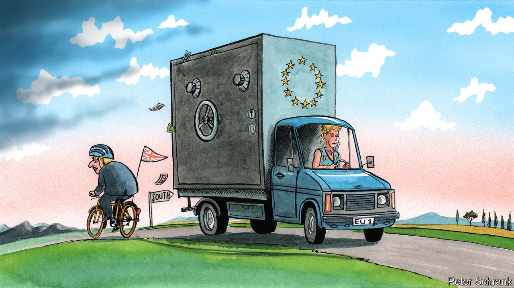

## Charlemagne

# The EU’s recovery fund is a benefit of Brexit

> The bloc takes steps that would have been impossible with Britain as a member

> May 30th 2020

CONSIDER A COUNTERFACTUAL. A few years after the referendum in which Britain narrowly voted to stay in the EU, David Cameron hands power to a loyal chancellor, George Osborne. Upon taking office, Mr Osborne faces a global pandemic and Britain’s deepest recession since 1706. To cap it all, an unwelcome proposal from Brussels arrives: a €750bn ($825bn) recovery fund earmarked for the struggling economies of southern Europe, paid for with debt issued by the bloc. Britain is on the hook for about €90bn. “I did warn you, George,” writes Boris Johnson, now editor of the Evening Standard, London’s local newspaper, in a gleeful column.

Had history taken that route, Britain would have vetoed the scheme that EU officials hope will dig the bloc out of its economic hole, points out Sir Ivan Rogers, the country’s former ambassador to the EU. Reality turned out differently. Britain voted to leave, Mr Johnson became prime minister and Mr Osborne edits a local newspaper in London. And, for the first time, the EU is taking a path that would have been blocked by its former member.

With Britain gone, the EU is coalescing. The scheme to issue a mix of grants worth €500bn and loans of €250bn to countries struggling with the effects of covid-19 is a step towards a more integrated bloc. Some breathlessly compare the move to America’s decision to mutualise debts in 1790. For others, it is less a leap than a shuffle: the EU has issued debt in this way before, if on a far smaller scale. In any case, the big member states are all on board. France and Germany proposed a plan similar to the European Commission’s, while Spain and Italy called for an even more generous one.

Yet even without the British, the path is not entirely clear. Austria, Sweden, the Netherlands and Denmark — the so-called “frugal four” — have criticised the scheme. Each has a veto in the coming talks, like every other member state. In a paper, the foursome demanded that aid must be paid back, not granted outright, and must come with strict promises of economic reform. Any fund will be negotiated as an add-on to the EU’s €1.1trn seven-year budget, which still has some souvenirs of British obstinacy. The “frugal four” are fond of rebates, the complicated systems of cashback for countries who pay in more than they receive, whichhave greased EU budget negotiations ever since Britain’s prime minister, Margaret Thatcher, demanded one in the 1980s.

Without Britain, the dynamics of the debate have changed. Budgetary hawks have far less weight than when they could rely on Britain’s support. Now they have no big ally. The crucial shift came when Germany, traditionally opposed to mutualised debt, gave its backing to the fund. Together the foursome have only 42m citizens—not even a tenth of the EU’s population and smaller than Spain’s. Their critiques of aid plans are restrained by the fact that each governing coalition contains stridently pro-EU parties. In Austria, Sebastian Kurz, the fiscally conservative chancellor, governs alongside the Green party, which is much keener on handing cash to needy Italians. In the Netherlands, the Christian Democratic Appeal’s hardline finance minister, Wopke Hoekstra, sits in government with the Europhile liberals of D66.

The fissures that do still exist, such as the division between the 19 states in the euro zone and the eight outside it, are narrower than when Britain was a member. During the euro crisis of 2010-12, Britain chose not to chip in to rescue funds for any euro-zone member apart from Ireland. Instead of help, Mr Cameron, then Britain’s prime minister, offered lectures on the structural flaws of the euro—the equivalent of a neighbour extolling the virtues of fire safety while the house next door is burning.

Running the recovery fund through the EU’s budget means all members are financially responsible for it, even if most of its beneficiaries sit in the euro zone. Sweden and Denmark, which are outside that currency area, seem happy to help, though they do not agree on how. Economic need is motivation enough: over 70% of Swedish exports end up in the EU. If the single market burns, so do they. Even countries such as Poland have fallen into line with the idea of a recovery fund, as long as it does not cut into the regular EU aid (“cohesion funds”) that flows from west to east. A one-size-fits-all approach to policies becomes more viable now that Britain, the most oddly shaped member, has departed.

Relying so heavily on the EU’s budget to fix the bloc’s ills has drawbacks. Chunks of EU funds aimed at building infrastructure in eastern Europe have often ended up in surprising places, such as the pockets of businessmen close to Viktor Orban, Hungary’s leader. If not trousered by some ne’er-do-well, the cash is sometimes ill spent, as deserted airports in southern Europe attest.

But the EU is not doomed to repeat old mistakes. Rules of spending have tightened. A new European Public Prosecutor’s Office will investigate any misuse of funds. In any case, dishing out bales of cash covered in EU flags is not the worst idea when countries clobbered by the pandemic are losing faith in the entire project. Polls suggest four in ten Italians want to leave the bloc. After Britain’s slapstick departure, no government is likely to put such a question to a vote. But it would be foolhardy to ignore the signals.

Whenever money is involved, the EU descends into an undignified brawl. Yet the outline of a deal is emerging. A compromise whereby the “frugal four” keep their rebates, eastern Europe continues to receive generous transfers, and Italy and Spain get their recovery fund seems feasible. France is able to cast itself in a lead role, while Germany reassures itself that nothing can happen in the bloc without its blessing. A scrap is still necessary. Part of this is choreography so leaders can declare victory at home; part of this is leaders grabbing what they can. With the seven-year budget and the recovery fund totalling €1.85trn, there is plenty to wrestle for, and even a planned negotiation can turn nasty. During the coming summer of arguments over cash, it may seem as if Britain never left. ■

Editor’s note: Some of our covid-19 coverage is free for readers of The Economist Today, our daily [newsletter](https://www.economist.com/https://my.economist.com/user#newsletter). For more stories and our pandemic tracker, see our [coronavirus hub](https://www.economist.com//news/2020/03/11/the-economists-coverage-of-the-coronavirus)