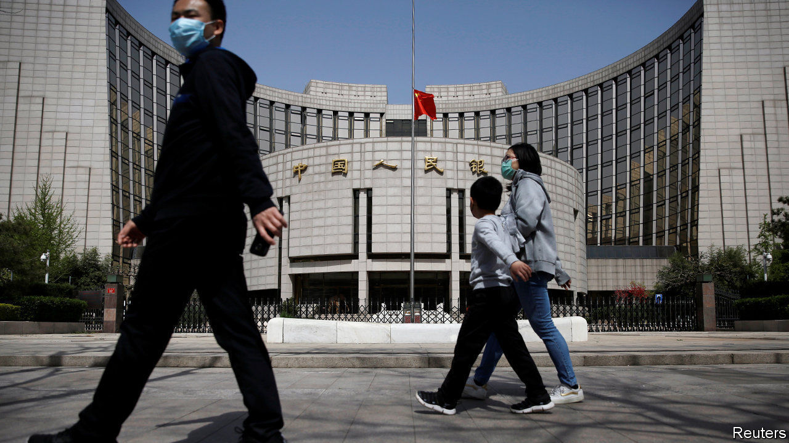

## The thin red line

# China’s economists debate deficit monetisation

> Inflation hawks seem to be prevailing—in theory, if not entirely in practice

> May 28th 2020SHANGHAI

NO ONE WOULD ever describe the Chinese central bank as Germanic. After all, China’s broad money supply has tripled over the past decade alone, the kind of expansion that would send shivers through Germany’s inflation hawks. But listen closely and Teutonic inflections can be heard in Beijing. A ruckus about how to finance this year’s yawning fiscal deficit has brought out China’s own inflation hawks. They warn that moves by the People’s Bank of China (PBOC) to purchase government bonds directly, as dovish economists have recommended, could spell trouble. And their conservatism seems to be prevailing—in theory, if not entirely in practice.

The question of deficit financing has arisen because of the sheer amount of public spending needed in China, much as in other countries hit by the covid-19 pandemic. On May 22nd the finance ministry announced that the central and provincial governments would collectively issue 8.5trn yuan ($1.2trn) in new bonds in 2020, nearly twice as much as last year and equivalent to about 8% of GDP. That, however, threatens to push bond yields higher, raising the cost of financing just as the central bank is trying to keep it down.

Liu Shangxi, the head of a think-tank linked to the finance ministry, made a radical proposal in late April to tackle the problem: the PBOC should monetise the fiscal deficit, in effect printing money to buy and hold new government bonds that make no coupon payments. He rebutted the standard objection that deficit monetisation could lead to spiralling inflation, saying that a decade of quantitative easing abroad had shown that to be false.

Mr Liu’s idea has met with widespread criticism. Many commentators, both foreign and Chinese, have described the response as a debate, but that would imply that a substantial portion of other economists have taken Mr Liu’s side. The overwhelming majority have not: according to a rough tally by The Economist, 15 of the 17 prominent Chinese economists (including analysts and former officials) who have waded into the fray have argued against monetisation.

Most have noted that, unlike America or Japan, China still has space to cut interest rates. The yield on ten-year government bonds, for instance, is about 2.75%. But many have also described the idea of monetisation in much more alarming terms. Li Daokui, a former member of the PBOC’s monetary committee, called it a trap that will undermine the yuan. Ma Jun, formerly the chief economist for the PBOC’s research bureau, warned of a litany of problems: inflation, asset bubbles and a loss of faith in sovereign credit. Lou Jiwei, a former finance minister, observed that it would violate China’s central-bank law.

For some outside China, this restraint might seem odd. The government, after all, continues to save many state-owned companies from defaulting. But for Chinese economists it is precisely this backdrop that worries them. Deficit monetisation would erase the “last line of defence” in managing public finances, says Mr Ma. Whereas Germany’s concern with inflation stems from the Weimar era, China’s scars are fresher. In 1994—when Yi Gang, the PBOC’s governor, returned to China from a professorship in America—annual inflation ran as high as 28%.

The opponents of deficit monetisation appear to have won. In his annual address to the National People’s Congress on May 22nd, Prime Minister Li Keqiang said China would cut interest rates and reduce banks’ required reserves to expand the money supply; he studiously avoided any mention of bond purchases by the PBOC.

In reality, though, monetary lines are easily blurred. In 2007 the PBOC evaded the ban on monetary financing by arranging for the finance ministry to sell 1.35trn yuan in bonds to a state bank, which it then immediately bought from the bank. It also regularly engages in large re-lending operations, creating money that banks use for quasi-fiscal purposes.

With yields on government bonds rising steeply over the past few weeks, the PBOC may yet scoop up some of the debt hitting the market. But in the name of propriety, it will do so indirectly. ■

## URL

https://www.economist.com/finance-and-economics/2020/05/28/chinas-economists-debate-deficit-monetisation
