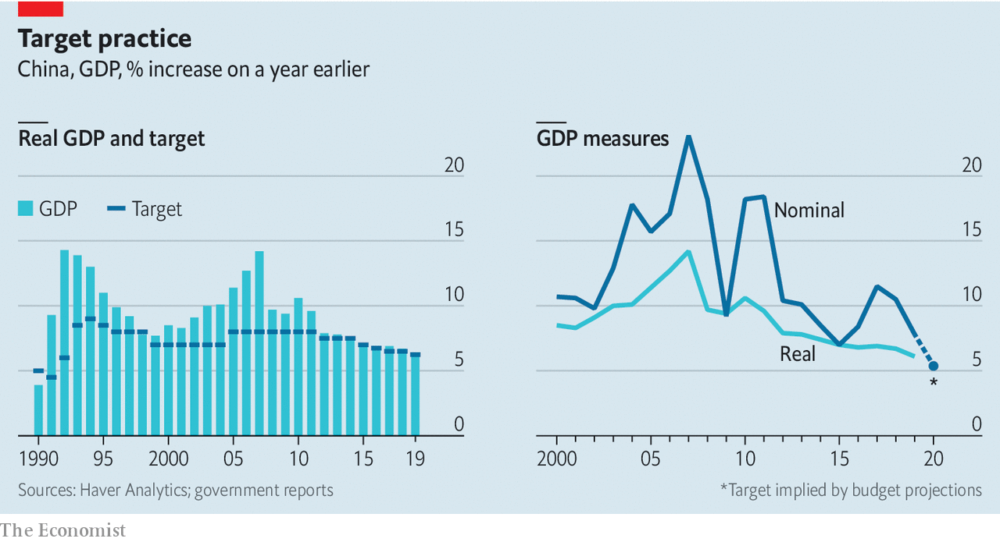

## A change of plan

# For the first time in 30 years, China has no GDP target

> The government will not set one this year, reflecting the pandemic’s uncertainties

> May 30th 2020

CHINA HAD long been the only large economy with an annual growth target. On May 22nd the government said it would not set one this year, so profound is the uncertainty wrought by the pandemic. Economists applauded: the target obsession led to much wasteful investment and some book-cooking. With a little digging you can still get an idea of how fast the government expects the economy to expand. Its budget projections suggest that it is implicitly aiming for nominal growth of 5.4% in 2020.

Editor’s note: Some of our covid-19 coverage is free for readers of The Economist Today, our daily [newsletter](https://www.economist.com/https://my.economist.com/user#newsletter). For more stories and our pandemic tracker, see our [coronavirus hub](https://www.economist.com//news/2020/03/11/the-economists-coverage-of-the-coronavirus)

## URL

https://www.economist.com/finance-and-economics/2020/05/30/for-the-first-time-in-30-years-china-has-no-gdp-target
