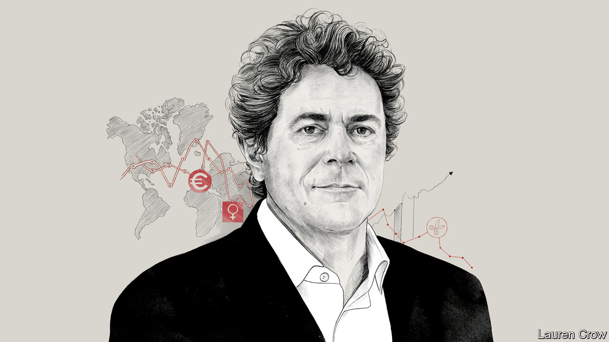

## Free exchange

# The legacy of Alberto Alesina

> He traced the links between culture, politics and fiscal policy

> May 28th 2020

A DECADE AFTER the last global downturn, the economics establishment’s U-turn on austerity is complete. In 2010 the IMF praised Britain’s tough deficit-reduction plan. Now it recommends a big fiscal expansion to cope with the coronavirus pandemic. Politicians were once fond of citing research co-authored by Kenneth Rogoff, an economist, to warn that public debt exceeding 90% of a country’s GDP would crimp growth. Today Mr Rogoff advises spending more. But Alberto Alesina, an economist at Harvard University who died on May 23rd, stood his ground.

In a book written with Carlo Favero and Francesco Giavazzi and published last year, Mr Alesina once again defended austerity—as long as the right policies were used. Tax rises might damage economic growth more than cuts in public spending—which in some cases could actually boost the economy, perhaps because investors would expect their future tax burden to be lower. Other economists criticised the results. Yet Mr Alesina did not mind being a dissenting voice. His papers—and there were reams of them—showed that democracies, especially his beloved Italy, tend to accumulate public debt. Somebody had to remind politicians of the dangers of unsustainable fiscal policy.

Mr Alesina was primarily an economist of politics and culture. Back in the 1980s, when he was completing his PhD at Harvard, wonks sneered at those investigating such supposedly soft questions. But Mr Alesina showed that explaining economic outcomes—why some countries are rich and others poor, or why immigrants succeed in some places but not others—meant looking beyond prices and GDP to subjects such as history and sociology.

He sought, for instance, to explain the wide variation in women’s labour-force participation between countries (in Iceland 82% of working-age women are in work; in Italy, 50% are). The answer lay in differences in agricultural technologies used hundreds of years ago, some of which favoured female labour more than others. Talking to The Economist shortly before he died, Mr Alesina presented new evidence that cultural traits persist. The grandchildren of China’s elites of the first half of the 20th century, he found, today earn more than others. Despite revolution and expropriation, hard-wired preferences—eg, they are found to be more likely to believe in the power of hard work—seem to give them an edge.

At first glance, these questions might seem a million miles from tax rates and debt ratios. Not so for Mr Alesina. “The same historical, sociological, cultural variables which may have led to the choice of certain institutions may also be correlated with fiscal policies,” he said. He asked why America spent relatively little on welfare, but Europe spent lots. His answer was that it was a matter of culture. Americans blamed the poor for their predicament; Europeans worried about the disadvantages holding them back.

Culture and politics might also explain a worrying fiscal trend. It was reasonable, said Mr Alesina, to expect governments to run budget surpluses during good times and deficits during bad. But, he noted, this increasingly did not happen. He was fond of citing a study from 2014, which found that only four out of 20 rich countries had run a budget surplus for more than half the time since the 1960s. Italy ran a deficit every year. Structurally weaker growth and an ageing population made it all too easy for governments to accumulate debts—even in the absence of a crisis. Mr Alesina, who was known for being generous in both time and spirit to junior researchers, worried that the young bore the costs of such profligacy. “In countries like Italy”, he argued, “we are reaching paradoxes in which youngsters do not find jobs because of high labour taxes”, which exist in order to “pay pensions for the parents, who then support the unemployed children”.

Sociopolitical factors might explain the deviation from optimal fiscal policy. Once public spending had gone up, people’s expectations changed, making it difficult to bring it down again. Mr Alesina’s research cautiously suggested that proportional-representation systems—which have long characterised countries such as Italy—were likely to be more fiscally lax than other systems. They were more unstable, and ministers expecting to lose office at any moment might not worry about dealing with the consequences of their actions. He also wondered whether coalition governments, which are more common under proportional representation, found it more difficult to shrink budget deficits because they had to cater to vested interests.

Mr Alesina puzzled over why fiscal irresponsibility had become acute. Perhaps, as the electorate aged, pressure to provide generous pensions and health care became overwhelming. Political polarisation may have allowed governments to feel little compunction in leaving a mess for their successors to clear up. In his research, and in emails that were notoriously riddled with typos, he encouraged others to explore the question further.

Whatever the explanation, something had to change. “If the French think that they can keep retiring at 60, they’re kidding themselves,” he argued. One solution was for governments to impose constraints on themselves. In the 1990s he argued for independent central banks, which made it harder for politicians to inflate debts away. Another solution was to adopt fiscal rules—for instance, a promise to balance the budget over the economic cycle. Yet Mr Alesina worried that these alone would not suffice. Could governments credibly commit themselves to upholding them?

Perhaps politicians could be persuaded to be more responsible. He found little evidence to support the idea that lawmakers who take tough decisions are booted out of office. But Mr Alesina also wanted them to recognise that, without vigilance, the logic of politics encourages unsustainable fiscal policy. As covid-19, rising health-care costs and an older population cause debt to mount, his arguments may soon seem more relevant than ever. ■

## URL

https://www.economist.com/finance-and-economics/2020/05/28/the-legacy-of-alberto-alesina
