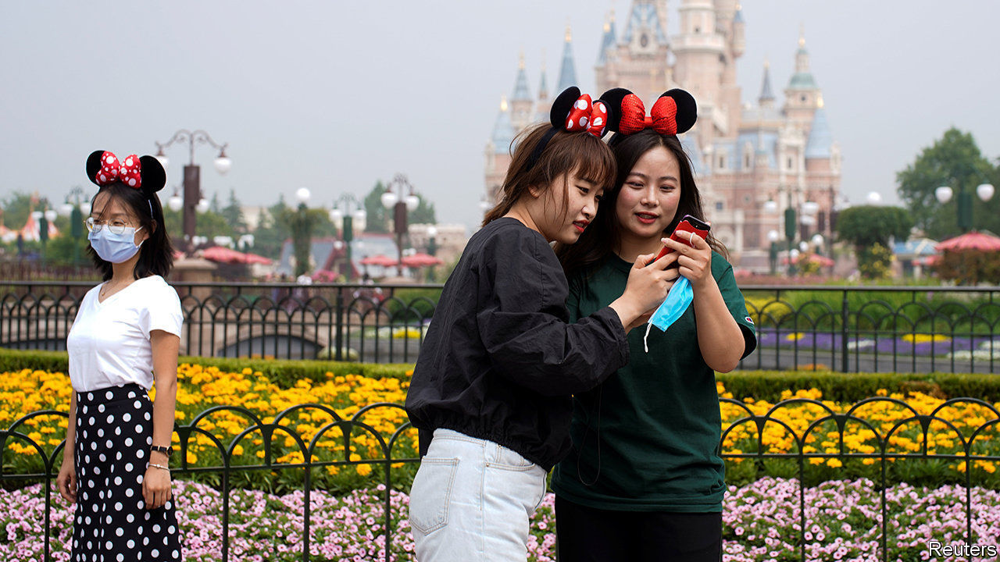

## Still grounded

# How China emerges from lockdown will affect global tourism

> Will footloose Chinese shoppers still feel welcome abroad?

> May 28th 2020

YOU CAN wave to the giant Mickey Mouse mascot, but not get close enough for a jolly selfie. Such are the rules at Disneyland Shanghai, which reopened on May 11th. Visitor numbers are capped at 30% of the sprawling park’s capacity. Meanwhile the Forbidden City in Beijing can now take only 5,000 visitors a day, just 6% of its normal cap.

China is leading the way out of travel lockdowns—but still largely within its own borders. Over the Labour Day weekend at the start of May, some 115m Chinese went on domestic holidays, a healthy 60% of last year’s number. Capacity on Chinese domestic flights was down by only 10% year-on-year in the first week of May. But foreign flights are still rare: each carrier gets one flight to every destination once a week.

Whether—and how fast—the Chinese rediscover their yen for venturing abroad matters a lot to the rest of the world. Once a tourism tiddler, China is now a giant: no country sends more tourists overseas. The surge of Chinese travellers accounts for a quarter of the rise in global spending on tourism since 2000. The 150m foreign trips by mainlanders (including to Hong Kong and Macau) in 2018 added up to 10% of all global departures, up from 1% in two decades. China is also now the fourth most-visited country behind France, Spain and America.

Purveyors of services beyond aviation and accommodation depend on it. Chinese tourists spend lavishly on overseas jaunts, around double the global average. Last year they accounted for 81% of South Korea’s duty-free sales. Over a third of all the luxury baubles sold by the likes of Louis Vuitton and Gucci are bought by Chinese splurgers, according to Bain, a consultancy. And over two-thirds of that is overseas, notably in Europe. If tourism sags, posh stores there will lose custom to luxury shops in China (despite selling the same stuff more cheaply).

Gloria Guevara of the World Travel and Tourism Council, a trade body, says Chinese may feel a whiff of stigmatisation thanks to the pandemic. “I think the Chinese will continue to travel and will travel internationally at the right time [but] at the beginning will want to travel to countries where they feel more welcome.” Alternatively, once the virus has largely been eradicated at home, Chinese tourists may decide that they are less keen to visit places where the contagion may still be lurking.

Editor’s note: Some of our covid-19 coverage is free for readers of The Economist Today, our daily [newsletter](https://www.economist.com/https://my.economist.com/user#newsletter). For more stories and our pandemic tracker, see our [coronavirus hub](https://www.economist.com//news/2020/03/11/the-economists-coverage-of-the-coronavirus)

## URL

https://www.economist.com/international/2020/05/28/how-china-emerges-from-lockdown-will-affect-global-tourism
