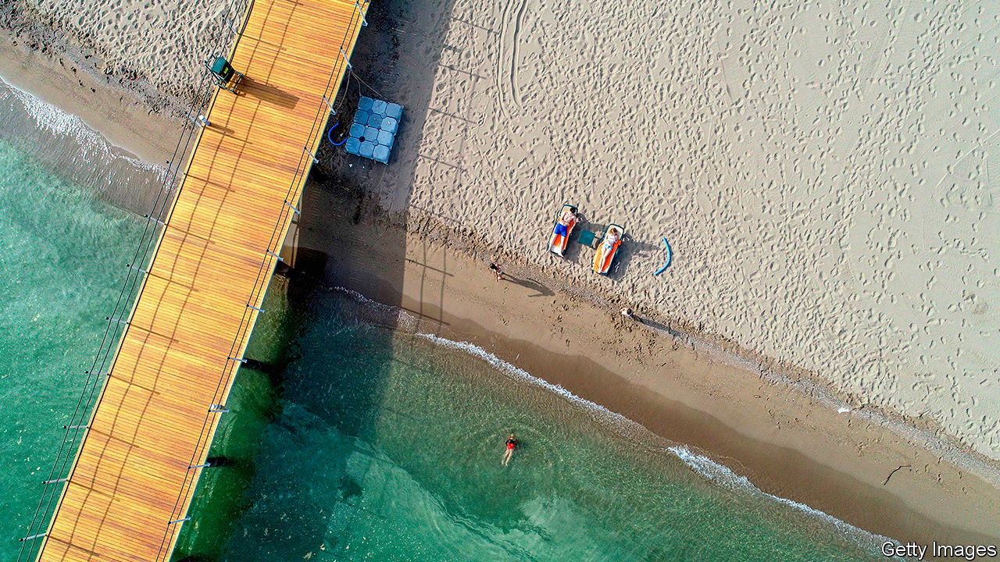
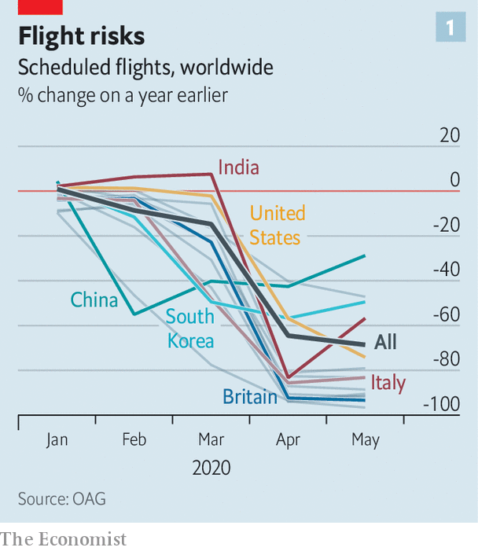
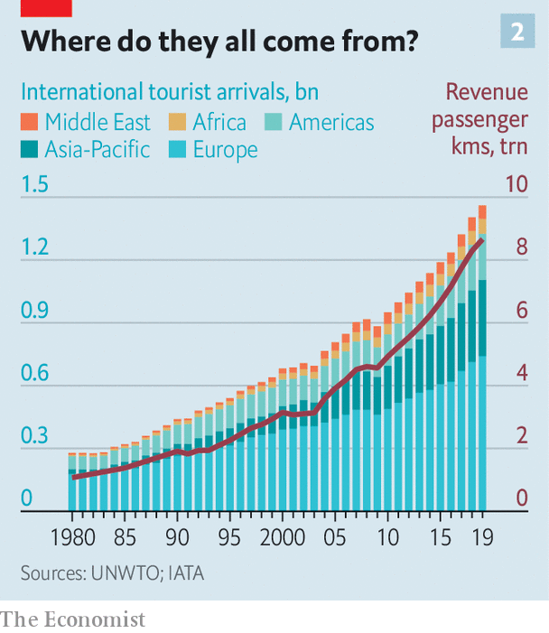

## Lonely planet

# What awaits tourists when they re-emerge from lockdown?

> Covid-19 will change the way people travel

> May 30th 2020HEATHROW AND PROVENCE

Editor’s note: Some of our covid-19 coverage is free for readers of The Economist Today, our daily [newsletter](https://www.economist.com/https://my.economist.com/user#newsletter). For more stories and our pandemic tracker, see our [coronavirus hub](https://www.economist.com//news/2020/03/11/the-economists-coverage-of-the-coronavirus)

MOST STRIKING is the absence—of cars outside the building, of people inside it, of any activity at all. So astonished was Alaba, an Uber driver, as he approached Heathrow airport on a Saturday morning in May that he circled the final roundabout twice, crying, “This can’t be Heathrow.”

Inside an employee stood ready to hand out facemasks, with no one to give them to. The vast check-in hall was nearly deserted. Just one lane at security was operating. Many of the lights were off. The departures board showed six flights for the entire day.

International travel has all but stopped. Borders are closed. Hotels are empty. In April last year 6.8m passengers passed through Heathrow. This April just over 200,000 did—fewer than a pandemic-less daily average. Flight movements across Europe are down by nearly 85% (see chart 1). In America the Transportation Security Administration screened 3.2m passengers in its airports last month, down from 70m during the same period last year. Some countries, such as India, stopped all road and rail transport, grounded all flights and shuttered airports. And as countries creak open, they are picking and choosing which nationalities to allow in. The old rules have gone out of the window.

And so for many 2020 will be a year without holidays. The fear of disease will keep people at home. Travel is already a luxury. Even in rich Europe, with its generous holiday entitlements, three in ten cannot afford a week’s annual holiday away from home. Those who have lost jobs or who are worried about recessions may cut travel from their budgets. For those who still dream of foreign beaches, the biggest obstacle will be getting anywhere. Many restrictions—including border closures and quarantines post-arrival—are still in place.

Tourism is a giant of the global economy. People went on 1.4bn foreign trips in 2018, twice the number in 2000 (see chart 2). In that time a rich-country habit became a global one. Such was the scramble to attract tourists, countries started projecting themselves as global travel brands (think Incredible India! or Epic Estonia). By the industry’s reckoning, 330m jobs—from well-paid airline pilots to tour guides and dishwashers working unseen in expensive resorts—depend on travellers. Many of those are local; about three-quarters of all tourism in rich countries is within national borders, according to the OECD, a club of mostly rich countries.

The health of national exchequers, as well as the shape of sectors from restaurants to hotels and luxury goods (which are often bought while people are on holiday), will depend on what tourism looks like when it is allowed to resume. Hotels and airlines are using the upheaval as an opportunity to rework how they function. Families are rethinking how and where they can safely take their holidays. Many of the changes will last only until a vaccine for covid-19 appears. But some will stick. How people start to travel in 2020—or 2021—will shape how they travel for years thereafter.

In normal times international tourists spend $1.6trn each year—more than Spain’s GDP. The jobs tourism creates cannot be offshored, and often appear in places where few other opportunities exist. A Barcelona bar selling sangria to a German tourist may not look like an exporter, but its impact on the national accounts is much the same as if it had shipped the bottle north. In fact as a source of global export revenues, tourism is bigger than the food or car industries.

But forecasts for 2020 range from the abysmal to the apocalyptic. The UN World Tourism Organisation predicts a fall in international travel spending of $910bn-1.2trn this year. It predicts that arrivals will tumble by 60-80%. Of the 217 destinations the body tracks, 72% have closed their borders to international tourists. Europe will be hit especially hard. It receives over half of the world’s tourists every year. Most are due to arrive soon. More than other tourism hotspots, summers are vital: 59% of all tourism-related receipts in Greece are booked from July to September. Tourism is a rare example of an industry where southern Europeans outshine (and often host) their northern counterparts.

Some are taking tentative steps towards reopening. Greece and Italy hope to welcome international tourists this summer. Regional “travel bubbles” are being considered in parts of Europe and Oceania (see [Banyan](https://www.economist.com//asia/2020/05/28/asian-countries-try-to-build-travel-bubbles)). But many would-be travellers will have to stay in their own countries.

In South Korea, which never locked down entirely, three-quarters of all planned trips by air in April were domestic, compared with a tenth normally, according to Skyscanner, a price-comparison website. Around the world car-rental searches are up, too. According to Airbnb, a home-rental website, domestic bookings everywhere have grown dramatically, to over 80% of total reservations. Even more striking, many people are booking properties within 50 miles (80km) of where they live, with the majority within 200 miles. Being able to drive home is useful if lockdown conditions change suddenly.

Travelling within China, which was the first country to impose a lockdown and now appears to have its outbreak largely under control, is returning to something close to normality (see [article](https://www.economist.com//international/2020/05/28/how-china-emerges-from-lockdown-will-affect-global-tourism)). But even in America, which is still reporting more than 20,000 fresh cases every day, the first weekend of May saw spikes in hotel occupancy, according to Keith Barr of IHG, a hotel group that includes the InterContinental and Holiday Inn chains. “The level of demand surprised me. I didn’t think anybody would be travelling right now,” he says. Given closed borders, the demand is all domestic.

For now European leaders, from Italy to France, are hoping that locals who cannot leave will replace foreigners who cannot enter. That might work, to some extent and in some countries. But many tourist hotspots, like Iceland or Caribbean islands, have too few locals to replace absent foreigners. Malta, which each year hosts nearly six foreign visitors for every native, might get a quarter of the 2.9m tourists it attracted last year, reckons Johann Buttigieg of the Malta Travel Authority—if its borders reopen in time for summer. Residents of countries that export more tourists than they receive, such as Britain, South Korea and Germany, will struggle to squeeze onto their own beaches.

Even more “balanced” countries, like the Netherlands, will struggle to slot domestic tourists into the gap left by foreigners: a pricey Airbnb overlooking an Amsterdam canal is more appealing to a New Yorker than to a stranded Rotterdammer. Backpacker hostels, which are as charming to skint foreign youngsters as they are unappealing to locals, are in for a tough spell. Camping grounds attracting relatively local caravaners will do better.

Meanwhile, urban destinations have fallen out of favour—why go to New York if Broadway is closed? Rural getaways by contrast are in demand. IHG’s busiest hotels are ones situated by beaches. STR, a travel-research firm, says occupancy rates at some seaside spots in America’s south were as high as 60%.

That might lead to what Brian Chesky, Airbnb’s boss, calls travel redistribution: people taking trips to out-of-the-way places rather than the usual metropolises. Airbnb, which can offer rooms almost anywhere, was already banking on a trend for people to move off the beaten track and save money by shunning tourist hotspots. That trend has become turbocharged. Mr Chesky says he used to think it would take 20-30 years for travellers’ habits to change. Now he thinks it will happen in mere weeks or months.

Upending the world’s travel habits even for a few months will have long-term effects. If tourists discover the virtues of new locations, they will want to return.

People are either looking for flights far further into the future or far closer to now—not so much last-minute as last-second travel, jokes Luca Romozzi of Sojern, a travel consultancy. Booking (and paying) later will change the business model of airlines and hotels, which have long bankrolled themselves with customers’ advance payments. Worse, most travel vendors now have to agree to flexible cancellation terms if they are to attract any kind of custom.

The economics of providing travel services will change in other ways. Making things easier to clean and reducing touchpoints will be priorities. Hotels are ditching carpets in favour of bare floors. Throw cushions are being thrown out. Restaurant menus will probably become digital or appear on chalkboards. Kitchens will offer fewer dishes, to simplify the cooking process and to avoid wasting stocked ingredients in case of more enforced closures.

Other disappearances will be more noticeable. The buffet has probably seen its last supper. Check-in will be automated. “We obviously still want to provide a welcome, but actually printing a key is just a transaction. That’s not really a welcome,” says Arne Sorenson of Marriott, the world’s biggest hotel chain. Expect mobile check-in, room keys on phones and more voice-activated room controls.

Such proposals are part of an immediate reaction to the pandemic—in-your-face health measures that form a sort of “hygiene theatre”. Countries such as Greece are selling themselves as less infected by covid-19. A Portuguese minister boasted of its wonderful nurses should travellers fall ill there, such as the one who tended to Boris Johnson, the British prime minister.

Using health and hygiene as marketing tools is a return to old form. Richard Clarke of Bernstein, a research firm, notes that an ad for Holiday Inn from the 1970s emphasised cleanliness as the chain’s main selling point, ahead of location and comfort. It will come to the fore again, to the benefit of big brands. People may put up with spartan digs if they know they have been thoroughly disinfected. Marriott now boasts of a “Global Cleanliness Council”.

Airports will also emphasise hygiene. “I think the move to minimising contact during any travel experience will just push us over the edge to having a contactless journey,” says John Holland-Kaye, Heathrow’s chief. “Once you get into the terminal, you’ll scan your passport, have an image of your face taken, drop your bags,” and then stroll through checkpoints as cameras use facial recognition to open gates.

Some of this may sound far-fetched, but citizens of some three dozen countries can already use e-gates to get through passport control on arrival at Heathrow and many other airports, allowing them to go from gate to kerb without talking to another person. Security will still involve slowing down, but even there it should soon be possible to leave laptops and liquids inside the bag. Automation will reduce the need to touch trays. Hand-sanitiser is already everywhere. Once implemented, such changes are unlikely to be undone.

By contrast the in-flight experience may change much less in the long term. Observant travellers will notice tweaks. In-flight magazines will probably disappear. Meal services may be reduced to bags of snacks and bottles of water for a while.

But crucial things—such as the middle seat on airplanes—will not disappear. Airlines are clear that it would destroy their business model, which requires around two-thirds of seats to be filled to make a profit. “We don’t think it is necessary and either we don’t fly or we have to increase prices by 45-50%, or 100% for some” airlines, says Alexandre de Juniac of the International Air Transport Association, aviation’s main trade body. Lower fuel costs will help somewhat with operational expenses, but airlines also have high fixed costs.

Instead, Mr de Juniac advocates a globally co-ordinated system of checks and safety measures that include health declarations from passengers, temperature checks at departure and arrival points, widespread use of facemasks and enhanced cleaning of aircraft. Some of these changes will endure and could increase costs. Adding several cabin cleanings a day will reduce the number of flights a single plane and crew can fly. This is particularly harmful to low-cost airlines, whose business models rely on quick turnarounds.

Not all these changes will be universal. People have diverse tastes, different reasons to travel and varying appetites for risk. Budgets also dictate their choice of destination and activity. Americans who might have gone to the Caribbean will have to make do with Florida. Chinese luxury-shoppers can turn to high-end malls at home. But Scottish sun-seekers or Saudis escaping the desert summer will want to get back on planes. The poshest travellers, who can afford first-class flights and private suites, will have less reason to fear disease. Places that appeal to a mostly younger crowd will probably function as close to normal as possible within governmental guidelines. Nobody wants to go to a socially distanced nightclub.

Giant cruise-liners carrying thousands of often-old people will take longer to recover their appeal—if they ever do. They guaranteed a steady flow of visitors to islands with few other sources of hard currency. A dozen countries rely on tourism to generate over 60% of their export income, according to the UN’s parasol counters, all of them renowned for their beaches. The Caribbean has seen a slew of credit-rating downgrades as a result. If travel curbs do not ease before the crucial winter season, downgrades will translate into defaults.

Much attention has been lavished in recent years on the problems of overtourism for a handful of superstar cities such as Venice and Barcelona. But most destinations have found a happy balance between tourism and normal life. It is those places that will feel its absence hardest. As Mr Buttigieg says, speaking from a deserted Malta, “Nobody realised how important tourism was until it was gone.” ■

Clarification: The figure showing the share of Airbnb reservations which are domestic bookings was updated after the publication of this article. 

## URL

https://www.economist.com/international/2020/05/30/what-awaits-tourists-when-they-re-emerge-from-lockdown
