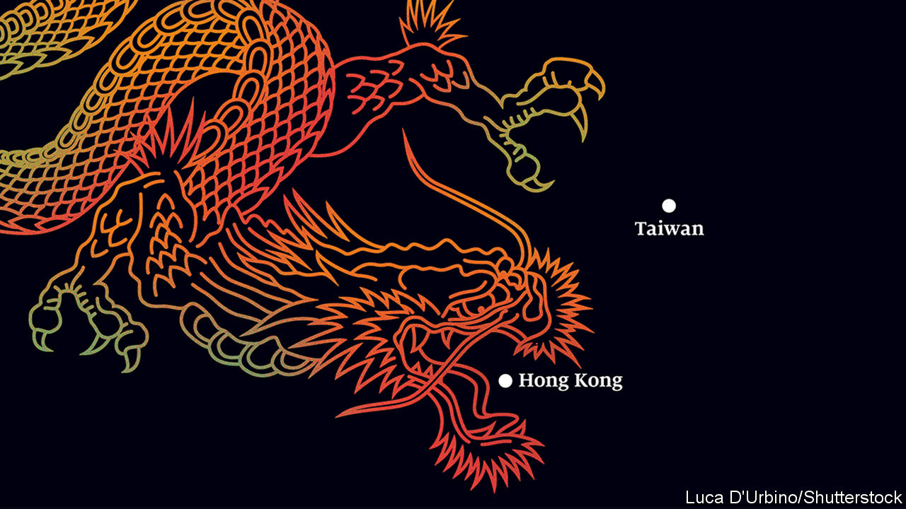

## Dragon strike

# China has launched rule by fear in Hong Kong

> The rest of the world should worry, too

> May 28th 2020

THE PEOPLE of Hong Kong want two things: to choose how they are governed, and to be subject to the rule of law. The Chinese Communist Party finds both ideas so frightening that many expected it to send troops to crush last year’s vast protests in Hong Kong. Instead, it bided its time. Now, with the world distracted by covid-19 and mass protests difficult because of social distancing, it has chosen a quieter way to show who’s boss. That threatens a broader reckoning with the world—and not just over Hong Kong, but also over the South China Sea and Taiwan.

On May 21st China declared, in effect, that Hong Kongers deemed to pose a threat to the party will become subject to the party’s wrath. A new security law, written in Beijing, will create still-to-be defined crimes of subversion and secession, terms used elsewhere in China to lock up dissidents, including Uighurs and Tibetans. Hong Kong will have no say in drafting the law, which will let China station its secret police there. The message is clear. Rule by fear is about to begin.

This is the most flagrant violation yet of the principle of “one country, two systems”. When the British colony was handed back to China in 1997, China agreed that Hong Kong would enjoy a “high degree of autonomy”, including impartial courts and free speech. Many Hong Kongers are outraged (see [article](https://www.economist.com//china/2020/05/28/chinas-national-security-bill-for-hong-kong-is-an-attempt-to-terrify)). Some investors are scared, too. The territory’s stockmarket fell by 5.6% on May 22nd, its biggest drop in five years. Hong Kong is a global commercial hub not only because it is situated next to the Chinese mainland, but also because it enjoys the rule of law. Business disputes are settled impartially, by rules that are known in advance. If China’s unaccountable enforcers are free to impose the party’s whims in Hong Kong, it will be a less attractive place for global firms to operate.

China’s move also has implications far beyond Hong Kong. “One country, two systems” was supposed to be a model for Taiwan, a democratic island of 24m that China also sees as its own. The aim was to show that reunification with the motherland need not mean losing one’s liberty. Under President Xi Jinping, China seems to have tired of this charade. Increasingly, it is making bare-knuckle threats instead. The re-election in January of a China-sceptic Taiwanese president, Tsai Ing-wen, will have convinced China’s rulers that the chances of a peaceful reunification are vanishingly small. On May 22nd, at the opening of China’s rubber-stamp parliament, the prime minister, Li Keqiang, ominously cut the word “peaceful” from his ritual reference to reunification. China has stepped up war games around Taiwan and its nationalists have been braying online for an invasion.

China is at odds with other countries, too. In its building of island fortresses in the South China Sea, it ignores both international law and the claims of smaller neighbours. This week hundreds, perhaps thousands of Chinese troops crossed China’s disputed border with India in the Himalayas. Minor scuffles along this frontier are common, but the latest incursion came as a state-owned Chinese paper asserted new claims to land that its nuclear-armed neighbour deems Indian (see [article](https://www.economist.com//asia/2020/05/28/a-border-dispute-between-india-and-china-is-getting-more-serious)). And, as a sombre backdrop to all this, relations with the United States are worse than they have been in decades, poisoning everything from trade and investment to scientific collaboration.

However much all the regional muscle-flexing appals the world, it makes sense to the Chinese Communist Party. In Hong Kong the party wants to stop a “colour revolution”, which it thinks could bring democrats to power there despite China’s best efforts to rig the system. If eroding Hong Kong’s freedoms causes economic damage, so be it, party bigwigs reason. The territory is still an important place for Chinese firms to raise international capital, especially since the Sino-American feud makes it harder and riskier for them to do so in New York. But Hong Kong’s GDP is equivalent to only 3% of mainland China’s now, down from more than 18% in 1997, because the mainland’s economy has grown 15-fold since then. China’s rulers assume that multinational firms and banks will keep a base in Hong Kong, simply to be near the vast Chinese market. They are probably right.

The simple picture that President Donald Trump paints of America and China locked in confrontation suits China’s rulers well. The party thinks that the balance of power is shifting in China’s favour. Mr Trump’s insults feed Chinese nationalist anger, which the party is delighted to exploit—just as it does any tensions between America and its allies. It portrays the democracy movement in Hong Kong as an American plot. That is absurd, but it helps explain many mainlanders’ scorn for Hong Kong’s protesters.

The rest of the world should stand up to China’s bullying. On the Sino-Indian border, the two sides should talk more to avoid miscalculations, as their leaders promised to in 2018. China should realise that, if it tries the tactics it has used in the South China Sea, building structures on disputed ground and daring others to push back, it will be viewed with greater distrust by all its neighbours.

In the case of Taiwan China faces a powerful deterrent: a suggestion in American law that America might come to Taiwan’s aid were the island to be attacked. There is a growing risk that a cocksure China may decide to put that to the test. America should make clear that doing so would be extremely dangerous. America’s allies should echo that, loudly.

Hong Kong’s options are bleaker. The Hong Kong Policy Act requires America to certify annually that the territory should in trade and other matters be treated as separate from China. This week the secretary of state, Mike Pompeo, declared that “facts on the ground” show Hong Kong is no longer autonomous. This allows America to slap tariffs on the territory’s exports, as it already does to those from the mainland. That is a powerful weapon, but the scope for miscalculation is vast, potentially harming Hong Kongers and driving out global firms and banks. It would be better, as the law also proposes, to impose sanctions on officials who abuse human rights in Hong Kong. Also, Britain should grant full residency rights to the hundreds of thousands of Hong Kongers who hold a kind of second-class British passport—much as Ms Tsai this week opened Taiwan’s door to Hong Kong citizens. None of this will stop China from imposing its will on Hong Kong. The party’s interests always trump the people’s. ■

## URL

https://www.economist.com/leaders/2020/05/28/china-has-launched-rule-by-fear-in-hong-kong
