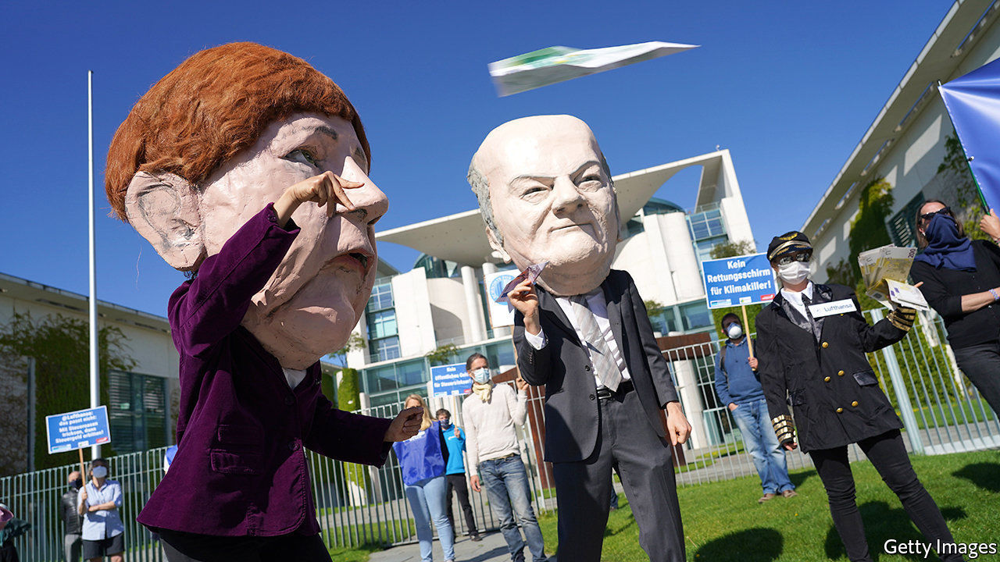
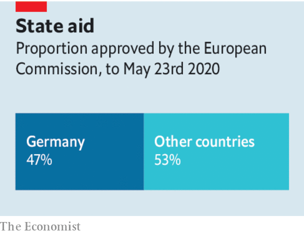

## Europe’s bail-outs

# Government handouts threaten Europe’s single market

> The dangers of Europe’s bail-outs

> May 28th 2020

Editor’s note: Some of our covid-19 coverage is free for readers of The Economist Today, our daily [newsletter](https://www.economist.com/https://my.economist.com/user#newsletter). For more stories and our pandemic tracker, see our [coronavirus hub](https://www.economist.com//news/2020/03/11/the-economists-coverage-of-the-coronavirus)

A BILLION OR two here, a giant government cheque there: the money doled out by European governments to support businesses is starting to add up. Some €2trn ($2.2trn) or so has been earmarked to keep firms afloat. The early beneficiaries included bakeries, bookshops and the like. Now it is increasingly the turn of corporate titans. This week France announced an €8bn package to support its carmakers, including a large loan to Renault. Lufthansa is negotiating a €9bn bail-out from Germany which may involve the state taking a 20% stake. Now the taps are open, more blue-chip bail-outs are expected.

In normal times such state aid is all but banned by the European Union to ensure a level playing field for firms across the bloc (see [article](https://www.economist.com//europe/2020/05/28/europes-habit-of-propping-up-firms-may-outlast-the-pandemic)). The idea is to ensure that companies thrive on their merits, not government favours. Restricting state aid frustrates politicians of a dirigiste persuasion—there are lots—but is vital to spare taxpayers, consumers and competitors the burden of a rigged market.

The rules have been quietly shelved as Europe grapples with covid-19. Giving governments a temporary reprieve was unavoidable as national exchequers battle to stave off depression. But it also carries long-term dangers. Even before the crisis, France and Germany railed against European rulings that they say prevented the creation of corporate champions able to compete with rivals from China and America. Now they may seize the moment to try to water down competition rules permanently.

It is not hard to see the harm that free-flowing state money could do. Germany represents a quarter of the bloc’s GDP but nearly half of its state aid, because its buoyant public finances allow it to be generous. Tough luck if you are a company in Spain or Italy where tighter budgets mean smaller handouts. Politicians usually favour certain companies—famous flag-carriers instead of scrappy low-cost airlines, say. And the bail-outs invariably come with nationalist strings. Renault and other French carmakers are promising to keep production and research in France (see [article](https://www.economist.com//business/2020/05/28/the-renault-nissan-alliance-hunkers-down)). Once the state becomes a shareholder or creditor, bosses know their firm’s prospects partly depend on a willingness to please their political masters.

How to ensure that the necessary evil of bail-outs does not cripple the single market? They should be tolerated only when all other options have been exhausted. In America even cruise-liners—a challenged business model if ever there was one—have raised bonds and found new shareholders. Europe has shallower capital markets, but plenty of investors with money to spend.

The risks of an uneven playing field will ease if bail-out money is distributed evenly around the EU. On May 27th the European Commission unveiled a €750bn plan to offer grants and loans from mainly rich countries to mainly poor ones. Though there is much haggling left to be done, this proposal heads in the right direction.

Most important, all bail-outs need to be carefully policed. This means ensuring that companies are not using public cash to run large losses or to pay for their expansion plans once the economy opens up. Governments may have to take shares in firms in order to safeguard taxpayers’ financial interests. But there should be rigorous enforcement of rules that encourage firms to repay loans and buy back government stakes quickly by banning them from paying dividends and bonuses. Bail-outs are taking place everywhere. But in Europe they are especially dangerous, because they can undermine economic integration and encourage politicians’ inexhaustible appetite to meddle in industry. Creating a giant, open and competitive market has been one of Europe’s great achievements. In the rush to help business it must not be eroded.■