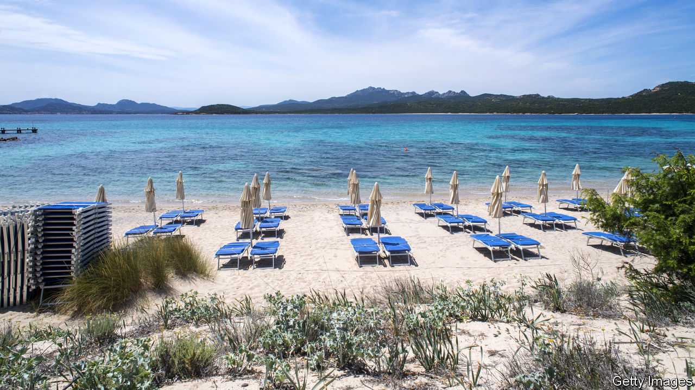

## The summer holiday will be back

# How tourism will survive the pandemic

> Foreign adventure, discovery and hedonism are on hold. They will be back

> May 28th 2020

Editor’s note: Some of our covid-19 coverage is free for readers of The Economist Today, our daily [newsletter](https://www.economist.com/https://my.economist.com/user#newsletter). For more stories and our pandemic tracker, see our [coronavirus hub](https://www.economist.com//news/2020/03/11/the-economists-coverage-of-the-coronavirus)

TOURISM IS THE most popular and least controversial form of globalisation. For those travelling abroad it promises an infinite variety of pleasures, from admiring Titians in Venice to sipping piña coladas in Goa. For the host countries it brings in cash—lots of it. The industry accounts for 7% of world exports and 330m jobs. But business is on pause (see [article](https://www.economist.com//international/2020/05/28/how-china-emerges-from-lockdown-will-affect-global-tourism)). Ticket sales at Angkor Wat in Cambodia are down by 99.5% compared with last year and countless Mediterranean sunbeds lie empty. Around the world a vital question is being asked: what will happen to the summer holidays? The answer is that tourism will be back—but not in exactly the same form, and only if NIMBYS and governments don’t spoil the fun.

Over the past half-century the travel industry has grown faster than a beach-bar tab on a sunny afternoon. In 1970 fewer than 200m people went on holiday abroad; last year the figure was 1.5bn. Soaring incomes in China explain part of the increase. It has also become cheaper to fly and easier to browse for the perfect swimming pool online—Expedia lists 1m hotels and properties. Visa rules have been loosened. The average person in the rich world can travel to over 100 countries without a visa, compared with 50 half a century ago, and the rules have got easier for people in emerging economies, too. As the industry has boomed, small firms and workers have prospered from the business of holidays. Some 80 countries, including Tanzania, Thailand and Turkey, rely on tourism for a tenth or more of their exports.

These countries’ need for foreign exchange means that they are desperate to ensure this summer is not a write-off. Hotel firms are keen to fill rooms and younger consumers are prepared to take risks, judging by the packed beaches in America on Memorial Day. Nonetheless, caution is warranted. By jamming together people from around the world, tourism can be a lethal spreader of the virus. A single bar in an Austrian ski resort may have caused outbreaks across Europe, while cruise ships turned into floating biohazards. That means tourism in 2020 and 2021 will necessarily involve restrictions. One is filtering visitors by nationality. Cyprus plans to open on June 9th to most European tourists, but not those from Britain and Russia, two covid-19 hot-spots. America has just banned visitors from Brazil. Another fix is lower density. Brian Chesky, the boss of Airbnb, reports a surge in bookings for out-of-town dwellings. All told, the number of tourists this summer will be a fraction of normal levels.

In the long term, supposing a vaccine is found, the picture is brighter. Even if some consumers remain nervous, the industry will adapt. Marriott has appointed a cleanliness council and is introducing electrostatic disinfectant sprayers; Airbus is working on touchless bathrooms. Better testing will give travellers and governments confidence that outbreaks can be managed.

The big danger is that temporary barriers become hard to remove because of squabbling and lobbying. At the end of April more than 150 countries were closed to foreign tourists. Ongoing restrictions include quarantines and incompatible tracing apps. History suggests that it is complacent to assume these will just fall away. It took a global summit in 1920 to set rules on passports and travel after a world war and Spanish flu closed borders—and some western Europeans needed visas to go to America as recently as 1991. Already the politics of travel in Asia have caused tensions (see [Banyan](https://www.economist.com//asia/2020/05/28/asian-countries-try-to-build-travel-bubbles)). Meanwhile, NIMBYS may seek to keep tourists out of the world’s most beautiful but busiest cities.

This summer should be used to make tourism work better. That means taxes and more astute planning to tackle overcrowding. And as the global travel and airline industries restructure, there is a chance to speed up the introduction of aircraft with lower carbon emissions. It must not take decades before the world returns to the levels of openness that it had as recently as January. Tourism makes the world wealthier and happier. It should be on only a temporary break.■