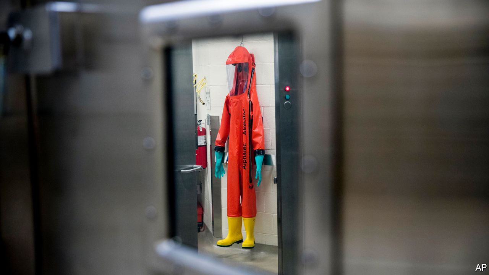
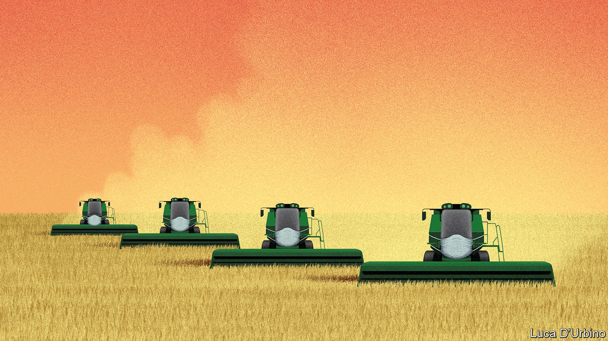

## On Bolivia, bio-weapons, covid-19 research, food, “The Leopard”

# Letters to the editor

> A selection of correspondence

> May 28th 2020

As well as a dire need for fresh elections, Bolivia requires a new constitutional order (“[In limbo](https://www.economist.com//the-americas/2020/05/16/bolivia-needs-an-election-but-covid-19-makes-that-hard)”, May 16th). Our constitutional institutions were not able to handle the crisis that led to the ousting of Evo Morales as president in 2019. The proper path of presidential succession was not followed; Jeanine Áñez’s declaration that she was president was unlawful and polarising.

Bolivia is in a state of instability last seen 15 years ago. Back in 2005 my interim government was able to conduct fair elections. The resulting constitution of 2009 flowed from a legitimate process. It affirmed the rights of indigenous citizens. Yet the institutional provisions it designed have been ineffective. The Constitutional Court granted Mr Morales a “human right” to re-election and sanctioned Ms Áñez’s accession despite her lack of a constitutional mandate.

The problem is a fixation on presidentialism. Our weak national state is held hostage by the dominance of the powerful heads of both the central government and the states. Court-packing limits the development of an independent and efficient judiciary. The Plurinational Assembly (formerly our congress) plays little part in decision-making or promoting checks and balances. That means that the main pressure-point on the presidency has come from protesters taking to the streets calling for change.

The liberalisation of social traditions by expanding civil rights is facing a terrible backlash. A new constitution must end presidentialism. Our regions need to be more independent from La Paz. Corruption is better tackled through oversight at lower levels of government. But overall, we need a strong parliamentary system, to end caudillismo and bring true plurality to politics.

EDUARDO RODRíGUEZ VELTZÉFormer president of Bolivia, 2005-06La Paz

Covid-19 has indeed raised concerns over the threat posed by biological weapons (“[Spore wars](https://www.economist.com//united-states/2020/04/23/the-havoc-wrought-by-covid-19-will-spark-new-concern-over-bio-weapons)”, April 25th). Fortunately, while advances in science and technology may be lowering the technical barriers to developing biological weapons, there are still many hurdles to overcome by anyone wishing to do so. One of these is provided by the Biological Weapons Convention and the widely accepted norm that it embodies against the use of disease as a weapon. As the preamble to the convention states, any use of a biological weapon would be “repugnant to the conscience of mankind”. Although a piece of paper alone will not stop a bio-attack, 183 countries have pledged to co-operate and come to each other’s aid in such an event.

The next review conference will take place in late 2021 and will provide the perfect opportunity to adapt the treaty to the challenges posed by technological advances and to reflect on the lessons learned from the current pandemic.

DANIEL FEAKESChiefBiological Weapons Convention Implementation Support UnitUnited Nations Office for Disarmament AffairsGeneva

You looked at the speed at which research into covid-19 is being released and preprinted on servers without peer review (“[Reaping from the whirlwind](https://www.economist.com//science-and-technology/2020/05/07/scientific-research-on-the-coronavirus-is-being-released-in-a-torrent)”, May 9th). However, publishers are collaborating to ensure peer review is thorough. We heard from academics who were overwhelmed with requests for peer review and from authors needing quick turnaround times. We have thus created a common database of peer reviewers to which we are asking researchers from around the world to sign up.

Reviewers are asked to commit to work fast and that their reviews and identity be shared among publishers and journals if submissions get rerouted for any reason. So far more than 1,200 researchers from around the world have signed on. Authors submitting relevant research will be asked to agree that reviews can be portable between publishers. So if a journal thinks work is more appropriate elsewhere it can be passed on with reviews alongside it, to speed up the decision for those editors.

This previously unheard of level of collaboration across publishers stresses the importance of working together on this challenge. Many of us within the open-science community hope that some of these changes will become the norm when we come out of the pandemic, laying the groundwork for more systematic cross-publisher collaboration that would further advance the dissemination of research. For now though we hope that our effort benefits research into this public-health emergency.

SARAH GREAVESChief publishing officerHindawiLondon

You called for “a new productivity revolution” to feed the world by 2050 (“[The food miracle](https://www.economist.com//leaders/2020/05/09/the-global-food-supply-chain-is-passing-a-severe-test)”, May 9th). It has already started, driven by the clever manipulation of crop biomes, gene editing (CRISPR technology), precision agriculture with big data, and the emergence of “new” protein sources, such as plant-based foods, insects and cultured meats. However, this revolution is happening in tandem with rejuvenated agricultural practices characteristic of previous centuries, which include composting, minimal tillage, integrating livestock and cropping, improving crop diversity and crop rotation. This is good news for farmers, consumers and our planet.

DAVID HUGHESEmeritus professor of food marketingImperial College London

The food system has held up well over the past couple of months in tough circumstances. However, the main challenges lie ahead. Around 130m more people may face crisis levels of hunger by the end of 2020, a humanitarian tragedy unless strong domestic safety nets with international support can be put in place. Crops in sub-Saharan Africa are already affected by locusts and poor weather conditions in some regions.

Far from being “left free to work its magic”, the current food system needs a reset. There are $12trn “hidden” environmental costs—emissions, biodiversity loss, eutrophication—caused each year by the food system. And we need to move beyond a narrow focus on hunger to deal with people suffering from micronutrient deficiency (or hidden hunger) as well as those who are overweight and obese.

SHENGGEN FANAGNES KALIBATAPAUL POLMANJEREMY OPPENHEIMFood and Land Use CoalitionLondon

Re-reading “The Leopard” ([Home entertainment](https://www.economist.com//books-and-arts/2020/05/02/travel-to-a-land-of-sun-and-dust-with-the-leopard), May 2nd) as the world debates what is or is not fake news brings to mind a quote from the melancholy finale of Giuseppe Tomasi di Lampedusa’s novel:

YACOV ARNOPOLINLondon

## URL

https://www.economist.com/letters/2020/05/28/letters-to-the-editor
