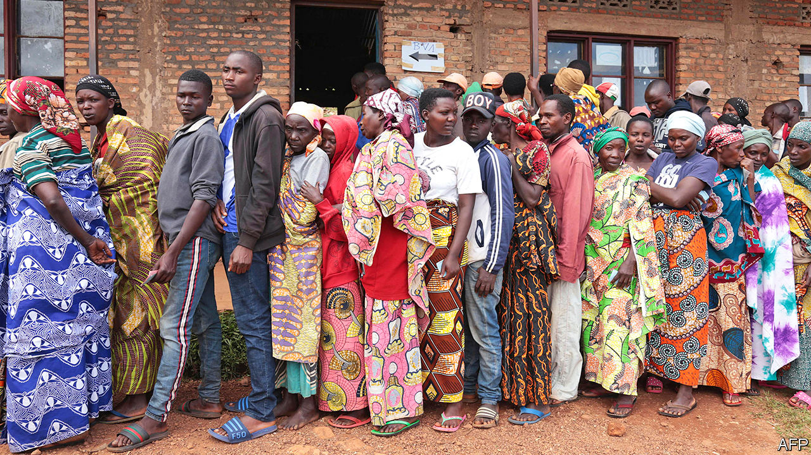

## Where dead men vote

# Burundi’s rigged election

> A landslide victory for the president’s hand-picked successor

> May 28th 2020

AS PEOPLE ELSEWHERE hunkered down at home to avoid covid-19, millions in Burundi crowded into polling stations on May 20th to vote in the general election. Among the many voters were scores of dead people, activists allege. Human-rights watchdogs said that members of the ruling party, CNDD-FDD, boosted its tallies by adding the ballots of people locked up in jail—and of those who had died.

“When I saw the same person voting for the third time I complained,” says one voter. He was sent packing by officials and told to “stop creating problems”.

Shenanigans such as these might explain why, for instance, in Bukeye in Muramvya province 4,000 more votes were cast than there were voters on the register. Another reason could be that some boxes already had papers in them when polling stations opened, suggests Aimé Magera, spokesman for the National Freedom Council (CNL), an opposition party. Few in Burundi were surprised when the ruling party’s candidate, Evariste Ndayishimiye, was declared the winner with 69% of the vote. Mr Ndayishimiye, an ex-general, was handpicked by Pierre Nkurunziza, the outgoing president who has ruled since 2005. Mr Nkurunziza is no stranger to controversy. In 2015 he won a third term, despite a constitutional limit of two. (He said his first term didn’t count, as he was chosen by parliament, rather than directly elected.)

Agathon Rwasa, the leader of the CNL, called the election a “fiasco” and plans to challenge the result in the constitutional court. Yet Burundi’s judiciary is not seen as independent. In 2015 the constitutional court ruled in favour of Mr Nkurunziza’s third term, days after the court’s vice-president fled into exile saying judges had received death threats.

More than 400 of Mr Rwasa’s supporters are in prison. Many were rounded up on polling day. In the months leading up to the election an exiled Burundian watchdog, Ligue Iteka, counted 67 killings, more than 200 arbitrary arrests and some 20 cases of torture. In Busiga in northern Burundi members of the ruling party’s fearsome youth wing painted red crosses on the doors of opposition supporters.

This sort of nastiness has been common in Burundi in recent years. Having at last agreed to retire, Mr Nkurunziza will become an adviser to his successor with the new title of “supreme guide to patriotism”. The next president will be legally obliged to consult him on matters of national unity and security.

So far, Mr Nkurunziza has appeared unfazed by covid-19. His party held huge rallies in the run-up to the election while his spokesman suggested that Burundi would be spared for putting “God first”. There are only 42 registered cases in the country, though hospital staff whisper that beds are full of undiagnosed sufferers. Handily, the pandemic did mean that no foreign election observers could get into the country. A delegation from the East African Community was warned just 12 days before the election that its members would be quarantined for two weeks.

The country is relatively calm, for now. Many fear that if they start protesting against the result, Mr Nkurunziza will enforce a belated lockdown—to stop the spread of covid-19, of course. ■

## URL

https://www.economist.com/middle-east-and-africa/2020/05/28/burundis-rigged-election
