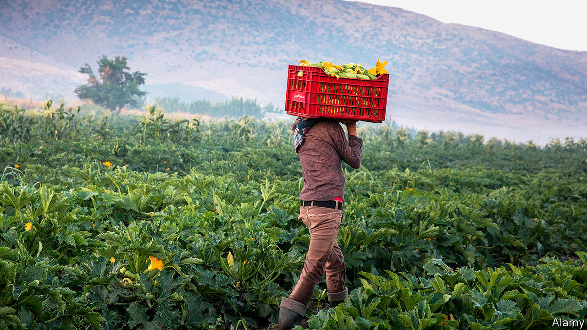

## Devaluation gardens

# Hobbyists hope to halt hunger in Lebanon by growing their own crops

> Expensive food is pushing people to the brink

> May 28th 2020BEIRUT

THE COVID-19 pandemic has brought no end of comparisons to Spanish flu, which raced around the globe in 1918. For Lebanon, though, that decade’s defining event was not flu but famine: years of hunger that killed half the population during the first world war. History feels newly relevant as the country tips into depression and food prices soar. Trapped at home these past months, often in their ancestral villages, some Lebanese have tried their hand at growing their own food. On a rooftop in Beirut, tomato vines crawl towards the sky. A designer spends weekdays behind a computer and weekends plucking broad beans in the mountains. Young people swap tips on what to grow and when.

Famous for its food, Lebanon is better at preparing the stuff than producing it. Some 20-25% of workers are involved in agriculture (including part-time and seasonal work on family plots). About 13% of the land is arable, with microclimates suited to nearly every crop. Rolling fields in the Bekaa valley can grow winter wheat and summer vegetables. The Mediterranean coast supports a year-round rotation.

Yet agriculture generates less than 3% of GDP and Lebanon imports 80% of its food. Farms are often too small to benefit from economies of scale. One-third of factories in Lebanon make packaged food, everything from poultry to pickles. Again, though, almost 90% of these are small, family-owned businesses, estimates Mounir Bissat, a director of Lebanon’s industrial syndicate.

Now a worsening currency crisis threatens to devastate the industry. The Lebanese pound has lost 63% of its value since October. This ought to help farmers and producers, as consumers shift to local products—but little about Lebanon’s food business is truly local. Most of its inputs, such as seeds, fertiliser and animal feed, are imported. The government subsidises fuel, but for everything else suppliers must obtain dollars on the black market, which has sent prices soaring. Potatoes and onions cost a third more than they did last spring. Tomato prices have more than doubled. Pine nuts are so expensive that people joke about using them in lieu of diamonds on engagement rings. Triangle, a local think-tank, estimates that even simple dishes like mujaddara, a mix of rice and lentils topped with fried onions, now cost 50% more to prepare.

Farmers are trapped in a cycle of debt. With cheap credit scarce, they take loans from companies that import agricultural supplies. Riad Saade, the head of the Centre de Recherche et d’Etudes Agricoles Libanais, puts outstanding debts at $140m. That seems a pittance compared with the broader economy (banks are staring at losses of up to $80bn). But farmers may struggle to repay even that sum. Weak demand and a weaker currency will cause their revenues to plunge. Mr Saade estimates the value of field crops sold in 2020 at just $58m, down from $181m in 2018.

Poor practices add to the burden. The ill-funded agriculture ministry offers little help. Farmers often get technical advice from their suppliers—and some of it is bad. “These companies have a vested interest in people using more of their products,” says Hadi Jaafar, an agriculture professor at the American University of Beirut. Lebanese farmers lay down 330kg of fertiliser per hectare of arable land, one of the highest rates in the world. Pesticide use is also similarly high.

Hobbyists can help, but only so much. Almost 90% of Lebanese live in urban areas. In greater Beirut, home to a third of the population, few have more than a balcony or rooftop for planting. Hassan Diab, the prime minister, has promised to subsidise staple imports, a temporary fix (if a costly and inefficient one). Farmers need access to credit and proper scientific advice. Some economists have called for a temporary freeze on their debts. Factories need reliable electricity and better transport, both of which the government has failed to sort out for decades. Investment in agriculture would bring not only food but jobs and exports—all badly needed in a country that can no longer live beyond its means. ■